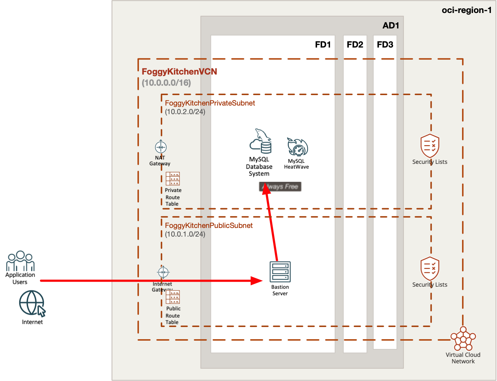

# FoggyKitchen OCI MySQL Heatwave with Terraform 

## LESSON 3 - Creating Free Tier MySQL Database Service with HeatWave Cluster

In this lesson, we'll delve into the creation of a **Free Tier MySQL Database Service** in Oracle Cloud Infrastructure with a **HeatWave Cluster** using a **Terraform module**, focusing on configuring a MySQL instance with in-memory query acceleration to significantly enhance the performance of analytical queries while utilizing free tier resources.



## Deploy Using Oracle Resource Manager

1. Click [](https://cloud.oracle.com/resourcemanager/stacks/create?region=home&zipUrl=https://github.com/mlinxfeld/terraform-oci-fk-heatwave/releases/latest/download/terraform-oci-fk-heatwave-lesson3.zip)

    If you aren't already signed in, when prompted, enter the tenancy and user credentials.

2. Review and accept the terms and conditions.

3. Select the region where you want to deploy the stack.

4. Follow the on-screen prompts and instructions to create the stack.

5. After creating the stack, click **Terraform Actions**, and select **Plan**.

6. Wait for the job to be completed, and review the plan.

    To make any changes, return to the Stack Details page, click **Edit Stack**, and make the required changes. Then, run the **Plan** action again.

7. If no further changes are necessary, return to the Stack Details page, click **Terraform Actions**, and select **Apply**. 

## Deploy Using the Terraform CLI 

### Clone of the repo 

Now, you'll want a local copy of this repo. You can make that with the commands:
Clone the repo from github by executing the command as follows and then go to proper subdirectory:

```
mlinxfeld@Martins-MacBook-Pro github % git clone https://github.com/mlinxfeld/terraform-oci-fk-heatwave.git

mlinxfeld@Martins-MacBook-Pro github % cd terraform-oci-fk-heatwave

mlinxfeld@Martins-MacBook-Pro terraform-oci-fk-heatwave % cd training/lesson3_free_tier_mds_with_heatwave_cluster/
```

### Prerequisites
Create environment file with terraform.tfvars file starting with example file:

```
mlinxfeld@Martins-MacBook-Pro lesson3_free_tier_mds_with_heatwave_cluster % cp terraform.tfvars.example terraform.tfvars

mlinxfeld@Martins-MacBook-Pro lesson3_free_tier_mds_with_heatwave_cluster % vi terraform.tfvars

tenancy_ocid            = "ocid1.tenancy.oc1..<your_tenancy_ocid>"
compartment_ocid        = "ocid1.compartment.oc1..<your_comparment_ocid>"
fingerprint             = "<fingerprint>"
private_key_path        = "<private_key_path>"
region                  = "<region>"
mds_availability_domain = "<ad_name>"
mds_compartment_ocid    = "<compartment_ocid>"
mds_admin_password      = "<admin_password>"
mds_heatwave_enabled    = true 
```

### Initialize Terraform

Run the following command to initialize Terraform environment:

```
mlinxfeld@Martins-MacBook-Pro lesson3_free_tier_mds_with_heatwave_cluster % terraform init
Initializing the backend...
Initializing modules...
Downloading git::https://github.com/mlinxfeld/terraform-oci-fk-heatwave.git for oci-fk-free-mds-heatwave...
- oci-fk-free-mds-heatwave in .terraform/modules/oci-fk-free-mds-heatwave
Initializing provider plugins...
- Finding latest version of hashicorp/template...
- Finding latest version of hashicorp/oci...
- Finding latest version of hashicorp/tls...
- Finding latest version of oracle/oci...
- Finding latest version of hashicorp/null...
- Installing hashicorp/tls v4.0.5...
- Installed hashicorp/tls v4.0.5 (signed by HashiCorp)
- Installing oracle/oci v6.9.0...
- Installed oracle/oci v6.9.0 (signed by a HashiCorp partner, key ID 1533A49284137CEB)
- Installing hashicorp/null v3.2.2...
- Installed hashicorp/null v3.2.2 (signed by HashiCorp)
- Installing hashicorp/template v2.2.0...
- Installed hashicorp/template v2.2.0 (signed by HashiCorp)
- Installing hashicorp/oci v6.9.0...
- Installed hashicorp/oci v6.9.0 (signed by HashiCorp)
Partner and community providers are signed by their developers.
If you'd like to know more about provider signing, you can read about it here:
https://www.terraform.io/docs/cli/plugins/signing.html
Terraform has created a lock file .terraform.lock.hcl to record the provider
selections it made above. Include this file in your version control repository
so that Terraform can guarantee to make the same selections by default when
you run "terraform init" in the future.

Terraform has been successfully initialized!

You may now begin working with Terraform. Try running "terraform plan" to see
any changes that are required for your infrastructure. All Terraform commands
should now work.

If you ever set or change modules or backend configuration for Terraform,
rerun this command to reinitialize your working directory. If you forget, other
commands will detect it and remind you to do so if necessary.

```

### Apply the changes 

Run the following command for applying changes with the proposed plan:

```
mlinxfeld@Martins-MacBook-Pro lesson3_free_tier_mds_with_heatwave_cluster % terraform apply                
data.oci_core_images.OSImage: Reading...
data.oci_identity_availability_domains.ADs: Reading...
data.oci_core_images.OSImage: Read complete after 1s [id=CoreImagesDataSource-2160886926]
data.oci_identity_availability_domains.ADs: Read complete after 1s [id=IdentityAvailabilityDomainsDataSource-3596290162]

Terraform used the selected providers to generate the following execution plan. Resource actions are indicated with the following symbols:
  + create
 <= read (data resources)

Terraform will perform the following actions:

  # data.oci_core_vnic.FoggyKitchenBastion_VNIC1 will be read during apply
  # (config refers to values not yet known)
 <= data "oci_core_vnic" "FoggyKitchenBastion_VNIC1" {
      + availability_domain    = (known after apply)
      + compartment_id         = (known after apply)
      + defined_tags           = (known after apply)
      + display_name           = (known after apply)
      + freeform_tags          = (known after apply)
      + hostname_label         = (known after apply)
      + id                     = (known after apply)
      + ipv6addresses          = (known after apply)
      + is_primary             = (known after apply)
      + mac_address            = (known after apply)
      + nsg_ids                = (known after apply)
      + private_ip_address     = (known after apply)
      + public_ip_address      = (known after apply)
      + skip_source_dest_check = (known after apply)
      + state                  = (known after apply)
      + subnet_id              = (known after apply)
      + time_created           = (known after apply)
      + vlan_id                = (known after apply)
      + vnic_id                = (known after apply)
    }

  # data.oci_core_vnic_attachments.FoggyKitchenBastion_VNIC1_attach will be read during apply
  # (config refers to values not yet known)
 <= data "oci_core_vnic_attachments" "FoggyKitchenBastion_VNIC1_attach" {
      + availability_domain = "unja:EU-FRANKFURT-1-AD-3"
      + compartment_id      = "ocid1.compartment.oc1..aaaaaaaaiyy4srmrb32v5rlniicwmpxsytywiucgbcp5ext6e4ahjfuloewa"
      + id                  = (known after apply)
      + instance_id         = (known after apply)
      + vnic_attachments    = (known after apply)
    }

  # oci_core_instance.FoggyKitchenBastion will be created
  + resource "oci_core_instance" "FoggyKitchenBastion" {
      + availability_domain                 = "unja:EU-FRANKFURT-1-AD-3"
      + boot_volume_id                      = (known after apply)
      + capacity_reservation_id             = (known after apply)
      + compartment_id                      = "ocid1.compartment.oc1..aaaaaaaaiyy4srmrb32v5rlniicwmpxsytywiucgbcp5ext6e4ahjfuloewa"
      + compute_cluster_id                  = (known after apply)
      + dedicated_vm_host_id                = (known after apply)
      + defined_tags                        = (known after apply)
      + display_name                        = "FoggyKitchenBastion"
      + extended_metadata                   = (known after apply)
      + fault_domain                        = (known after apply)
      + freeform_tags                       = (known after apply)
      + hostname_label                      = (known after apply)
      + id                                  = (known after apply)
      + image                               = (known after apply)
      + instance_configuration_id           = (known after apply)
      + ipxe_script                         = (known after apply)
      + is_cross_numa_node                  = (known after apply)
      + is_pv_encryption_in_transit_enabled = (known after apply)
      + launch_mode                         = (known after apply)
      + metadata                            = (known after apply)
      + private_ip                          = (known after apply)
      + public_ip                           = (known after apply)
      + region                              = (known after apply)
      + shape                               = "VM.Standard.A1.Flex"
      + state                               = (known after apply)
      + subnet_id                           = (known after apply)
      + system_tags                         = (known after apply)
      + time_created                        = (known after apply)
      + time_maintenance_reboot_due         = (known after apply)

      + agent_config (known after apply)

      + availability_config (known after apply)

      + create_vnic_details {
          + assign_ipv6ip          = (known after apply)
          + assign_public_ip       = "true"
          + defined_tags           = (known after apply)
          + display_name           = (known after apply)
          + freeform_tags          = (known after apply)
          + hostname_label         = (known after apply)
          + nsg_ids                = (known after apply)
          + private_ip             = (known after apply)
          + skip_source_dest_check = (known after apply)
          + subnet_id              = (known after apply)
          + vlan_id                = (known after apply)

          + ipv6address_ipv6subnet_cidr_pair_details (known after apply)
        }

      + instance_options (known after apply)

      + launch_options (known after apply)

      + launch_volume_attachments (known after apply)

      + platform_config (known after apply)

      + preemptible_instance_config (known after apply)

      + shape_config {
          + baseline_ocpu_utilization     = (known after apply)
          + gpu_description               = (known after apply)
          + gpus                          = (known after apply)
          + local_disk_description        = (known after apply)
          + local_disks                   = (known after apply)
          + local_disks_total_size_in_gbs = (known after apply)
          + max_vnic_attachments          = (known after apply)
          + memory_in_gbs                 = 1
          + networking_bandwidth_in_gbps  = (known after apply)
          + nvmes                         = (known after apply)
          + ocpus                         = 1
          + processor_description         = (known after apply)
          + vcpus                         = (known after apply)
        }

      + source_details {
          + boot_volume_size_in_gbs = (known after apply)
          + boot_volume_vpus_per_gb = (known after apply)
          + source_id               = "ocid1.image.oc1.eu-frankfurt-1.aaaaaaaag6jeiojxtzc7ozuohudl3uysucv7oeixhgclsbgbuks6cr5m53fa"
          + source_type             = "image"

          + instance_source_image_filter_details (known after apply)
        }
    }

  # oci_core_internet_gateway.FoggyKitchenInternetGateway will be created
  + resource "oci_core_internet_gateway" "FoggyKitchenInternetGateway" {
      + compartment_id = "ocid1.compartment.oc1..aaaaaaaaiyy4srmrb32v5rlniicwmpxsytywiucgbcp5ext6e4ahjfuloewa"
      + defined_tags   = (known after apply)
      + display_name   = "FoggyKitchenInternetGateway"
      + enabled        = true
      + freeform_tags  = (known after apply)
      + id             = (known after apply)
      + route_table_id = (known after apply)
      + state          = (known after apply)
      + time_created   = (known after apply)
      + vcn_id         = (known after apply)
    }

  # oci_core_nat_gateway.FoggyKitchenNATGateway will be created
  + resource "oci_core_nat_gateway" "FoggyKitchenNATGateway" {
      + block_traffic  = (known after apply)
      + compartment_id = "ocid1.compartment.oc1..aaaaaaaaiyy4srmrb32v5rlniicwmpxsytywiucgbcp5ext6e4ahjfuloewa"
      + defined_tags   = (known after apply)
      + display_name   = "FoggyKitchenNATGateway"
      + freeform_tags  = (known after apply)
      + id             = (known after apply)
      + nat_ip         = (known after apply)
      + public_ip_id   = (known after apply)
      + route_table_id = (known after apply)
      + state          = (known after apply)
      + time_created   = (known after apply)
      + vcn_id         = (known after apply)
    }

  # oci_core_route_table.FoggyKitchenPrivateRouteTable will be created
  + resource "oci_core_route_table" "FoggyKitchenPrivateRouteTable" {
      + compartment_id = "ocid1.compartment.oc1..aaaaaaaaiyy4srmrb32v5rlniicwmpxsytywiucgbcp5ext6e4ahjfuloewa"
      + defined_tags   = (known after apply)
      + display_name   = "FoggyKitchenPrivateRouteTable"
      + freeform_tags  = (known after apply)
      + id             = (known after apply)
      + state          = (known after apply)
      + time_created   = (known after apply)
      + vcn_id         = (known after apply)

      + route_rules {
          + cidr_block        = (known after apply)
          + description       = (known after apply)
          + destination       = "0.0.0.0/0"
          + destination_type  = "CIDR_BLOCK"
          + network_entity_id = (known after apply)
          + route_type        = (known after apply)
        }
    }

  # oci_core_route_table.FoggyKitchenPublicRouteTable will be created
  + resource "oci_core_route_table" "FoggyKitchenPublicRouteTable" {
      + compartment_id = "ocid1.compartment.oc1..aaaaaaaaiyy4srmrb32v5rlniicwmpxsytywiucgbcp5ext6e4ahjfuloewa"
      + defined_tags   = (known after apply)
      + display_name   = "FoggyKitchenPublicRouteTable"
      + freeform_tags  = (known after apply)
      + id             = (known after apply)
      + state          = (known after apply)
      + time_created   = (known after apply)
      + vcn_id         = (known after apply)

      + route_rules {
          + cidr_block        = (known after apply)
          + description       = (known after apply)
          + destination       = "0.0.0.0/0"
          + destination_type  = "CIDR_BLOCK"
          + network_entity_id = (known after apply)
          + route_type        = (known after apply)
        }
    }

  # oci_core_route_table_attachment.FoggyKitchenPrivateSubnetRouteTableAttachment will be created
  + resource "oci_core_route_table_attachment" "FoggyKitchenPrivateSubnetRouteTableAttachment" {
      + id             = (known after apply)
      + route_table_id = (known after apply)
      + subnet_id      = (known after apply)
    }

  # oci_core_route_table_attachment.FoggyKitchenPublicSubnetRouteTableAttachment will be created
  + resource "oci_core_route_table_attachment" "FoggyKitchenPublicSubnetRouteTableAttachment" {
      + id             = (known after apply)
      + route_table_id = (known after apply)
      + subnet_id      = (known after apply)
    }

  # oci_core_security_list.FoggyKitchenBastionSecurityList will be created
  + resource "oci_core_security_list" "FoggyKitchenBastionSecurityList" {
      + compartment_id = "ocid1.compartment.oc1..aaaaaaaaiyy4srmrb32v5rlniicwmpxsytywiucgbcp5ext6e4ahjfuloewa"
      + defined_tags   = (known after apply)
      + display_name   = "FoggyKitchenBastionSecurityList"
      + freeform_tags  = (known after apply)
      + id             = (known after apply)
      + state          = (known after apply)
      + time_created   = (known after apply)
      + vcn_id         = (known after apply)

      + egress_security_rules {
          + description      = (known after apply)
          + destination      = "0.0.0.0/0"
          + destination_type = (known after apply)
          + protocol         = "all"
          + stateless        = (known after apply)
        }

      + ingress_security_rules {
          + description = (known after apply)
          + protocol    = "6"
          + source      = "0.0.0.0/0"
          + source_type = "CIDR_BLOCK"
          + stateless   = false

          + tcp_options {
              + max = 22
              + min = 22
            }
        }
    }

  # oci_core_security_list.FoggyKitchenMDSSecurityList will be created
  + resource "oci_core_security_list" "FoggyKitchenMDSSecurityList" {
      + compartment_id = "ocid1.compartment.oc1..aaaaaaaaiyy4srmrb32v5rlniicwmpxsytywiucgbcp5ext6e4ahjfuloewa"
      + defined_tags   = (known after apply)
      + display_name   = "FoggyKitchenMDSSecurityList"
      + freeform_tags  = (known after apply)
      + id             = (known after apply)
      + state          = (known after apply)
      + time_created   = (known after apply)
      + vcn_id         = (known after apply)

      + egress_security_rules {
          + description      = (known after apply)
          + destination      = "0.0.0.0/0"
          + destination_type = (known after apply)
          + protocol         = "all"
          + stateless        = (known after apply)
        }

      + ingress_security_rules {
          + description = (known after apply)
          + protocol    = "6"
          + source      = "0.0.0.0/0"
          + source_type = "CIDR_BLOCK"
          + stateless   = false

          + tcp_options {
              + max = 33060
              + min = 33060
            }
        }
      + ingress_security_rules {
          + description = (known after apply)
          + protocol    = "6"
          + source      = "0.0.0.0/0"
          + source_type = "CIDR_BLOCK"
          + stateless   = false

          + tcp_options {
              + max = 3306
              + min = 3306
            }
        }
    }

  # oci_core_subnet.FoggyKitchenPrivateSubnet will be created
  + resource "oci_core_subnet" "FoggyKitchenPrivateSubnet" {
      + availability_domain        = (known after apply)
      + cidr_block                 = "10.0.2.0/24"
      + compartment_id             = "ocid1.compartment.oc1..aaaaaaaaiyy4srmrb32v5rlniicwmpxsytywiucgbcp5ext6e4ahjfuloewa"
      + defined_tags               = (known after apply)
      + dhcp_options_id            = (known after apply)
      + display_name               = "FoggyKitchenPrivateSubnet"
      + dns_label                  = (known after apply)
      + freeform_tags              = (known after apply)
      + id                         = (known after apply)
      + ipv6cidr_block             = (known after apply)
      + ipv6cidr_blocks            = (known after apply)
      + ipv6virtual_router_ip      = (known after apply)
      + prohibit_internet_ingress  = (known after apply)
      + prohibit_public_ip_on_vnic = true
      + route_table_id             = (known after apply)
      + security_list_ids          = (known after apply)
      + state                      = (known after apply)
      + subnet_domain_name         = (known after apply)
      + time_created               = (known after apply)
      + vcn_id                     = (known after apply)
      + virtual_router_ip          = (known after apply)
      + virtual_router_mac         = (known after apply)
    }

  # oci_core_subnet.FoggyKitchenPublicSubnet will be created
  + resource "oci_core_subnet" "FoggyKitchenPublicSubnet" {
      + availability_domain        = (known after apply)
      + cidr_block                 = "10.0.1.0/24"
      + compartment_id             = "ocid1.compartment.oc1..aaaaaaaaiyy4srmrb32v5rlniicwmpxsytywiucgbcp5ext6e4ahjfuloewa"
      + defined_tags               = (known after apply)
      + dhcp_options_id            = (known after apply)
      + display_name               = "FoggyKitchenPublicSubnet"
      + dns_label                  = (known after apply)
      + freeform_tags              = (known after apply)
      + id                         = (known after apply)
      + ipv6cidr_block             = (known after apply)
      + ipv6cidr_blocks            = (known after apply)
      + ipv6virtual_router_ip      = (known after apply)
      + prohibit_internet_ingress  = (known after apply)
      + prohibit_public_ip_on_vnic = (known after apply)
      + route_table_id             = (known after apply)
      + security_list_ids          = (known after apply)
      + state                      = (known after apply)
      + subnet_domain_name         = (known after apply)
      + time_created               = (known after apply)
      + vcn_id                     = (known after apply)
      + virtual_router_ip          = (known after apply)
      + virtual_router_mac         = (known after apply)
    }

  # oci_core_vcn.FoggyKitchenVCN will be created
  + resource "oci_core_vcn" "FoggyKitchenVCN" {
      + byoipv6cidr_blocks               = (known after apply)
      + cidr_block                       = "10.0.0.0/16"
      + cidr_blocks                      = (known after apply)
      + compartment_id                   = "ocid1.compartment.oc1..aaaaaaaaiyy4srmrb32v5rlniicwmpxsytywiucgbcp5ext6e4ahjfuloewa"
      + default_dhcp_options_id          = (known after apply)
      + default_route_table_id           = (known after apply)
      + default_security_list_id         = (known after apply)
      + defined_tags                     = (known after apply)
      + display_name                     = "FoggyKitchenMDSVCN"
      + dns_label                        = "mdsvcn"
      + freeform_tags                    = (known after apply)
      + id                               = (known after apply)
      + ipv6cidr_blocks                  = (known after apply)
      + ipv6private_cidr_blocks          = (known after apply)
      + is_ipv6enabled                   = (known after apply)
      + is_oracle_gua_allocation_enabled = (known after apply)
      + state                            = (known after apply)
      + time_created                     = (known after apply)
      + vcn_domain_name                  = (known after apply)

      + byoipv6cidr_details (known after apply)
    }

  # tls_private_key.public_private_key_pair will be created
  + resource "tls_private_key" "public_private_key_pair" {
      + algorithm                     = "RSA"
      + ecdsa_curve                   = "P224"
      + id                            = (known after apply)
      + private_key_openssh           = (sensitive value)
      + private_key_pem               = (sensitive value)
      + private_key_pem_pkcs8         = (sensitive value)
      + public_key_fingerprint_md5    = (known after apply)
      + public_key_fingerprint_sha256 = (known after apply)
      + public_key_openssh            = (known after apply)
      + public_key_pem                = (known after apply)
      + rsa_bits                      = 2048
    }

  # module.oci-fk-free-mds-heatwave.oci_mysql_heat_wave_cluster.FoggyKitchenHeatWave[0] will be created
  + resource "oci_mysql_heat_wave_cluster" "FoggyKitchenHeatWave" {
      + cluster_nodes        = (known after apply)
      + cluster_size         = 1
      + db_system_id         = (known after apply)
      + id                   = (known after apply)
      + is_lakehouse_enabled = (known after apply)
      + lifecycle_details    = (known after apply)
      + shape_name           = "HeatWave.Free"
      + state                = (known after apply)
      + time_created         = (known after apply)
      + time_updated         = (known after apply)
    }

  # module.oci-fk-free-mds-heatwave.oci_mysql_mysql_db_system.FoggyKitchenMDS[0] will be created
  + resource "oci_mysql_mysql_db_system" "FoggyKitchenMDS" {
      + admin_password                 = (sensitive value)
      + admin_username                 = "mysql"
      + availability_domain            = "unja:EU-FRANKFURT-1-AD-3"
      + channels                       = (known after apply)
      + compartment_id                 = "ocid1.compartment.oc1..aaaaaaaaiyy4srmrb32v5rlniicwmpxsytywiucgbcp5ext6e4ahjfuloewa"
      + configuration_id               = (known after apply)
      + crash_recovery                 = (known after apply)
      + current_placement              = (known after apply)
      + data_storage_size_in_gb        = 50
      + database_management            = (known after apply)
      + defined_tags                   = (known after apply)
      + description                    = "FoggyKitchenMySQL/Heatwave Database System"
      + display_name                   = "FoggyKitchenMDSHeatwave"
      + endpoints                      = (known after apply)
      + fault_domain                   = (known after apply)
      + freeform_tags                  = (known after apply)
      + heat_wave_cluster              = (known after apply)
      + hostname_label                 = "fkmds"
      + id                             = (known after apply)
      + ip_address                     = (known after apply)
      + is_heat_wave_cluster_attached  = (known after apply)
      + is_highly_available            = false
      + lifecycle_details              = (known after apply)
      + mysql_version                  = (known after apply)
      + point_in_time_recovery_details = (known after apply)
      + port                           = 3306
      + port_x                         = 33060
      + shape_name                     = "MySQL.Free"
      + state                          = (known after apply)
      + subnet_id                      = (known after apply)
      + time_created                   = (known after apply)
      + time_updated                   = (known after apply)

      + backup_policy (known after apply)

      + customer_contacts (known after apply)

      + data_storage (known after apply)

      + deletion_policy (known after apply)

      + maintenance {
          + window_start_time = "MONDAY 23:59"
        }

      + secure_connections (known after apply)

      + source (known after apply)
    }

Plan: 15 to add, 0 to change, 0 to destroy.

Changes to Outputs:
  + FoggyKitchenBastionPublicIP = [
      + (known after apply),
    ]
  + generated_ssh_private_key   = (sensitive value)
  + mds_database                = {
      + mds_id         = (known after apply)
      + mds_ip_address = (known after apply)
      + mds_port       = (known after apply)
      + mds_port_x     = (known after apply)
    }

Do you want to perform these actions?
  Terraform will perform the actions described above.
  Only 'yes' will be accepted to approve.

  Enter a value: yes

tls_private_key.public_private_key_pair: Creating...
oci_core_vcn.FoggyKitchenVCN: Creating...
tls_private_key.public_private_key_pair: Creation complete after 1s [id=677829f5129a163d388df98a0676642208627632]
oci_core_vcn.FoggyKitchenVCN: Creation complete after 1s [id=ocid1.vcn.oc1.eu-frankfurt-1.amaaaaaadngk4gia4laahkdozzbnwtrujymampaqnyqpfyun24mdsu4gh3fa]
oci_core_nat_gateway.FoggyKitchenNATGateway: Creating...
oci_core_internet_gateway.FoggyKitchenInternetGateway: Creating...
oci_core_security_list.FoggyKitchenBastionSecurityList: Creating...
oci_core_security_list.FoggyKitchenMDSSecurityList: Creating...
oci_core_internet_gateway.FoggyKitchenInternetGateway: Creation complete after 1s [id=ocid1.internetgateway.oc1.eu-frankfurt-1.aaaaaaaam44frvfgykogsomg2llkcc6exoxwbaqnl4eac43vwvqo5uw33e5q]
oci_core_route_table.FoggyKitchenPublicRouteTable: Creating...
oci_core_security_list.FoggyKitchenMDSSecurityList: Creation complete after 1s [id=ocid1.securitylist.oc1.eu-frankfurt-1.aaaaaaaazlonhpklsy64iaua26ct343tzoindl33slmm7xo2lrhapjrzoebq]
oci_core_security_list.FoggyKitchenBastionSecurityList: Creation complete after 1s [id=ocid1.securitylist.oc1.eu-frankfurt-1.aaaaaaaax5bwfgw5js3ofzpgigrkds3f4knwz6pai4fikm6hlaflacos5rpa]
oci_core_subnet.FoggyKitchenPrivateSubnet: Creating...
oci_core_subnet.FoggyKitchenPublicSubnet: Creating...
oci_core_route_table.FoggyKitchenPublicRouteTable: Creation complete after 0s [id=ocid1.routetable.oc1.eu-frankfurt-1.aaaaaaaaoujxnzxerpvg44bkxy7wwhcikfzg6rbtgg2sly5lwid2hrdu75ha]
oci_core_nat_gateway.FoggyKitchenNATGateway: Creation complete after 1s [id=ocid1.natgateway.oc1.eu-frankfurt-1.aaaaaaaajasvfc6w33qggqkmae3kuf6dzras33dqvkpqqzfeq3kyirvnfmca]
oci_core_route_table.FoggyKitchenPrivateRouteTable: Creating...
oci_core_route_table.FoggyKitchenPrivateRouteTable: Creation complete after 1s [id=ocid1.routetable.oc1.eu-frankfurt-1.aaaaaaaacvqth3ytpdstt7fcseiluuliegjkljstcsfgpn3b26ywaqg6zxaa]
oci_core_subnet.FoggyKitchenPublicSubnet: Creation complete after 2s [id=ocid1.subnet.oc1.eu-frankfurt-1.aaaaaaaao5wd7gfnyy5qtjdd5zrhnhx5df22pwd7getpdibfqfgra3muyeqq]
oci_core_route_table_attachment.FoggyKitchenPublicSubnetRouteTableAttachment: Creating...
oci_core_instance.FoggyKitchenBastion: Creating...
oci_core_route_table_attachment.FoggyKitchenPublicSubnetRouteTableAttachment: Creation complete after 0s [id=ocid1.subnet.oc1.eu-frankfurt-1.aaaaaaaao5wd7gfnyy5qtjdd5zrhnhx5df22pwd7getpdibfqfgra3muyeqq/ocid1.routetable.oc1.eu-frankfurt-1.aaaaaaaaoujxnzxerpvg44bkxy7wwhcikfzg6rbtgg2sly5lwid2hrdu75ha]
oci_core_subnet.FoggyKitchenPrivateSubnet: Creation complete after 2s [id=ocid1.subnet.oc1.eu-frankfurt-1.aaaaaaaaursvcpndnyqblicepkqlnyetxdi56stch2i7nfhchqzpwhpyw3gq]
oci_core_route_table_attachment.FoggyKitchenPrivateSubnetRouteTableAttachment: Creating...
module.oci-fk-free-mds-heatwave.oci_mysql_mysql_db_system.FoggyKitchenMDS[0]: Creating...
oci_core_route_table_attachment.FoggyKitchenPrivateSubnetRouteTableAttachment: Creation complete after 1s [id=ocid1.subnet.oc1.eu-frankfurt-1.aaaaaaaaursvcpndnyqblicepkqlnyetxdi56stch2i7nfhchqzpwhpyw3gq/ocid1.routetable.oc1.eu-frankfurt-1.aaaaaaaacvqth3ytpdstt7fcseiluuliegjkljstcsfgpn3b26ywaqg6zxaa]
oci_core_instance.FoggyKitchenBastion: Still creating... [10s elapsed]
module.oci-fk-free-mds-heatwave.oci_mysql_mysql_db_system.FoggyKitchenMDS[0]: Still creating... [10s elapsed]
oci_core_instance.FoggyKitchenBastion: Still creating... [20s elapsed]
module.oci-fk-free-mds-heatwave.oci_mysql_mysql_db_system.FoggyKitchenMDS[0]: Still creating... [20s elapsed]
oci_core_instance.FoggyKitchenBastion: Still creating... [30s elapsed]
module.oci-fk-free-mds-heatwave.oci_mysql_mysql_db_system.FoggyKitchenMDS[0]: Still creating... [30s elapsed]
oci_core_instance.FoggyKitchenBastion: Still creating... [40s elapsed]
module.oci-fk-free-mds-heatwave.oci_mysql_mysql_db_system.FoggyKitchenMDS[0]: Still creating... [40s elapsed]
oci_core_instance.FoggyKitchenBastion: Still creating... [50s elapsed]
module.oci-fk-free-mds-heatwave.oci_mysql_mysql_db_system.FoggyKitchenMDS[0]: Still creating... [50s elapsed]
oci_core_instance.FoggyKitchenBastion: Still creating... [1m0s elapsed]
module.oci-fk-free-mds-heatwave.oci_mysql_mysql_db_system.FoggyKitchenMDS[0]: Still creating... [1m0s elapsed]
oci_core_instance.FoggyKitchenBastion: Still creating... [1m10s elapsed]
module.oci-fk-free-mds-heatwave.oci_mysql_mysql_db_system.FoggyKitchenMDS[0]: Still creating... [1m10s elapsed]
oci_core_instance.FoggyKitchenBastion: Still creating... [1m20s elapsed]
module.oci-fk-free-mds-heatwave.oci_mysql_mysql_db_system.FoggyKitchenMDS[0]: Still creating... [1m20s elapsed]
oci_core_instance.FoggyKitchenBastion: Still creating... [1m30s elapsed]
module.oci-fk-free-mds-heatwave.oci_mysql_mysql_db_system.FoggyKitchenMDS[0]: Still creating... [1m30s elapsed]
oci_core_instance.FoggyKitchenBastion: Still creating... [1m40s elapsed]
module.oci-fk-free-mds-heatwave.oci_mysql_mysql_db_system.FoggyKitchenMDS[0]: Still creating... [1m40s elapsed]
oci_core_instance.FoggyKitchenBastion: Still creating... [1m50s elapsed]
module.oci-fk-free-mds-heatwave.oci_mysql_mysql_db_system.FoggyKitchenMDS[0]: Still creating... [1m50s elapsed]
oci_core_instance.FoggyKitchenBastion: Still creating... [2m0s elapsed]
module.oci-fk-free-mds-heatwave.oci_mysql_mysql_db_system.FoggyKitchenMDS[0]: Still creating... [2m0s elapsed]
oci_core_instance.FoggyKitchenBastion: Creation complete after 2m7s [id=ocid1.instance.oc1.eu-frankfurt-1.antheljtdngk4gickjtbjf6mv72hpxtelqteb65mckrzz72n2amkl6ecarea]
data.oci_core_vnic_attachments.FoggyKitchenBastion_VNIC1_attach: Reading...
data.oci_core_vnic_attachments.FoggyKitchenBastion_VNIC1_attach: Read complete after 0s [id=CoreVnicAttachmentsDataSource-411408538]
data.oci_core_vnic.FoggyKitchenBastion_VNIC1: Reading...
data.oci_core_vnic.FoggyKitchenBastion_VNIC1: Read complete after 0s [id=ocid1.vnic.oc1.eu-frankfurt-1.abtheljtcy6lkowpjh4uu6u66wykhgw66qxa2hgpd34tmwoc2wpq6fgtk6gq]
module.oci-fk-free-mds-heatwave.oci_mysql_mysql_db_system.FoggyKitchenMDS[0]: Still creating... [2m10s elapsed]
module.oci-fk-free-mds-heatwave.oci_mysql_mysql_db_system.FoggyKitchenMDS[0]: Still creating... [2m20s elapsed]
module.oci-fk-free-mds-heatwave.oci_mysql_mysql_db_system.FoggyKitchenMDS[0]: Still creating... [2m30s elapsed]
module.oci-fk-free-mds-heatwave.oci_mysql_mysql_db_system.FoggyKitchenMDS[0]: Still creating... [2m40s elapsed]
module.oci-fk-free-mds-heatwave.oci_mysql_mysql_db_system.FoggyKitchenMDS[0]: Still creating... [2m50s elapsed]
module.oci-fk-free-mds-heatwave.oci_mysql_mysql_db_system.FoggyKitchenMDS[0]: Still creating... [3m0s elapsed]
module.oci-fk-free-mds-heatwave.oci_mysql_mysql_db_system.FoggyKitchenMDS[0]: Still creating... [3m10s elapsed]
module.oci-fk-free-mds-heatwave.oci_mysql_mysql_db_system.FoggyKitchenMDS[0]: Still creating... [3m20s elapsed]
module.oci-fk-free-mds-heatwave.oci_mysql_mysql_db_system.FoggyKitchenMDS[0]: Still creating... [3m30s elapsed]
module.oci-fk-free-mds-heatwave.oci_mysql_mysql_db_system.FoggyKitchenMDS[0]: Still creating... [3m40s elapsed]
module.oci-fk-free-mds-heatwave.oci_mysql_mysql_db_system.FoggyKitchenMDS[0]: Still creating... [3m50s elapsed]
module.oci-fk-free-mds-heatwave.oci_mysql_mysql_db_system.FoggyKitchenMDS[0]: Still creating... [4m0s elapsed]
module.oci-fk-free-mds-heatwave.oci_mysql_mysql_db_system.FoggyKitchenMDS[0]: Still creating... [4m10s elapsed]
module.oci-fk-free-mds-heatwave.oci_mysql_mysql_db_system.FoggyKitchenMDS[0]: Still creating... [4m20s elapsed]
module.oci-fk-free-mds-heatwave.oci_mysql_mysql_db_system.FoggyKitchenMDS[0]: Still creating... [4m30s elapsed]
module.oci-fk-free-mds-heatwave.oci_mysql_mysql_db_system.FoggyKitchenMDS[0]: Still creating... [4m40s elapsed]
module.oci-fk-free-mds-heatwave.oci_mysql_mysql_db_system.FoggyKitchenMDS[0]: Still creating... [4m50s elapsed]
module.oci-fk-free-mds-heatwave.oci_mysql_mysql_db_system.FoggyKitchenMDS[0]: Still creating... [5m0s elapsed]
module.oci-fk-free-mds-heatwave.oci_mysql_mysql_db_system.FoggyKitchenMDS[0]: Still creating... [5m10s elapsed]
module.oci-fk-free-mds-heatwave.oci_mysql_mysql_db_system.FoggyKitchenMDS[0]: Still creating... [5m20s elapsed]
module.oci-fk-free-mds-heatwave.oci_mysql_mysql_db_system.FoggyKitchenMDS[0]: Still creating... [5m30s elapsed]
module.oci-fk-free-mds-heatwave.oci_mysql_mysql_db_system.FoggyKitchenMDS[0]: Still creating... [5m40s elapsed]
module.oci-fk-free-mds-heatwave.oci_mysql_mysql_db_system.FoggyKitchenMDS[0]: Still creating... [5m50s elapsed]
module.oci-fk-free-mds-heatwave.oci_mysql_mysql_db_system.FoggyKitchenMDS[0]: Still creating... [6m0s elapsed]
module.oci-fk-free-mds-heatwave.oci_mysql_mysql_db_system.FoggyKitchenMDS[0]: Still creating... [6m10s elapsed]
module.oci-fk-free-mds-heatwave.oci_mysql_mysql_db_system.FoggyKitchenMDS[0]: Still creating... [6m20s elapsed]
module.oci-fk-free-mds-heatwave.oci_mysql_mysql_db_system.FoggyKitchenMDS[0]: Still creating... [6m30s elapsed]
module.oci-fk-free-mds-heatwave.oci_mysql_mysql_db_system.FoggyKitchenMDS[0]: Still creating... [6m40s elapsed]
module.oci-fk-free-mds-heatwave.oci_mysql_mysql_db_system.FoggyKitchenMDS[0]: Still creating... [6m50s elapsed]
module.oci-fk-free-mds-heatwave.oci_mysql_mysql_db_system.FoggyKitchenMDS[0]: Still creating... [7m0s elapsed]
module.oci-fk-free-mds-heatwave.oci_mysql_mysql_db_system.FoggyKitchenMDS[0]: Still creating... [7m10s elapsed]
module.oci-fk-free-mds-heatwave.oci_mysql_mysql_db_system.FoggyKitchenMDS[0]: Still creating... [7m20s elapsed]
module.oci-fk-free-mds-heatwave.oci_mysql_mysql_db_system.FoggyKitchenMDS[0]: Still creating... [7m30s elapsed]
module.oci-fk-free-mds-heatwave.oci_mysql_mysql_db_system.FoggyKitchenMDS[0]: Still creating... [7m40s elapsed]
module.oci-fk-free-mds-heatwave.oci_mysql_mysql_db_system.FoggyKitchenMDS[0]: Still creating... [7m50s elapsed]
module.oci-fk-free-mds-heatwave.oci_mysql_mysql_db_system.FoggyKitchenMDS[0]: Still creating... [8m0s elapsed]
module.oci-fk-free-mds-heatwave.oci_mysql_mysql_db_system.FoggyKitchenMDS[0]: Still creating... [8m10s elapsed]
module.oci-fk-free-mds-heatwave.oci_mysql_mysql_db_system.FoggyKitchenMDS[0]: Still creating... [8m20s elapsed]
module.oci-fk-free-mds-heatwave.oci_mysql_mysql_db_system.FoggyKitchenMDS[0]: Still creating... [8m30s elapsed]
module.oci-fk-free-mds-heatwave.oci_mysql_mysql_db_system.FoggyKitchenMDS[0]: Still creating... [8m40s elapsed]
module.oci-fk-free-mds-heatwave.oci_mysql_mysql_db_system.FoggyKitchenMDS[0]: Still creating... [8m50s elapsed]
module.oci-fk-free-mds-heatwave.oci_mysql_mysql_db_system.FoggyKitchenMDS[0]: Still creating... [9m0s elapsed]
module.oci-fk-free-mds-heatwave.oci_mysql_mysql_db_system.FoggyKitchenMDS[0]: Still creating... [9m10s elapsed]
module.oci-fk-free-mds-heatwave.oci_mysql_mysql_db_system.FoggyKitchenMDS[0]: Still creating... [9m20s elapsed]
module.oci-fk-free-mds-heatwave.oci_mysql_mysql_db_system.FoggyKitchenMDS[0]: Still creating... [9m30s elapsed]
module.oci-fk-free-mds-heatwave.oci_mysql_mysql_db_system.FoggyKitchenMDS[0]: Still creating... [9m40s elapsed]
module.oci-fk-free-mds-heatwave.oci_mysql_mysql_db_system.FoggyKitchenMDS[0]: Still creating... [9m50s elapsed]
module.oci-fk-free-mds-heatwave.oci_mysql_mysql_db_system.FoggyKitchenMDS[0]: Still creating... [10m0s elapsed]
module.oci-fk-free-mds-heatwave.oci_mysql_mysql_db_system.FoggyKitchenMDS[0]: Still creating... [10m10s elapsed]
module.oci-fk-free-mds-heatwave.oci_mysql_mysql_db_system.FoggyKitchenMDS[0]: Still creating... [10m20s elapsed]
module.oci-fk-free-mds-heatwave.oci_mysql_mysql_db_system.FoggyKitchenMDS[0]: Still creating... [10m30s elapsed]
module.oci-fk-free-mds-heatwave.oci_mysql_mysql_db_system.FoggyKitchenMDS[0]: Still creating... [10m40s elapsed]
module.oci-fk-free-mds-heatwave.oci_mysql_mysql_db_system.FoggyKitchenMDS[0]: Still creating... [10m50s elapsed]
module.oci-fk-free-mds-heatwave.oci_mysql_mysql_db_system.FoggyKitchenMDS[0]: Still creating... [11m0s elapsed]
module.oci-fk-free-mds-heatwave.oci_mysql_mysql_db_system.FoggyKitchenMDS[0]: Still creating... [11m10s elapsed]
module.oci-fk-free-mds-heatwave.oci_mysql_mysql_db_system.FoggyKitchenMDS[0]: Still creating... [11m20s elapsed]
module.oci-fk-free-mds-heatwave.oci_mysql_mysql_db_system.FoggyKitchenMDS[0]: Still creating... [11m30s elapsed]
module.oci-fk-free-mds-heatwave.oci_mysql_mysql_db_system.FoggyKitchenMDS[0]: Still creating... [11m40s elapsed]
module.oci-fk-free-mds-heatwave.oci_mysql_mysql_db_system.FoggyKitchenMDS[0]: Still creating... [11m50s elapsed]
module.oci-fk-free-mds-heatwave.oci_mysql_mysql_db_system.FoggyKitchenMDS[0]: Still creating... [12m0s elapsed]
module.oci-fk-free-mds-heatwave.oci_mysql_mysql_db_system.FoggyKitchenMDS[0]: Still creating... [12m10s elapsed]
module.oci-fk-free-mds-heatwave.oci_mysql_mysql_db_system.FoggyKitchenMDS[0]: Still creating... [12m20s elapsed]
module.oci-fk-free-mds-heatwave.oci_mysql_mysql_db_system.FoggyKitchenMDS[0]: Still creating... [12m30s elapsed]
module.oci-fk-free-mds-heatwave.oci_mysql_mysql_db_system.FoggyKitchenMDS[0]: Still creating... [12m40s elapsed]
module.oci-fk-free-mds-heatwave.oci_mysql_mysql_db_system.FoggyKitchenMDS[0]: Still creating... [12m50s elapsed]
module.oci-fk-free-mds-heatwave.oci_mysql_mysql_db_system.FoggyKitchenMDS[0]: Still creating... [13m0s elapsed]
module.oci-fk-free-mds-heatwave.oci_mysql_mysql_db_system.FoggyKitchenMDS[0]: Still creating... [13m10s elapsed]
module.oci-fk-free-mds-heatwave.oci_mysql_mysql_db_system.FoggyKitchenMDS[0]: Still creating... [13m20s elapsed]
module.oci-fk-free-mds-heatwave.oci_mysql_mysql_db_system.FoggyKitchenMDS[0]: Still creating... [13m30s elapsed]
module.oci-fk-free-mds-heatwave.oci_mysql_mysql_db_system.FoggyKitchenMDS[0]: Still creating... [13m40s elapsed]
module.oci-fk-free-mds-heatwave.oci_mysql_mysql_db_system.FoggyKitchenMDS[0]: Creation complete after 13m48s [id=ocid1.mysqldbsystem.oc1.eu-frankfurt-1.aaaaaaaauhv5hyylvjg3cydm7vjbrioz7dg6iytynrknkjai2v27zoidb7sq]
module.oci-fk-free-mds-heatwave.oci_mysql_heat_wave_cluster.FoggyKitchenHeatWave[0]: Creating...
module.oci-fk-free-mds-heatwave.oci_mysql_heat_wave_cluster.FoggyKitchenHeatWave[0]: Still creating... [10s elapsed]
module.oci-fk-free-mds-heatwave.oci_mysql_heat_wave_cluster.FoggyKitchenHeatWave[0]: Still creating... [20s elapsed]
module.oci-fk-free-mds-heatwave.oci_mysql_heat_wave_cluster.FoggyKitchenHeatWave[0]: Still creating... [30s elapsed]
module.oci-fk-free-mds-heatwave.oci_mysql_heat_wave_cluster.FoggyKitchenHeatWave[0]: Still creating... [40s elapsed]
module.oci-fk-free-mds-heatwave.oci_mysql_heat_wave_cluster.FoggyKitchenHeatWave[0]: Still creating... [50s elapsed]
module.oci-fk-free-mds-heatwave.oci_mysql_heat_wave_cluster.FoggyKitchenHeatWave[0]: Still creating... [1m0s elapsed]
module.oci-fk-free-mds-heatwave.oci_mysql_heat_wave_cluster.FoggyKitchenHeatWave[0]: Still creating... [1m10s elapsed]
module.oci-fk-free-mds-heatwave.oci_mysql_heat_wave_cluster.FoggyKitchenHeatWave[0]: Still creating... [1m20s elapsed]
module.oci-fk-free-mds-heatwave.oci_mysql_heat_wave_cluster.FoggyKitchenHeatWave[0]: Still creating... [1m30s elapsed]
module.oci-fk-free-mds-heatwave.oci_mysql_heat_wave_cluster.FoggyKitchenHeatWave[0]: Still creating... [1m40s elapsed]
module.oci-fk-free-mds-heatwave.oci_mysql_heat_wave_cluster.FoggyKitchenHeatWave[0]: Still creating... [1m50s elapsed]
module.oci-fk-free-mds-heatwave.oci_mysql_heat_wave_cluster.FoggyKitchenHeatWave[0]: Still creating... [2m0s elapsed]
module.oci-fk-free-mds-heatwave.oci_mysql_heat_wave_cluster.FoggyKitchenHeatWave[0]: Still creating... [2m10s elapsed]
module.oci-fk-free-mds-heatwave.oci_mysql_heat_wave_cluster.FoggyKitchenHeatWave[0]: Still creating... [2m20s elapsed]
module.oci-fk-free-mds-heatwave.oci_mysql_heat_wave_cluster.FoggyKitchenHeatWave[0]: Still creating... [2m30s elapsed]
module.oci-fk-free-mds-heatwave.oci_mysql_heat_wave_cluster.FoggyKitchenHeatWave[0]: Still creating... [2m40s elapsed]
module.oci-fk-free-mds-heatwave.oci_mysql_heat_wave_cluster.FoggyKitchenHeatWave[0]: Still creating... [2m50s elapsed]
module.oci-fk-free-mds-heatwave.oci_mysql_heat_wave_cluster.FoggyKitchenHeatWave[0]: Still creating... [3m0s elapsed]
module.oci-fk-free-mds-heatwave.oci_mysql_heat_wave_cluster.FoggyKitchenHeatWave[0]: Still creating... [3m10s elapsed]
module.oci-fk-free-mds-heatwave.oci_mysql_heat_wave_cluster.FoggyKitchenHeatWave[0]: Still creating... [3m20s elapsed]
module.oci-fk-free-mds-heatwave.oci_mysql_heat_wave_cluster.FoggyKitchenHeatWave[0]: Still creating... [3m30s elapsed]
module.oci-fk-free-mds-heatwave.oci_mysql_heat_wave_cluster.FoggyKitchenHeatWave[0]: Still creating... [3m40s elapsed]
module.oci-fk-free-mds-heatwave.oci_mysql_heat_wave_cluster.FoggyKitchenHeatWave[0]: Still creating... [3m50s elapsed]
module.oci-fk-free-mds-heatwave.oci_mysql_heat_wave_cluster.FoggyKitchenHeatWave[0]: Still creating... [4m0s elapsed]
module.oci-fk-free-mds-heatwave.oci_mysql_heat_wave_cluster.FoggyKitchenHeatWave[0]: Still creating... [4m10s elapsed]
module.oci-fk-free-mds-heatwave.oci_mysql_heat_wave_cluster.FoggyKitchenHeatWave[0]: Still creating... [4m20s elapsed]
module.oci-fk-free-mds-heatwave.oci_mysql_heat_wave_cluster.FoggyKitchenHeatWave[0]: Still creating... [4m30s elapsed]
module.oci-fk-free-mds-heatwave.oci_mysql_heat_wave_cluster.FoggyKitchenHeatWave[0]: Still creating... [4m40s elapsed]
module.oci-fk-free-mds-heatwave.oci_mysql_heat_wave_cluster.FoggyKitchenHeatWave[0]: Still creating... [4m50s elapsed]
module.oci-fk-free-mds-heatwave.oci_mysql_heat_wave_cluster.FoggyKitchenHeatWave[0]: Still creating... [5m0s elapsed]
module.oci-fk-free-mds-heatwave.oci_mysql_heat_wave_cluster.FoggyKitchenHeatWave[0]: Still creating... [5m10s elapsed]
module.oci-fk-free-mds-heatwave.oci_mysql_heat_wave_cluster.FoggyKitchenHeatWave[0]: Still creating... [5m20s elapsed]
module.oci-fk-free-mds-heatwave.oci_mysql_heat_wave_cluster.FoggyKitchenHeatWave[0]: Still creating... [5m30s elapsed]
module.oci-fk-free-mds-heatwave.oci_mysql_heat_wave_cluster.FoggyKitchenHeatWave[0]: Still creating... [5m40s elapsed]
module.oci-fk-free-mds-heatwave.oci_mysql_heat_wave_cluster.FoggyKitchenHeatWave[0]: Still creating... [5m50s elapsed]
module.oci-fk-free-mds-heatwave.oci_mysql_heat_wave_cluster.FoggyKitchenHeatWave[0]: Still creating... [6m0s elapsed]
module.oci-fk-free-mds-heatwave.oci_mysql_heat_wave_cluster.FoggyKitchenHeatWave[0]: Still creating... [6m10s elapsed]
module.oci-fk-free-mds-heatwave.oci_mysql_heat_wave_cluster.FoggyKitchenHeatWave[0]: Still creating... [6m20s elapsed]
module.oci-fk-free-mds-heatwave.oci_mysql_heat_wave_cluster.FoggyKitchenHeatWave[0]: Still creating... [6m30s elapsed]
module.oci-fk-free-mds-heatwave.oci_mysql_heat_wave_cluster.FoggyKitchenHeatWave[0]: Still creating... [6m40s elapsed]
module.oci-fk-free-mds-heatwave.oci_mysql_heat_wave_cluster.FoggyKitchenHeatWave[0]: Still creating... [6m50s elapsed]
module.oci-fk-free-mds-heatwave.oci_mysql_heat_wave_cluster.FoggyKitchenHeatWave[0]: Still creating... [7m0s elapsed]
module.oci-fk-free-mds-heatwave.oci_mysql_heat_wave_cluster.FoggyKitchenHeatWave[0]: Still creating... [7m10s elapsed]
module.oci-fk-free-mds-heatwave.oci_mysql_heat_wave_cluster.FoggyKitchenHeatWave[0]: Still creating... [7m20s elapsed]
module.oci-fk-free-mds-heatwave.oci_mysql_heat_wave_cluster.FoggyKitchenHeatWave[0]: Still creating... [7m30s elapsed]
module.oci-fk-free-mds-heatwave.oci_mysql_heat_wave_cluster.FoggyKitchenHeatWave[0]: Still creating... [7m40s elapsed]
module.oci-fk-free-mds-heatwave.oci_mysql_heat_wave_cluster.FoggyKitchenHeatWave[0]: Still creating... [7m50s elapsed]
module.oci-fk-free-mds-heatwave.oci_mysql_heat_wave_cluster.FoggyKitchenHeatWave[0]: Still creating... [8m0s elapsed]
module.oci-fk-free-mds-heatwave.oci_mysql_heat_wave_cluster.FoggyKitchenHeatWave[0]: Still creating... [8m10s elapsed]
module.oci-fk-free-mds-heatwave.oci_mysql_heat_wave_cluster.FoggyKitchenHeatWave[0]: Still creating... [8m20s elapsed]
module.oci-fk-free-mds-heatwave.oci_mysql_heat_wave_cluster.FoggyKitchenHeatWave[0]: Still creating... [8m30s elapsed]
module.oci-fk-free-mds-heatwave.oci_mysql_heat_wave_cluster.FoggyKitchenHeatWave[0]: Still creating... [8m40s elapsed]
module.oci-fk-free-mds-heatwave.oci_mysql_heat_wave_cluster.FoggyKitchenHeatWave[0]: Still creating... [8m50s elapsed]
module.oci-fk-free-mds-heatwave.oci_mysql_heat_wave_cluster.FoggyKitchenHeatWave[0]: Still creating... [9m0s elapsed]
module.oci-fk-free-mds-heatwave.oci_mysql_heat_wave_cluster.FoggyKitchenHeatWave[0]: Still creating... [9m10s elapsed]
module.oci-fk-free-mds-heatwave.oci_mysql_heat_wave_cluster.FoggyKitchenHeatWave[0]: Still creating... [9m20s elapsed]
module.oci-fk-free-mds-heatwave.oci_mysql_heat_wave_cluster.FoggyKitchenHeatWave[0]: Still creating... [9m30s elapsed]
module.oci-fk-free-mds-heatwave.oci_mysql_heat_wave_cluster.FoggyKitchenHeatWave[0]: Still creating... [9m40s elapsed]
module.oci-fk-free-mds-heatwave.oci_mysql_heat_wave_cluster.FoggyKitchenHeatWave[0]: Still creating... [9m50s elapsed]
module.oci-fk-free-mds-heatwave.oci_mysql_heat_wave_cluster.FoggyKitchenHeatWave[0]: Still creating... [10m0s elapsed]
module.oci-fk-free-mds-heatwave.oci_mysql_heat_wave_cluster.FoggyKitchenHeatWave[0]: Still creating... [10m10s elapsed]
module.oci-fk-free-mds-heatwave.oci_mysql_heat_wave_cluster.FoggyKitchenHeatWave[0]: Still creating... [10m20s elapsed]
module.oci-fk-free-mds-heatwave.oci_mysql_heat_wave_cluster.FoggyKitchenHeatWave[0]: Still creating... [10m30s elapsed]
module.oci-fk-free-mds-heatwave.oci_mysql_heat_wave_cluster.FoggyKitchenHeatWave[0]: Still creating... [10m40s elapsed]
module.oci-fk-free-mds-heatwave.oci_mysql_heat_wave_cluster.FoggyKitchenHeatWave[0]: Still creating... [10m50s elapsed]
module.oci-fk-free-mds-heatwave.oci_mysql_heat_wave_cluster.FoggyKitchenHeatWave[0]: Still creating... [11m0s elapsed]
module.oci-fk-free-mds-heatwave.oci_mysql_heat_wave_cluster.FoggyKitchenHeatWave[0]: Still creating... [11m10s elapsed]
module.oci-fk-free-mds-heatwave.oci_mysql_heat_wave_cluster.FoggyKitchenHeatWave[0]: Still creating... [11m20s elapsed]
module.oci-fk-free-mds-heatwave.oci_mysql_heat_wave_cluster.FoggyKitchenHeatWave[0]: Still creating... [11m30s elapsed]
module.oci-fk-free-mds-heatwave.oci_mysql_heat_wave_cluster.FoggyKitchenHeatWave[0]: Still creating... [11m40s elapsed]
module.oci-fk-free-mds-heatwave.oci_mysql_heat_wave_cluster.FoggyKitchenHeatWave[0]: Creation complete after 11m46s [id=dbSystem/ocid1.mysqldbsystem.oc1.eu-frankfurt-1.aaaaaaaauhv5hyylvjg3cydm7vjbrioz7dg6iytynrknkjai2v27zoidb7sq/heatWaveCluster]

Apply complete! Resources: 15 added, 0 changed, 0 destroyed.

Outputs:

FoggyKitchenBastionPublicIP = [
  "141.147.26.61",
]
generated_ssh_private_key = <sensitive>
mds_database = {
  "mds_id" = "ocid1.mysqldbsystem.oc1.eu-frankfurt-1.aaaaaaaauhv5hyylvjg3cydm7vjbrioz7dg6iytynrknkjai2v27zoidb7sq"
  "mds_ip_address" = "10.0.2.73"
  "mds_port" = "3306"
  "mds_port_x" = "33060"
}
```

### Destroy the changes 

Run the following command for destroying all resources:

```
mlinxfeld@Martins-MacBook-Pro lesson2_free_tier_mds_with_public_access % terraform destroy

tls_private_key.public_private_key_pair: Refreshing state... [id=677829f5129a163d388df98a0676642208627632]
data.oci_identity_availability_domains.ADs: Reading...
data.oci_core_images.OSImage: Reading...
oci_core_vcn.FoggyKitchenVCN: Refreshing state... [id=ocid1.vcn.oc1.eu-frankfurt-1.amaaaaaadngk4gia4laahkdozzbnwtrujymampaqnyqpfyun24mdsu4gh3fa]
data.oci_identity_availability_domains.ADs: Read complete after 0s [id=IdentityAvailabilityDomainsDataSource-3596290162]
data.oci_core_images.OSImage: Read complete after 0s [id=CoreImagesDataSource-2160886926]
oci_core_internet_gateway.FoggyKitchenInternetGateway: Refreshing state... [id=ocid1.internetgateway.oc1.eu-frankfurt-1.aaaaaaaam44frvfgykogsomg2llkcc6exoxwbaqnl4eac43vwvqo5uw33e5q]
oci_core_nat_gateway.FoggyKitchenNATGateway: Refreshing state... [id=ocid1.natgateway.oc1.eu-frankfurt-1.aaaaaaaajasvfc6w33qggqkmae3kuf6dzras33dqvkpqqzfeq3kyirvnfmca]
oci_core_security_list.FoggyKitchenBastionSecurityList: Refreshing state... [id=ocid1.securitylist.oc1.eu-frankfurt-1.aaaaaaaax5bwfgw5js3ofzpgigrkds3f4knwz6pai4fikm6hlaflacos5rpa]
oci_core_security_list.FoggyKitchenMDSSecurityList: Refreshing state... [id=ocid1.securitylist.oc1.eu-frankfurt-1.aaaaaaaazlonhpklsy64iaua26ct343tzoindl33slmm7xo2lrhapjrzoebq]
oci_core_route_table.FoggyKitchenPrivateRouteTable: Refreshing state... [id=ocid1.routetable.oc1.eu-frankfurt-1.aaaaaaaacvqth3ytpdstt7fcseiluuliegjkljstcsfgpn3b26ywaqg6zxaa]
oci_core_route_table.FoggyKitchenPublicRouteTable: Refreshing state... [id=ocid1.routetable.oc1.eu-frankfurt-1.aaaaaaaaoujxnzxerpvg44bkxy7wwhcikfzg6rbtgg2sly5lwid2hrdu75ha]
oci_core_subnet.FoggyKitchenPrivateSubnet: Refreshing state... [id=ocid1.subnet.oc1.eu-frankfurt-1.aaaaaaaaursvcpndnyqblicepkqlnyetxdi56stch2i7nfhchqzpwhpyw3gq]
oci_core_subnet.FoggyKitchenPublicSubnet: Refreshing state... [id=ocid1.subnet.oc1.eu-frankfurt-1.aaaaaaaao5wd7gfnyy5qtjdd5zrhnhx5df22pwd7getpdibfqfgra3muyeqq]
oci_core_route_table_attachment.FoggyKitchenPrivateSubnetRouteTableAttachment: Refreshing state... [id=ocid1.subnet.oc1.eu-frankfurt-1.aaaaaaaaursvcpndnyqblicepkqlnyetxdi56stch2i7nfhchqzpwhpyw3gq/ocid1.routetable.oc1.eu-frankfurt-1.aaaaaaaacvqth3ytpdstt7fcseiluuliegjkljstcsfgpn3b26ywaqg6zxaa]
module.oci-fk-free-mds-heatwave.oci_mysql_mysql_db_system.FoggyKitchenMDS[0]: Refreshing state... [id=ocid1.mysqldbsystem.oc1.eu-frankfurt-1.aaaaaaaauhv5hyylvjg3cydm7vjbrioz7dg6iytynrknkjai2v27zoidb7sq]
oci_core_route_table_attachment.FoggyKitchenPublicSubnetRouteTableAttachment: Refreshing state... [id=ocid1.subnet.oc1.eu-frankfurt-1.aaaaaaaao5wd7gfnyy5qtjdd5zrhnhx5df22pwd7getpdibfqfgra3muyeqq/ocid1.routetable.oc1.eu-frankfurt-1.aaaaaaaaoujxnzxerpvg44bkxy7wwhcikfzg6rbtgg2sly5lwid2hrdu75ha]
oci_core_instance.FoggyKitchenBastion: Refreshing state... [id=ocid1.instance.oc1.eu-frankfurt-1.antheljtdngk4gickjtbjf6mv72hpxtelqteb65mckrzz72n2amkl6ecarea]
module.oci-fk-free-mds-heatwave.oci_mysql_heat_wave_cluster.FoggyKitchenHeatWave[0]: Refreshing state... [id=dbSystem/ocid1.mysqldbsystem.oc1.eu-frankfurt-1.aaaaaaaauhv5hyylvjg3cydm7vjbrioz7dg6iytynrknkjai2v27zoidb7sq/heatWaveCluster]
data.oci_core_vnic_attachments.FoggyKitchenBastion_VNIC1_attach: Reading...
data.oci_core_vnic_attachments.FoggyKitchenBastion_VNIC1_attach: Read complete after 0s [id=CoreVnicAttachmentsDataSource-411408538]
data.oci_core_vnic.FoggyKitchenBastion_VNIC1: Reading...
data.oci_core_vnic.FoggyKitchenBastion_VNIC1: Read complete after 1s [id=ocid1.vnic.oc1.eu-frankfurt-1.abtheljtcy6lkowpjh4uu6u66wykhgw66qxa2hgpd34tmwoc2wpq6fgtk6gq]

Terraform used the selected providers to generate the following execution plan. Resource actions are indicated with the following symbols:
  - destroy

Terraform will perform the following actions:

  # oci_core_instance.FoggyKitchenBastion will be destroyed
  - resource "oci_core_instance" "FoggyKitchenBastion" {
      - availability_domain         = "unja:EU-FRANKFURT-1-AD-3" -> null
      - boot_volume_id              = "ocid1.bootvolume.oc1.eu-frankfurt-1.abtheljt2hhu7fdediio5kibs6gupabktuxqmi3tc4qy25qpwzh7tasd4nlq" -> null
      - compartment_id              = "ocid1.compartment.oc1..aaaaaaaaiyy4srmrb32v5rlniicwmpxsytywiucgbcp5ext6e4ahjfuloewa" -> null
      - defined_tags                = {} -> null
      - display_name                = "FoggyKitchenBastion" -> null
      - extended_metadata           = {} -> null
      - fault_domain                = "FAULT-DOMAIN-3" -> null
      - freeform_tags               = {} -> null
      - id                          = "ocid1.instance.oc1.eu-frankfurt-1.antheljtdngk4gickjtbjf6mv72hpxtelqteb65mckrzz72n2amkl6ecarea" -> null
      - image                       = "ocid1.image.oc1.eu-frankfurt-1.aaaaaaaag6jeiojxtzc7ozuohudl3uysucv7oeixhgclsbgbuks6cr5m53fa" -> null
      - is_cross_numa_node          = false -> null
      - launch_mode                 = "PARAVIRTUALIZED" -> null
      - metadata                    = {
          - "ssh_authorized_keys" = <<-EOT
                ssh-rsa AAAAB3NzaC1yc2EAAAADAQABAAABAQDw8UhvTYznRjDyN6E8+17EGkNeIwqkyvdvs3I+NMAl0WXVeHxg7WReYUIcg7AZZruOfSDFrmPSkkOMfPWlOHOTgVv0hCOyYgOL3FElADZWASnds3Gvx9WT2WHC+9EzfWucqx6nUuGAGBShAwgohIeRvW1mSc6JC61ah6BEZG/Gwv6fpILQAlHxA5+KyIInmDeKtjss0UVirbeWNsN2kCRjUHFc+uVommLgsRY9yzr4p39iVNmP8hrWWDwE/5hYLn0h5hvPMOQ8sFPLTJWk0WBjUD+PgrhgJCxkrTDhsd7K2pY18p44y/22i0OzflaOAuPT3xdIz2xdSKfZFi+LG/Qx
            EOT
        } -> null
      - private_ip                  = "10.0.1.57" -> null
      - public_ip                   = "141.147.26.61" -> null
      - region                      = "eu-frankfurt-1" -> null
      - shape                       = "VM.Standard.A1.Flex" -> null
      - state                       = "RUNNING" -> null
      - subnet_id                   = "ocid1.subnet.oc1.eu-frankfurt-1.aaaaaaaao5wd7gfnyy5qtjdd5zrhnhx5df22pwd7getpdibfqfgra3muyeqq" -> null
      - system_tags                 = {} -> null
      - time_created                = "2024-09-08 11:55:16.801 +0000 UTC" -> null
        # (2 unchanged attributes hidden)

      - agent_config {
          - are_all_plugins_disabled = false -> null
          - is_management_disabled   = false -> null
          - is_monitoring_disabled   = false -> null
        }

      - availability_config {
          - is_live_migration_preferred = false -> null
          - recovery_action             = "RESTORE_INSTANCE" -> null
        }

      - create_vnic_details {
          - assign_ipv6ip             = false -> null
          - assign_private_dns_record = false -> null
          - assign_public_ip          = "true" -> null
          - defined_tags              = {} -> null
          - display_name              = "FoggyKitchenBastion" -> null
          - freeform_tags             = {} -> null
          - nsg_ids                   = [] -> null
          - private_ip                = "10.0.1.57" -> null
          - skip_source_dest_check    = false -> null
          - subnet_id                 = "ocid1.subnet.oc1.eu-frankfurt-1.aaaaaaaao5wd7gfnyy5qtjdd5zrhnhx5df22pwd7getpdibfqfgra3muyeqq" -> null
            # (2 unchanged attributes hidden)
        }

      - instance_options {
          - are_legacy_imds_endpoints_disabled = false -> null
        }

      - launch_options {
          - boot_volume_type                    = "PARAVIRTUALIZED" -> null
          - firmware                            = "UEFI_64" -> null
          - is_consistent_volume_naming_enabled = true -> null
          - is_pv_encryption_in_transit_enabled = false -> null
          - network_type                        = "PARAVIRTUALIZED" -> null
          - remote_data_volume_type             = "PARAVIRTUALIZED" -> null
        }

      - shape_config {
          - gpus                          = 0 -> null
          - local_disks                   = 0 -> null
          - local_disks_total_size_in_gbs = 0 -> null
          - max_vnic_attachments          = 2 -> null
          - memory_in_gbs                 = 1 -> null
          - networking_bandwidth_in_gbps  = 1 -> null
          - nvmes                         = 0 -> null
          - ocpus                         = 1 -> null
          - processor_description         = "3.0 GHz Ampere Altra" -> null
          - vcpus                         = 1 -> null
            # (3 unchanged attributes hidden)
        }

      - source_details {
          - boot_volume_size_in_gbs         = "47" -> null
          - boot_volume_vpus_per_gb         = "10" -> null
          - is_preserve_boot_volume_enabled = false -> null
          - source_id                       = "ocid1.image.oc1.eu-frankfurt-1.aaaaaaaag6jeiojxtzc7ozuohudl3uysucv7oeixhgclsbgbuks6cr5m53fa" -> null
          - source_type                     = "image" -> null
            # (1 unchanged attribute hidden)
        }
    }

  # oci_core_internet_gateway.FoggyKitchenInternetGateway will be destroyed
  - resource "oci_core_internet_gateway" "FoggyKitchenInternetGateway" {
      - compartment_id = "ocid1.compartment.oc1..aaaaaaaaiyy4srmrb32v5rlniicwmpxsytywiucgbcp5ext6e4ahjfuloewa" -> null
      - defined_tags   = {} -> null
      - display_name   = "FoggyKitchenInternetGateway" -> null
      - enabled        = true -> null
      - freeform_tags  = {} -> null
      - id             = "ocid1.internetgateway.oc1.eu-frankfurt-1.aaaaaaaam44frvfgykogsomg2llkcc6exoxwbaqnl4eac43vwvqo5uw33e5q" -> null
      - state          = "AVAILABLE" -> null
      - time_created   = "2024-09-08 11:55:13.212 +0000 UTC" -> null
      - vcn_id         = "ocid1.vcn.oc1.eu-frankfurt-1.amaaaaaadngk4gia4laahkdozzbnwtrujymampaqnyqpfyun24mdsu4gh3fa" -> null
    }

  # oci_core_nat_gateway.FoggyKitchenNATGateway will be destroyed
  - resource "oci_core_nat_gateway" "FoggyKitchenNATGateway" {
      - block_traffic  = false -> null
      - compartment_id = "ocid1.compartment.oc1..aaaaaaaaiyy4srmrb32v5rlniicwmpxsytywiucgbcp5ext6e4ahjfuloewa" -> null
      - defined_tags   = {} -> null
      - display_name   = "FoggyKitchenNATGateway" -> null
      - freeform_tags  = {} -> null
      - id             = "ocid1.natgateway.oc1.eu-frankfurt-1.aaaaaaaajasvfc6w33qggqkmae3kuf6dzras33dqvkpqqzfeq3kyirvnfmca" -> null
      - nat_ip         = "138.2.158.97" -> null
      - public_ip_id   = "ocid1.publicip.oc1.eu-frankfurt-1.aaaaaaaaq4nynu5ydyrjadeqqvupur2p4ams5y77wpyld27d5pvyk5ock5qa" -> null
      - state          = "AVAILABLE" -> null
      - time_created   = "2024-09-08 11:55:13.577 +0000 UTC" -> null
      - vcn_id         = "ocid1.vcn.oc1.eu-frankfurt-1.amaaaaaadngk4gia4laahkdozzbnwtrujymampaqnyqpfyun24mdsu4gh3fa" -> null
    }

  # oci_core_route_table.FoggyKitchenPrivateRouteTable will be destroyed
  - resource "oci_core_route_table" "FoggyKitchenPrivateRouteTable" {
      - compartment_id = "ocid1.compartment.oc1..aaaaaaaaiyy4srmrb32v5rlniicwmpxsytywiucgbcp5ext6e4ahjfuloewa" -> null
      - defined_tags   = {} -> null
      - display_name   = "FoggyKitchenPrivateRouteTable" -> null
      - freeform_tags  = {} -> null
      - id             = "ocid1.routetable.oc1.eu-frankfurt-1.aaaaaaaacvqth3ytpdstt7fcseiluuliegjkljstcsfgpn3b26ywaqg6zxaa" -> null
      - state          = "AVAILABLE" -> null
      - time_created   = "2024-09-08 11:55:14.505 +0000 UTC" -> null
      - vcn_id         = "ocid1.vcn.oc1.eu-frankfurt-1.amaaaaaadngk4gia4laahkdozzbnwtrujymampaqnyqpfyun24mdsu4gh3fa" -> null

      - route_rules {
          - destination       = "0.0.0.0/0" -> null
          - destination_type  = "CIDR_BLOCK" -> null
          - network_entity_id = "ocid1.natgateway.oc1.eu-frankfurt-1.aaaaaaaajasvfc6w33qggqkmae3kuf6dzras33dqvkpqqzfeq3kyirvnfmca" -> null
            # (3 unchanged attributes hidden)
        }
    }

  # oci_core_route_table.FoggyKitchenPublicRouteTable will be destroyed
  - resource "oci_core_route_table" "FoggyKitchenPublicRouteTable" {
      - compartment_id = "ocid1.compartment.oc1..aaaaaaaaiyy4srmrb32v5rlniicwmpxsytywiucgbcp5ext6e4ahjfuloewa" -> null
      - defined_tags   = {} -> null
      - display_name   = "FoggyKitchenPublicRouteTable" -> null
      - freeform_tags  = {} -> null
      - id             = "ocid1.routetable.oc1.eu-frankfurt-1.aaaaaaaaoujxnzxerpvg44bkxy7wwhcikfzg6rbtgg2sly5lwid2hrdu75ha" -> null
      - state          = "AVAILABLE" -> null
      - time_created   = "2024-09-08 11:55:13.637 +0000 UTC" -> null
      - vcn_id         = "ocid1.vcn.oc1.eu-frankfurt-1.amaaaaaadngk4gia4laahkdozzbnwtrujymampaqnyqpfyun24mdsu4gh3fa" -> null

      - route_rules {
          - destination       = "0.0.0.0/0" -> null
          - destination_type  = "CIDR_BLOCK" -> null
          - network_entity_id = "ocid1.internetgateway.oc1.eu-frankfurt-1.aaaaaaaam44frvfgykogsomg2llkcc6exoxwbaqnl4eac43vwvqo5uw33e5q" -> null
            # (3 unchanged attributes hidden)
        }
    }

  # oci_core_route_table_attachment.FoggyKitchenPrivateSubnetRouteTableAttachment will be destroyed
  - resource "oci_core_route_table_attachment" "FoggyKitchenPrivateSubnetRouteTableAttachment" {
      - id             = "ocid1.subnet.oc1.eu-frankfurt-1.aaaaaaaaursvcpndnyqblicepkqlnyetxdi56stch2i7nfhchqzpwhpyw3gq/ocid1.routetable.oc1.eu-frankfurt-1.aaaaaaaacvqth3ytpdstt7fcseiluuliegjkljstcsfgpn3b26ywaqg6zxaa" -> null
      - route_table_id = "ocid1.routetable.oc1.eu-frankfurt-1.aaaaaaaacvqth3ytpdstt7fcseiluuliegjkljstcsfgpn3b26ywaqg6zxaa" -> null
      - subnet_id      = "ocid1.subnet.oc1.eu-frankfurt-1.aaaaaaaaursvcpndnyqblicepkqlnyetxdi56stch2i7nfhchqzpwhpyw3gq" -> null
    }

  # oci_core_route_table_attachment.FoggyKitchenPublicSubnetRouteTableAttachment will be destroyed
  - resource "oci_core_route_table_attachment" "FoggyKitchenPublicSubnetRouteTableAttachment" {
      - id             = "ocid1.subnet.oc1.eu-frankfurt-1.aaaaaaaao5wd7gfnyy5qtjdd5zrhnhx5df22pwd7getpdibfqfgra3muyeqq/ocid1.routetable.oc1.eu-frankfurt-1.aaaaaaaaoujxnzxerpvg44bkxy7wwhcikfzg6rbtgg2sly5lwid2hrdu75ha" -> null
      - route_table_id = "ocid1.routetable.oc1.eu-frankfurt-1.aaaaaaaaoujxnzxerpvg44bkxy7wwhcikfzg6rbtgg2sly5lwid2hrdu75ha" -> null
      - subnet_id      = "ocid1.subnet.oc1.eu-frankfurt-1.aaaaaaaao5wd7gfnyy5qtjdd5zrhnhx5df22pwd7getpdibfqfgra3muyeqq" -> null
    }

  # oci_core_security_list.FoggyKitchenBastionSecurityList will be destroyed
  - resource "oci_core_security_list" "FoggyKitchenBastionSecurityList" {
      - compartment_id = "ocid1.compartment.oc1..aaaaaaaaiyy4srmrb32v5rlniicwmpxsytywiucgbcp5ext6e4ahjfuloewa" -> null
      - defined_tags   = {} -> null
      - display_name   = "FoggyKitchenBastionSecurityList" -> null
      - freeform_tags  = {} -> null
      - id             = "ocid1.securitylist.oc1.eu-frankfurt-1.aaaaaaaax5bwfgw5js3ofzpgigrkds3f4knwz6pai4fikm6hlaflacos5rpa" -> null
      - state          = "AVAILABLE" -> null
      - time_created   = "2024-09-08 11:55:13.368 +0000 UTC" -> null
      - vcn_id         = "ocid1.vcn.oc1.eu-frankfurt-1.amaaaaaadngk4gia4laahkdozzbnwtrujymampaqnyqpfyun24mdsu4gh3fa" -> null

      - egress_security_rules {
          - destination      = "0.0.0.0/0" -> null
          - destination_type = "CIDR_BLOCK" -> null
          - protocol         = "all" -> null
          - stateless        = false -> null
            # (1 unchanged attribute hidden)
        }

      - ingress_security_rules {
          - protocol    = "6" -> null
          - source      = "0.0.0.0/0" -> null
          - source_type = "CIDR_BLOCK" -> null
          - stateless   = false -> null
            # (1 unchanged attribute hidden)

          - tcp_options {
              - max = 22 -> null
              - min = 22 -> null
            }
        }
    }

  # oci_core_security_list.FoggyKitchenMDSSecurityList will be destroyed
  - resource "oci_core_security_list" "FoggyKitchenMDSSecurityList" {
      - compartment_id = "ocid1.compartment.oc1..aaaaaaaaiyy4srmrb32v5rlniicwmpxsytywiucgbcp5ext6e4ahjfuloewa" -> null
      - defined_tags   = {} -> null
      - display_name   = "FoggyKitchenMDSSecurityList" -> null
      - freeform_tags  = {} -> null
      - id             = "ocid1.securitylist.oc1.eu-frankfurt-1.aaaaaaaazlonhpklsy64iaua26ct343tzoindl33slmm7xo2lrhapjrzoebq" -> null
      - state          = "AVAILABLE" -> null
      - time_created   = "2024-09-08 11:55:13.373 +0000 UTC" -> null
      - vcn_id         = "ocid1.vcn.oc1.eu-frankfurt-1.amaaaaaadngk4gia4laahkdozzbnwtrujymampaqnyqpfyun24mdsu4gh3fa" -> null

      - egress_security_rules {
          - destination      = "0.0.0.0/0" -> null
          - destination_type = "CIDR_BLOCK" -> null
          - protocol         = "all" -> null
          - stateless        = false -> null
            # (1 unchanged attribute hidden)
        }

      - ingress_security_rules {
          - protocol    = "6" -> null
          - source      = "0.0.0.0/0" -> null
          - source_type = "CIDR_BLOCK" -> null
          - stateless   = false -> null
            # (1 unchanged attribute hidden)

          - tcp_options {
              - max = 33060 -> null
              - min = 33060 -> null
            }
        }
      - ingress_security_rules {
          - protocol    = "6" -> null
          - source      = "0.0.0.0/0" -> null
          - source_type = "CIDR_BLOCK" -> null
          - stateless   = false -> null
            # (1 unchanged attribute hidden)

          - tcp_options {
              - max = 3306 -> null
              - min = 3306 -> null
            }
        }
    }

  # oci_core_subnet.FoggyKitchenPrivateSubnet will be destroyed
  - resource "oci_core_subnet" "FoggyKitchenPrivateSubnet" {
      - cidr_block                 = "10.0.2.0/24" -> null
      - compartment_id             = "ocid1.compartment.oc1..aaaaaaaaiyy4srmrb32v5rlniicwmpxsytywiucgbcp5ext6e4ahjfuloewa" -> null
      - defined_tags               = {} -> null
      - dhcp_options_id            = "ocid1.dhcpoptions.oc1.eu-frankfurt-1.aaaaaaaa23sxhuregelaqrv4t7kqjhxqwczkfobpngdblto4fflamz24qrla" -> null
      - display_name               = "FoggyKitchenPrivateSubnet" -> null
      - freeform_tags              = {} -> null
      - id                         = "ocid1.subnet.oc1.eu-frankfurt-1.aaaaaaaaursvcpndnyqblicepkqlnyetxdi56stch2i7nfhchqzpwhpyw3gq" -> null
      - ipv6cidr_blocks            = [] -> null
      - prohibit_internet_ingress  = true -> null
      - prohibit_public_ip_on_vnic = true -> null
      - route_table_id             = "ocid1.routetable.oc1.eu-frankfurt-1.aaaaaaaacvqth3ytpdstt7fcseiluuliegjkljstcsfgpn3b26ywaqg6zxaa" -> null
      - security_list_ids          = [
          - "ocid1.securitylist.oc1.eu-frankfurt-1.aaaaaaaazlonhpklsy64iaua26ct343tzoindl33slmm7xo2lrhapjrzoebq",
        ] -> null
      - state                      = "AVAILABLE" -> null
      - time_created               = "2024-09-08 11:55:13.952 +0000 UTC" -> null
      - vcn_id                     = "ocid1.vcn.oc1.eu-frankfurt-1.amaaaaaadngk4gia4laahkdozzbnwtrujymampaqnyqpfyun24mdsu4gh3fa" -> null
      - virtual_router_ip          = "10.0.2.1" -> null
      - virtual_router_mac         = "00:00:17:C8:A4:8F" -> null
    }

  # oci_core_subnet.FoggyKitchenPublicSubnet will be destroyed
  - resource "oci_core_subnet" "FoggyKitchenPublicSubnet" {
      - cidr_block                 = "10.0.1.0/24" -> null
      - compartment_id             = "ocid1.compartment.oc1..aaaaaaaaiyy4srmrb32v5rlniicwmpxsytywiucgbcp5ext6e4ahjfuloewa" -> null
      - defined_tags               = {} -> null
      - dhcp_options_id            = "ocid1.dhcpoptions.oc1.eu-frankfurt-1.aaaaaaaa23sxhuregelaqrv4t7kqjhxqwczkfobpngdblto4fflamz24qrla" -> null
      - display_name               = "FoggyKitchenPublicSubnet" -> null
      - freeform_tags              = {} -> null
      - id                         = "ocid1.subnet.oc1.eu-frankfurt-1.aaaaaaaao5wd7gfnyy5qtjdd5zrhnhx5df22pwd7getpdibfqfgra3muyeqq" -> null
      - ipv6cidr_blocks            = [] -> null
      - prohibit_internet_ingress  = false -> null
      - prohibit_public_ip_on_vnic = false -> null
      - route_table_id             = "ocid1.routetable.oc1.eu-frankfurt-1.aaaaaaaaoujxnzxerpvg44bkxy7wwhcikfzg6rbtgg2sly5lwid2hrdu75ha" -> null
      - security_list_ids          = [
          - "ocid1.securitylist.oc1.eu-frankfurt-1.aaaaaaaax5bwfgw5js3ofzpgigrkds3f4knwz6pai4fikm6hlaflacos5rpa",
        ] -> null
      - state                      = "AVAILABLE" -> null
      - time_created               = "2024-09-08 11:55:13.728 +0000 UTC" -> null
      - vcn_id                     = "ocid1.vcn.oc1.eu-frankfurt-1.amaaaaaadngk4gia4laahkdozzbnwtrujymampaqnyqpfyun24mdsu4gh3fa" -> null
      - virtual_router_ip          = "10.0.1.1" -> null
      - virtual_router_mac         = "00:00:17:C8:A4:8F" -> null
    }

  # oci_core_vcn.FoggyKitchenVCN will be destroyed
  - resource "oci_core_vcn" "FoggyKitchenVCN" {
      - byoipv6cidr_blocks       = [] -> null
      - cidr_block               = "10.0.0.0/16" -> null
      - cidr_blocks              = [
          - "10.0.0.0/16",
        ] -> null
      - compartment_id           = "ocid1.compartment.oc1..aaaaaaaaiyy4srmrb32v5rlniicwmpxsytywiucgbcp5ext6e4ahjfuloewa" -> null
      - default_dhcp_options_id  = "ocid1.dhcpoptions.oc1.eu-frankfurt-1.aaaaaaaa23sxhuregelaqrv4t7kqjhxqwczkfobpngdblto4fflamz24qrla" -> null
      - default_route_table_id   = "ocid1.routetable.oc1.eu-frankfurt-1.aaaaaaaah66psl7o5cdsme7e5guuse3f5jum53nq65mmndbfxbgqjf7d3uta" -> null
      - default_security_list_id = "ocid1.securitylist.oc1.eu-frankfurt-1.aaaaaaaa3xuqf5gfaygeserjvtmq6rtdunjnonopijkntoukk6svbd23bmuq" -> null
      - defined_tags             = {} -> null
      - display_name             = "FoggyKitchenMDSVCN" -> null
      - dns_label                = "mdsvcn" -> null
      - freeform_tags            = {} -> null
      - id                       = "ocid1.vcn.oc1.eu-frankfurt-1.amaaaaaadngk4gia4laahkdozzbnwtrujymampaqnyqpfyun24mdsu4gh3fa" -> null
      - ipv6cidr_blocks          = [] -> null
      - ipv6private_cidr_blocks  = [] -> null
      - is_ipv6enabled           = false -> null
      - state                    = "AVAILABLE" -> null
      - time_created             = "2024-09-08 11:55:12.544 +0000 UTC" -> null
      - vcn_domain_name          = "mdsvcn.oraclevcn.com" -> null
    }

  # tls_private_key.public_private_key_pair will be destroyed
  - resource "tls_private_key" "public_private_key_pair" {
      - algorithm                     = "RSA" -> null
      - ecdsa_curve                   = "P224" -> null
      - id                            = "677829f5129a163d388df98a0676642208627632" -> null
      - private_key_openssh           = (sensitive value) -> null
      - private_key_pem               = (sensitive value) -> null
      - private_key_pem_pkcs8         = (sensitive value) -> null
      - public_key_fingerprint_md5    = "42:7a:86:58:1f:8c:e5:2b:6c:18:93:e2:e8:1b:28:50" -> null
      - public_key_fingerprint_sha256 = "SHA256:hHe34y1OQp9zcfZwYrhwHdYcQ/+Nkx5L2ZCvLsklezI" -> null
      - public_key_openssh            = <<-EOT
            ssh-rsa AAAAB3NzaC1yc2EAAAADAQABAAABAQDw8UhvTYznRjDyN6E8+17EGkNeIwqkyvdvs3I+NMAl0WXVeHxg7WReYUIcg7AZZruOfSDFrmPSkkOMfPWlOHOTgVv0hCOyYgOL3FElADZWASnds3Gvx9WT2WHC+9EzfWucqx6nUuGAGBShAwgohIeRvW1mSc6JC61ah6BEZG/Gwv6fpILQAlHxA5+KyIInmDeKtjss0UVirbeWNsN2kCRjUHFc+uVommLgsRY9yzr4p39iVNmP8hrWWDwE/5hYLn0h5hvPMOQ8sFPLTJWk0WBjUD+PgrhgJCxkrTDhsd7K2pY18p44y/22i0OzflaOAuPT3xdIz2xdSKfZFi+LG/Qx
        EOT -> null
      - public_key_pem                = <<-EOT
            -----BEGIN PUBLIC KEY-----
            MIIBIjANBgkqhkiG9w0BAQEFAAOCAQ8AMIIBCgKCAQEA8PFIb02M50Yw8jehPPte
            xBpDXiMKpMr3b7NyPjTAJdFl1Xh8YO1kXmFCHIOwGWa7jn0gxa5j0pJDjHz1pThz
            k4Fb9IQjsmIDi9xRJQA2VgEp3bNxr8fVk9lhwvvRM31rnKsep1LhgBgUoQMIKISH
            kb1tZknOiQutWoegRGRvxsL+n6SC0AJR8QOfisiCJ5g3irY7LNFFYq23ljbDdpAk
            Y1BxXPrlaJpi4LEWPcs6+Kd/YlTZj/Ia1lg8BP+YWC59IeYbzzDkPLBTy0yVpNFg
            Y1A/j4K4YCQsZK0w4bHeytqWNfKeOMv9totDs35WjgLj098XSM9sXUin2RYvixv0
            MQIDAQAB
            -----END PUBLIC KEY-----
        EOT -> null
      - rsa_bits                      = 2048 -> null
    }

  # module.oci-fk-free-mds-heatwave.oci_mysql_heat_wave_cluster.FoggyKitchenHeatWave[0] will be destroyed
  - resource "oci_mysql_heat_wave_cluster" "FoggyKitchenHeatWave" {
      - cluster_nodes        = [
          - {
              - node_id      = "cluster-node-1"
              - state        = "ACTIVE"
              - time_created = "2024-09-08 12:09:58.941 +0000 UTC"
              - time_updated = "2024-09-08 12:10:40.401 +0000 UTC"
            },
        ] -> null
      - cluster_size         = 1 -> null
      - db_system_id         = "ocid1.mysqldbsystem.oc1.eu-frankfurt-1.aaaaaaaauhv5hyylvjg3cydm7vjbrioz7dg6iytynrknkjai2v27zoidb7sq" -> null
      - id                   = "dbSystem/ocid1.mysqldbsystem.oc1.eu-frankfurt-1.aaaaaaaauhv5hyylvjg3cydm7vjbrioz7dg6iytynrknkjai2v27zoidb7sq/heatWaveCluster" -> null
      - is_lakehouse_enabled = false -> null
      - shape_name           = "HeatWave.Free" -> null
      - state                = "ACTIVE" -> null
      - time_created         = "2024-09-08 12:09:04.756 +0000 UTC" -> null
      - time_updated         = "2024-09-08 12:20:44.185 +0000 UTC" -> null
    }

  # module.oci-fk-free-mds-heatwave.oci_mysql_mysql_db_system.FoggyKitchenMDS[0] will be destroyed
  - resource "oci_mysql_mysql_db_system" "FoggyKitchenMDS" {
      - admin_password                 = (sensitive value) -> null
      - admin_username                 = "mysql" -> null
      - availability_domain            = "unja:EU-FRANKFURT-1-AD-3" -> null
      - channels                       = [] -> null
      - compartment_id                 = "ocid1.compartment.oc1..aaaaaaaaiyy4srmrb32v5rlniicwmpxsytywiucgbcp5ext6e4ahjfuloewa" -> null
      - configuration_id               = "ocid1.mysqlconfiguration.oc1..aaaaaaaa5a33g5cxy33cwd2egvmmyhnx5lsf5frueox3mgrnfqabdqdwio7a" -> null
      - crash_recovery                 = "ENABLED" -> null
      - current_placement              = [
          - {
              - availability_domain = "unja:EU-FRANKFURT-1-AD-3"
              - fault_domain        = "FAULT-DOMAIN-3"
            },
        ] -> null
      - data_storage_size_in_gb        = 50 -> null
      - database_management            = "DISABLED" -> null
      - defined_tags                   = {} -> null
      - description                    = "FoggyKitchenMySQL/Heatwave Database System" -> null
      - display_name                   = "FoggyKitchenMDSHeatwave" -> null
      - endpoints                      = [
          - {
              - hostname       = "fkmds"
              - ip_address     = "10.0.2.73"
              - modes          = [
                  - "READ",
                  - "WRITE",
                ]
              - port           = 3306
              - port_x         = 33060
              - resource_id    = "ocid1.mysqldbsystem.oc1.eu-frankfurt-1.aaaaaaaauhv5hyylvjg3cydm7vjbrioz7dg6iytynrknkjai2v27zoidb7sq"
              - resource_type  = "DBSYSTEM"
              - status         = "ACTIVE"
                # (1 unchanged attribute hidden)
            },
        ] -> null
      - fault_domain                   = "FAULT-DOMAIN-3" -> null
      - freeform_tags                  = {} -> null
      - heat_wave_cluster              = [
          - {
              - cluster_size         = 1
              - is_lakehouse_enabled = false
              - shape_name           = "HeatWave.Free"
              - state                = "ACTIVE"
              - time_created         = "2024-09-08 12:09:04.756 +0000 UTC"
              - time_updated         = "2024-09-08 12:20:44.185 +0000 UTC"
            },
        ] -> null
      - hostname_label                 = "fkmds" -> null
      - id                             = "ocid1.mysqldbsystem.oc1.eu-frankfurt-1.aaaaaaaauhv5hyylvjg3cydm7vjbrioz7dg6iytynrknkjai2v27zoidb7sq" -> null
      - ip_address                     = "10.0.2.73" -> null
      - is_heat_wave_cluster_attached  = true -> null
      - is_highly_available            = false -> null
      - mysql_version                  = "9.0.1" -> null
      - point_in_time_recovery_details = [] -> null
      - port                           = 3306 -> null
      - port_x                         = 33060 -> null
      - shape_name                     = "MySQL.Free" -> null
      - state                          = "ACTIVE" -> null
      - subnet_id                      = "ocid1.subnet.oc1.eu-frankfurt-1.aaaaaaaaursvcpndnyqblicepkqlnyetxdi56stch2i7nfhchqzpwhpyw3gq" -> null
      - time_created                   = "2024-09-08 11:55:17.314 +0000 UTC" -> null
      - time_updated                   = "2024-09-08 12:20:44.336 +0000 UTC" -> null
        # (1 unchanged attribute hidden)

      - backup_policy {
          - defined_tags      = {} -> null
          - freeform_tags     = {} -> null
          - is_enabled        = true -> null
          - retention_in_days = 1 -> null
          - window_start_time = "17:48" -> null

          - pitr_policy {
              - is_enabled = false -> null
            }
        }

      - data_storage {
          - allocated_storage_size_in_gbs  = 50 -> null
          - data_storage_size_in_gb        = 50 -> null
          - data_storage_size_limit_in_gbs = 32768 -> null
          - is_auto_expand_storage_enabled = false -> null
          - max_storage_size_in_gbs        = 0 -> null
        }

      - deletion_policy {
          - automatic_backup_retention = "RETAIN" -> null
          - final_backup               = "SKIP_FINAL_BACKUP" -> null
          - is_delete_protected        = false -> null
        }

      - maintenance {
          - window_start_time = "MONDAY 23:59" -> null
        }

      - secure_connections {
          - certificate_generation_type = "SYSTEM" -> null
            # (1 unchanged attribute hidden)
        }

      - source {
          - source_type    = "NONE" -> null
            # (4 unchanged attributes hidden)
        }
    }

Plan: 0 to add, 0 to change, 15 to destroy.

Changes to Outputs:
  - FoggyKitchenBastionPublicIP = [
      - "141.147.26.61",
    ] -> null
  - generated_ssh_private_key   = (sensitive value) -> null
  - mds_database                = {
      - mds_id         = "ocid1.mysqldbsystem.oc1.eu-frankfurt-1.aaaaaaaauhv5hyylvjg3cydm7vjbrioz7dg6iytynrknkjai2v27zoidb7sq"
      - mds_ip_address = "10.0.2.73"
      - mds_port       = "3306"
      - mds_port_x     = "33060"
    } -> null

Do you really want to destroy all resources?
  Terraform will destroy all your managed infrastructure, as shown above.
  There is no undo. Only 'yes' will be accepted to confirm.

  Enter a value: yes

module.oci-fk-free-mds-heatwave.oci_mysql_heat_wave_cluster.FoggyKitchenHeatWave[0]: Destroying... [id=dbSystem/ocid1.mysqldbsystem.oc1.eu-frankfurt-1.aaaaaaaauhv5hyylvjg3cydm7vjbrioz7dg6iytynrknkjai2v27zoidb7sq/heatWaveCluster]
oci_core_route_table_attachment.FoggyKitchenPrivateSubnetRouteTableAttachment: Destroying... [id=ocid1.subnet.oc1.eu-frankfurt-1.aaaaaaaaursvcpndnyqblicepkqlnyetxdi56stch2i7nfhchqzpwhpyw3gq/ocid1.routetable.oc1.eu-frankfurt-1.aaaaaaaacvqth3ytpdstt7fcseiluuliegjkljstcsfgpn3b26ywaqg6zxaa]
oci_core_route_table_attachment.FoggyKitchenPublicSubnetRouteTableAttachment: Destroying... [id=ocid1.subnet.oc1.eu-frankfurt-1.aaaaaaaao5wd7gfnyy5qtjdd5zrhnhx5df22pwd7getpdibfqfgra3muyeqq/ocid1.routetable.oc1.eu-frankfurt-1.aaaaaaaaoujxnzxerpvg44bkxy7wwhcikfzg6rbtgg2sly5lwid2hrdu75ha]
oci_core_instance.FoggyKitchenBastion: Destroying... [id=ocid1.instance.oc1.eu-frankfurt-1.antheljtdngk4gickjtbjf6mv72hpxtelqteb65mckrzz72n2amkl6ecarea]
oci_core_route_table_attachment.FoggyKitchenPrivateSubnetRouteTableAttachment: Destruction complete after 1s
oci_core_route_table.FoggyKitchenPrivateRouteTable: Destroying... [id=ocid1.routetable.oc1.eu-frankfurt-1.aaaaaaaacvqth3ytpdstt7fcseiluuliegjkljstcsfgpn3b26ywaqg6zxaa]
oci_core_route_table_attachment.FoggyKitchenPublicSubnetRouteTableAttachment: Destruction complete after 1s
oci_core_route_table.FoggyKitchenPublicRouteTable: Destroying... [id=ocid1.routetable.oc1.eu-frankfurt-1.aaaaaaaaoujxnzxerpvg44bkxy7wwhcikfzg6rbtgg2sly5lwid2hrdu75ha]
oci_core_route_table.FoggyKitchenPrivateRouteTable: Destruction complete after 0s
oci_core_nat_gateway.FoggyKitchenNATGateway: Destroying... [id=ocid1.natgateway.oc1.eu-frankfurt-1.aaaaaaaajasvfc6w33qggqkmae3kuf6dzras33dqvkpqqzfeq3kyirvnfmca]
oci_core_route_table.FoggyKitchenPublicRouteTable: Destruction complete after 0s
oci_core_internet_gateway.FoggyKitchenInternetGateway: Destroying... [id=ocid1.internetgateway.oc1.eu-frankfurt-1.aaaaaaaam44frvfgykogsomg2llkcc6exoxwbaqnl4eac43vwvqo5uw33e5q]
oci_core_internet_gateway.FoggyKitchenInternetGateway: Destruction complete after 1s
oci_core_nat_gateway.FoggyKitchenNATGateway: Destruction complete after 1s
oci_core_instance.FoggyKitchenBastion: Still destroying... [id=ocid1.instance.oc1.eu-frankfurt-1.anthe...6mv72hpxtelqteb65mckrzz72n2amkl6ecarea, 10s elapsed]
module.oci-fk-free-mds-heatwave.oci_mysql_heat_wave_cluster.FoggyKitchenHeatWave[0]: Still destroying... [id=dbSystem/ocid1.mysqldbsystem.oc1.eu-fra...tynrknkjai2v27zoidb7sq/heatWaveCluster, 10s elapsed]
oci_core_instance.FoggyKitchenBastion: Still destroying... [id=ocid1.instance.oc1.eu-frankfurt-1.anthe...6mv72hpxtelqteb65mckrzz72n2amkl6ecarea, 20s elapsed]
module.oci-fk-free-mds-heatwave.oci_mysql_heat_wave_cluster.FoggyKitchenHeatWave[0]: Still destroying... [id=dbSystem/ocid1.mysqldbsystem.oc1.eu-fra...tynrknkjai2v27zoidb7sq/heatWaveCluster, 20s elapsed]
module.oci-fk-free-mds-heatwave.oci_mysql_heat_wave_cluster.FoggyKitchenHeatWave[0]: Still destroying... [id=dbSystem/ocid1.mysqldbsystem.oc1.eu-fra...tynrknkjai2v27zoidb7sq/heatWaveCluster, 30s elapsed]
oci_core_instance.FoggyKitchenBastion: Still destroying... [id=ocid1.instance.oc1.eu-frankfurt-1.anthe...6mv72hpxtelqteb65mckrzz72n2amkl6ecarea, 30s elapsed]
oci_core_instance.FoggyKitchenBastion: Still destroying... [id=ocid1.instance.oc1.eu-frankfurt-1.anthe...6mv72hpxtelqteb65mckrzz72n2amkl6ecarea, 40s elapsed]
module.oci-fk-free-mds-heatwave.oci_mysql_heat_wave_cluster.FoggyKitchenHeatWave[0]: Still destroying... [id=dbSystem/ocid1.mysqldbsystem.oc1.eu-fra...tynrknkjai2v27zoidb7sq/heatWaveCluster, 40s elapsed]
oci_core_instance.FoggyKitchenBastion: Destruction complete after 45s
oci_core_subnet.FoggyKitchenPublicSubnet: Destroying... [id=ocid1.subnet.oc1.eu-frankfurt-1.aaaaaaaao5wd7gfnyy5qtjdd5zrhnhx5df22pwd7getpdibfqfgra3muyeqq]
tls_private_key.public_private_key_pair: Destroying... [id=677829f5129a163d388df98a0676642208627632]
tls_private_key.public_private_key_pair: Destruction complete after 0s
oci_core_subnet.FoggyKitchenPublicSubnet: Destruction complete after 1s
oci_core_security_list.FoggyKitchenBastionSecurityList: Destroying... [id=ocid1.securitylist.oc1.eu-frankfurt-1.aaaaaaaax5bwfgw5js3ofzpgigrkds3f4knwz6pai4fikm6hlaflacos5rpa]
oci_core_security_list.FoggyKitchenBastionSecurityList: Destruction complete after 0s
module.oci-fk-free-mds-heatwave.oci_mysql_heat_wave_cluster.FoggyKitchenHeatWave[0]: Still destroying... [id=dbSystem/ocid1.mysqldbsystem.oc1.eu-fra...tynrknkjai2v27zoidb7sq/heatWaveCluster, 50s elapsed]
module.oci-fk-free-mds-heatwave.oci_mysql_heat_wave_cluster.FoggyKitchenHeatWave[0]: Still destroying... [id=dbSystem/ocid1.mysqldbsystem.oc1.eu-fra...tynrknkjai2v27zoidb7sq/heatWaveCluster, 1m0s elapsed]
module.oci-fk-free-mds-heatwave.oci_mysql_heat_wave_cluster.FoggyKitchenHeatWave[0]: Still destroying... [id=dbSystem/ocid1.mysqldbsystem.oc1.eu-fra...tynrknkjai2v27zoidb7sq/heatWaveCluster, 1m10s elapsed]
module.oci-fk-free-mds-heatwave.oci_mysql_heat_wave_cluster.FoggyKitchenHeatWave[0]: Still destroying... [id=dbSystem/ocid1.mysqldbsystem.oc1.eu-fra...tynrknkjai2v27zoidb7sq/heatWaveCluster, 1m20s elapsed]
module.oci-fk-free-mds-heatwave.oci_mysql_heat_wave_cluster.FoggyKitchenHeatWave[0]: Still destroying... [id=dbSystem/ocid1.mysqldbsystem.oc1.eu-fra...tynrknkjai2v27zoidb7sq/heatWaveCluster, 1m30s elapsed]
module.oci-fk-free-mds-heatwave.oci_mysql_heat_wave_cluster.FoggyKitchenHeatWave[0]: Still destroying... [id=dbSystem/ocid1.mysqldbsystem.oc1.eu-fra...tynrknkjai2v27zoidb7sq/heatWaveCluster, 1m40s elapsed]
module.oci-fk-free-mds-heatwave.oci_mysql_heat_wave_cluster.FoggyKitchenHeatWave[0]: Still destroying... [id=dbSystem/ocid1.mysqldbsystem.oc1.eu-fra...tynrknkjai2v27zoidb7sq/heatWaveCluster, 1m50s elapsed]
module.oci-fk-free-mds-heatwave.oci_mysql_heat_wave_cluster.FoggyKitchenHeatWave[0]: Still destroying... [id=dbSystem/ocid1.mysqldbsystem.oc1.eu-fra...tynrknkjai2v27zoidb7sq/heatWaveCluster, 2m0s elapsed]
module.oci-fk-free-mds-heatwave.oci_mysql_heat_wave_cluster.FoggyKitchenHeatWave[0]: Still destroying... [id=dbSystem/ocid1.mysqldbsystem.oc1.eu-fra...tynrknkjai2v27zoidb7sq/heatWaveCluster, 2m10s elapsed]
module.oci-fk-free-mds-heatwave.oci_mysql_heat_wave_cluster.FoggyKitchenHeatWave[0]: Still destroying... [id=dbSystem/ocid1.mysqldbsystem.oc1.eu-fra...tynrknkjai2v27zoidb7sq/heatWaveCluster, 2m20s elapsed]
module.oci-fk-free-mds-heatwave.oci_mysql_heat_wave_cluster.FoggyKitchenHeatWave[0]: Still destroying... [id=dbSystem/ocid1.mysqldbsystem.oc1.eu-fra...tynrknkjai2v27zoidb7sq/heatWaveCluster, 2m30s elapsed]
module.oci-fk-free-mds-heatwave.oci_mysql_heat_wave_cluster.FoggyKitchenHeatWave[0]: Still destroying... [id=dbSystem/ocid1.mysqldbsystem.oc1.eu-fra...tynrknkjai2v27zoidb7sq/heatWaveCluster, 2m40s elapsed]
module.oci-fk-free-mds-heatwave.oci_mysql_heat_wave_cluster.FoggyKitchenHeatWave[0]: Still destroying... [id=dbSystem/ocid1.mysqldbsystem.oc1.eu-fra...tynrknkjai2v27zoidb7sq/heatWaveCluster, 2m50s elapsed]
module.oci-fk-free-mds-heatwave.oci_mysql_heat_wave_cluster.FoggyKitchenHeatWave[0]: Still destroying... [id=dbSystem/ocid1.mysqldbsystem.oc1.eu-fra...tynrknkjai2v27zoidb7sq/heatWaveCluster, 3m0s elapsed]
module.oci-fk-free-mds-heatwave.oci_mysql_heat_wave_cluster.FoggyKitchenHeatWave[0]: Still destroying... [id=dbSystem/ocid1.mysqldbsystem.oc1.eu-fra...tynrknkjai2v27zoidb7sq/heatWaveCluster, 3m10s elapsed]
module.oci-fk-free-mds-heatwave.oci_mysql_heat_wave_cluster.FoggyKitchenHeatWave[0]: Still destroying... [id=dbSystem/ocid1.mysqldbsystem.oc1.eu-fra...tynrknkjai2v27zoidb7sq/heatWaveCluster, 3m20s elapsed]
module.oci-fk-free-mds-heatwave.oci_mysql_heat_wave_cluster.FoggyKitchenHeatWave[0]: Still destroying... [id=dbSystem/ocid1.mysqldbsystem.oc1.eu-fra...tynrknkjai2v27zoidb7sq/heatWaveCluster, 3m30s elapsed]
module.oci-fk-free-mds-heatwave.oci_mysql_heat_wave_cluster.FoggyKitchenHeatWave[0]: Still destroying... [id=dbSystem/ocid1.mysqldbsystem.oc1.eu-fra...tynrknkjai2v27zoidb7sq/heatWaveCluster, 3m40s elapsed]
module.oci-fk-free-mds-heatwave.oci_mysql_heat_wave_cluster.FoggyKitchenHeatWave[0]: Still destroying... [id=dbSystem/ocid1.mysqldbsystem.oc1.eu-fra...tynrknkjai2v27zoidb7sq/heatWaveCluster, 3m50s elapsed]
module.oci-fk-free-mds-heatwave.oci_mysql_heat_wave_cluster.FoggyKitchenHeatWave[0]: Still destroying... [id=dbSystem/ocid1.mysqldbsystem.oc1.eu-fra...tynrknkjai2v27zoidb7sq/heatWaveCluster, 4m0s elapsed]
module.oci-fk-free-mds-heatwave.oci_mysql_heat_wave_cluster.FoggyKitchenHeatWave[0]: Still destroying... [id=dbSystem/ocid1.mysqldbsystem.oc1.eu-fra...tynrknkjai2v27zoidb7sq/heatWaveCluster, 4m10s elapsed]
module.oci-fk-free-mds-heatwave.oci_mysql_heat_wave_cluster.FoggyKitchenHeatWave[0]: Still destroying... [id=dbSystem/ocid1.mysqldbsystem.oc1.eu-fra...tynrknkjai2v27zoidb7sq/heatWaveCluster, 4m20s elapsed]
module.oci-fk-free-mds-heatwave.oci_mysql_heat_wave_cluster.FoggyKitchenHeatWave[0]: Destruction complete after 4m24s
module.oci-fk-free-mds-heatwave.oci_mysql_mysql_db_system.FoggyKitchenMDS[0]: Destroying... [id=ocid1.mysqldbsystem.oc1.eu-frankfurt-1.aaaaaaaauhv5hyylvjg3cydm7vjbrioz7dg6iytynrknkjai2v27zoidb7sq]
module.oci-fk-free-mds-heatwave.oci_mysql_mysql_db_system.FoggyKitchenMDS[0]: Still destroying... [id=ocid1.mysqldbsystem.oc1.eu-frankfurt-1....dm7vjbrioz7dg6iytynrknkjai2v27zoidb7sq, 10s elapsed]
module.oci-fk-free-mds-heatwave.oci_mysql_mysql_db_system.FoggyKitchenMDS[0]: Still destroying... [id=ocid1.mysqldbsystem.oc1.eu-frankfurt-1....dm7vjbrioz7dg6iytynrknkjai2v27zoidb7sq, 20s elapsed]
module.oci-fk-free-mds-heatwave.oci_mysql_mysql_db_system.FoggyKitchenMDS[0]: Still destroying... [id=ocid1.mysqldbsystem.oc1.eu-frankfurt-1....dm7vjbrioz7dg6iytynrknkjai2v27zoidb7sq, 30s elapsed]
module.oci-fk-free-mds-heatwave.oci_mysql_mysql_db_system.FoggyKitchenMDS[0]: Still destroying... [id=ocid1.mysqldbsystem.oc1.eu-frankfurt-1....dm7vjbrioz7dg6iytynrknkjai2v27zoidb7sq, 40s elapsed]
module.oci-fk-free-mds-heatwave.oci_mysql_mysql_db_system.FoggyKitchenMDS[0]: Still destroying... [id=ocid1.mysqldbsystem.oc1.eu-frankfurt-1....dm7vjbrioz7dg6iytynrknkjai2v27zoidb7sq, 50s elapsed]
module.oci-fk-free-mds-heatwave.oci_mysql_mysql_db_system.FoggyKitchenMDS[0]: Still destroying... [id=ocid1.mysqldbsystem.oc1.eu-frankfurt-1....dm7vjbrioz7dg6iytynrknkjai2v27zoidb7sq, 1m0s elapsed]
module.oci-fk-free-mds-heatwave.oci_mysql_mysql_db_system.FoggyKitchenMDS[0]: Still destroying... [id=ocid1.mysqldbsystem.oc1.eu-frankfurt-1....dm7vjbrioz7dg6iytynrknkjai2v27zoidb7sq, 1m10s elapsed]
module.oci-fk-free-mds-heatwave.oci_mysql_mysql_db_system.FoggyKitchenMDS[0]: Still destroying... [id=ocid1.mysqldbsystem.oc1.eu-frankfurt-1....dm7vjbrioz7dg6iytynrknkjai2v27zoidb7sq, 1m20s elapsed]
module.oci-fk-free-mds-heatwave.oci_mysql_mysql_db_system.FoggyKitchenMDS[0]: Still destroying... [id=ocid1.mysqldbsystem.oc1.eu-frankfurt-1....dm7vjbrioz7dg6iytynrknkjai2v27zoidb7sq, 1m30s elapsed]
module.oci-fk-free-mds-heatwave.oci_mysql_mysql_db_system.FoggyKitchenMDS[0]: Still destroying... [id=ocid1.mysqldbsystem.oc1.eu-frankfurt-1....dm7vjbrioz7dg6iytynrknkjai2v27zoidb7sq, 1m40s elapsed]
module.oci-fk-free-mds-heatwave.oci_mysql_mysql_db_system.FoggyKitchenMDS[0]: Still destroying... [id=ocid1.mysqldbsystem.oc1.eu-frankfurt-1....dm7vjbrioz7dg6iytynrknkjai2v27zoidb7sq, 1m50s elapsed]
module.oci-fk-free-mds-heatwave.oci_mysql_mysql_db_system.FoggyKitchenMDS[0]: Still destroying... [id=ocid1.mysqldbsystem.oc1.eu-frankfurt-1....dm7vjbrioz7dg6iytynrknkjai2v27zoidb7sq, 2m0s elapsed]
module.oci-fk-free-mds-heatwave.oci_mysql_mysql_db_system.FoggyKitchenMDS[0]: Still destroying... [id=ocid1.mysqldbsystem.oc1.eu-frankfurt-1....dm7vjbrioz7dg6iytynrknkjai2v27zoidb7sq, 2m10s elapsed]
module.oci-fk-free-mds-heatwave.oci_mysql_mysql_db_system.FoggyKitchenMDS[0]: Still destroying... [id=ocid1.mysqldbsystem.oc1.eu-frankfurt-1....dm7vjbrioz7dg6iytynrknkjai2v27zoidb7sq, 2m20s elapsed]
module.oci-fk-free-mds-heatwave.oci_mysql_mysql_db_system.FoggyKitchenMDS[0]: Still destroying... [id=ocid1.mysqldbsystem.oc1.eu-frankfurt-1....dm7vjbrioz7dg6iytynrknkjai2v27zoidb7sq, 2m30s elapsed]
module.oci-fk-free-mds-heatwave.oci_mysql_mysql_db_system.FoggyKitchenMDS[0]: Still destroying... [id=ocid1.mysqldbsystem.oc1.eu-frankfurt-1....dm7vjbrioz7dg6iytynrknkjai2v27zoidb7sq, 2m40s elapsed]
module.oci-fk-free-mds-heatwave.oci_mysql_mysql_db_system.FoggyKitchenMDS[0]: Still destroying... [id=ocid1.mysqldbsystem.oc1.eu-frankfurt-1....dm7vjbrioz7dg6iytynrknkjai2v27zoidb7sq, 2m50s elapsed]
module.oci-fk-free-mds-heatwave.oci_mysql_mysql_db_system.FoggyKitchenMDS[0]: Destruction complete after 2m50s
oci_core_subnet.FoggyKitchenPrivateSubnet: Destroying... [id=ocid1.subnet.oc1.eu-frankfurt-1.aaaaaaaaursvcpndnyqblicepkqlnyetxdi56stch2i7nfhchqzpwhpyw3gq]
oci_core_subnet.FoggyKitchenPrivateSubnet: Destruction complete after 2s
oci_core_security_list.FoggyKitchenMDSSecurityList: Destroying... [id=ocid1.securitylist.oc1.eu-frankfurt-1.aaaaaaaazlonhpklsy64iaua26ct343tzoindl33slmm7xo2lrhapjrzoebq]
oci_core_security_list.FoggyKitchenMDSSecurityList: Destruction complete after 0s
oci_core_vcn.FoggyKitchenVCN: Destroying... [id=ocid1.vcn.oc1.eu-frankfurt-1.amaaaaaadngk4gia4laahkdozzbnwtrujymampaqnyqpfyun24mdsu4gh3fa]
oci_core_vcn.FoggyKitchenVCN: Destruction complete after 1s

Destroy complete! Resources: 15 destroyed.
```

## Copyright
Copyright (c) 2024 [FoggyKitchen.com](https://foggykitchen.com/)