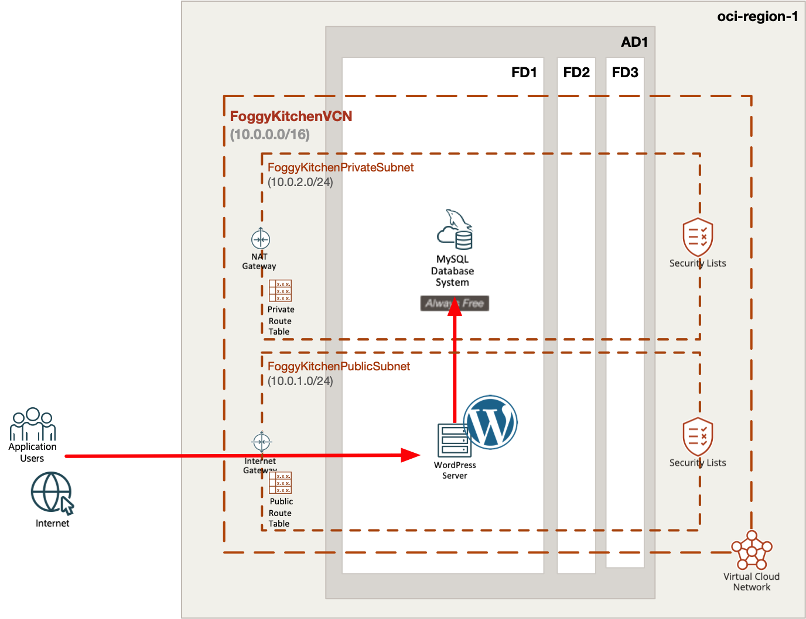
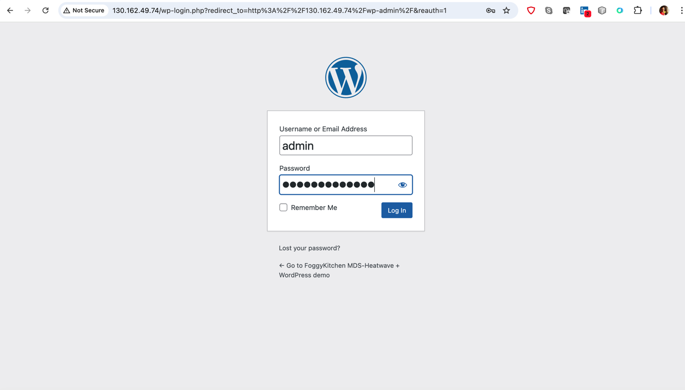

# FoggyKitchen OCI MySQL Heatwave with Terraform 

## LESSON 4 - Creating Free Tier MySQL Database Service with WordPress CMS

In this lesson, we'll delve into the creation of a **Free Tier MySQL Database Service** in Oracle Cloud Infrastructure, combined with the deployment of **WordPress CMS** using a **Terraform module**, focusing on setting up a scalable MySQL instance to power a WordPress website while utilizing free tier resources.



## Deploy Using Oracle Resource Manager

1. Click [](https://cloud.oracle.com/resourcemanager/stacks/create?region=home&zipUrl=https://github.com/mlinxfeld/terraform-oci-fk-heatwave/releases/latest/download/terraform-oci-fk-heatwave-lesson4.zip)

    If you aren't already signed in, when prompted, enter the tenancy and user credentials.

2. Review and accept the terms and conditions.

3. Select the region where you want to deploy the stack.

4. Follow the on-screen prompts and instructions to create the stack.

5. After creating the stack, click **Terraform Actions**, and select **Plan**.

6. Wait for the job to be completed, and review the plan.

    To make any changes, return to the Stack Details page, click **Edit Stack**, and make the required changes. Then, run the **Plan** action again.

7. If no further changes are necessary, return to the Stack Details page, click **Terraform Actions**, and select **Apply**. 

## Deploy Using the Terraform CLI 

### Clone of the repo 

Now, you'll want a local copy of this repo. You can make that with the commands:
Clone the repo from github by executing the command as follows and then go to proper subdirectory:

```
mlinxfeld@Martins-MacBook-Pro github % git clone https://github.com/mlinxfeld/terraform-oci-fk-heatwave.git

mlinxfeld@Martins-MacBook-Pro github % cd terraform-oci-fk-heatwave

mlinxfeld@Martins-MacBook-Pro terraform-oci-fk-heatwave % cd training/lesson4_free_tier_mds_with_wordpress/
```

### Prerequisites
Create environment file with terraform.tfvars file starting with example file:

```
mlinxfeld@Martins-MacBook-Pro lesson4_free_tier_mds_with_wordpress % cp terraform.tfvars.example terraform.tfvars

mlinxfeld@Martins-MacBook-Pro lesson4_free_tier_mds_with_wordpress % vi terraform.tfvars

tenancy_ocid            = "ocid1.tenancy.oc1..<your_tenancy_ocid>"
compartment_ocid        = "ocid1.compartment.oc1..<your_comparment_ocid>"
fingerprint             = "<fingerprint>"
private_key_path        = "<private_key_path>"
region                  = "<region>"
mds_availability_domain = "<ad_name>"
mds_compartment_ocid    = "<compartment_ocid>"
mds_admin_password      = "<mds_admin_password>" # MySQL Database Service ADMIN password
mds_wp_password         = "<mds_wp_password>"    # MySQL Database WP user password
wp_site_admin_pass      = "<wp_site_admin_pass>" # WordPress ADMIN User password
```

### Initialize Terraform

Run the following command to initialize Terraform environment:

```
mlinxfeld@Martins-MacBook-Pro lesson4_free_tier_mds_with_wordpress % terraform init 
Initializing the backend...
Initializing modules...
Downloading git::https://github.com/mlinxfeld/terraform-oci-fk-heatwave.git for oci-fk-free-mds...
- oci-fk-free-mds in .terraform/modules/oci-fk-free-mds
Downloading git::https://github.com/mlinxfeld/terraform-oci-fk-wordpress.git for oci-fk-wordpress...
- oci-fk-wordpress in .terraform/modules/oci-fk-wordpress
Initializing provider plugins...
- Finding latest version of hashicorp/null...
- Finding latest version of hashicorp/time...
- Finding latest version of hashicorp/template...
- Finding latest version of hashicorp/oci...
- Finding latest version of hashicorp/tls...
- Finding latest version of oracle/oci...
- Installing hashicorp/null v3.2.2...
- Installed hashicorp/null v3.2.2 (signed by HashiCorp)
- Installing hashicorp/time v0.12.0...
- Installed hashicorp/time v0.12.0 (signed by HashiCorp)
- Installing hashicorp/template v2.2.0...
- Installed hashicorp/template v2.2.0 (signed by HashiCorp)
- Installing hashicorp/oci v6.9.0...
- Installed hashicorp/oci v6.9.0 (signed by HashiCorp)
- Installing hashicorp/tls v4.0.5...
- Installed hashicorp/tls v4.0.5 (signed by HashiCorp)
- Installing oracle/oci v6.9.0...
- Installed oracle/oci v6.9.0 (signed by a HashiCorp partner, key ID 1533A49284137CEB)
Partner and community providers are signed by their developers.
If you'd like to know more about provider signing, you can read about it here:
https://www.terraform.io/docs/cli/plugins/signing.html
Terraform has created a lock file .terraform.lock.hcl to record the provider
selections it made above. Include this file in your version control repository
so that Terraform can guarantee to make the same selections by default when
you run "terraform init" in the future.

You may now begin working with Terraform. Try running "terraform plan" to see
any changes that are required for your infrastructure. All Terraform commands
should now work.

If you ever set or change modules or backend configuration for Terraform,
rerun this command to reinitialize your working directory. If you forget, other
commands will detect it and remind you to do so if necessary.
```

### Apply the changes 

Run the following command for applying changes with the proposed plan:

```
mlinxfeld@Martins-MacBook-Pro lesson4_free_tier_mds_with_wordpress % terraform apply                

(...)

  + mds_database              = {
      + mds_id         = (known after apply)
      + mds_ip_address = (known after apply)
      + mds_port       = (known after apply)
      + mds_port_x     = (known after apply)
    }
  + wordpress_home_URL        = (known after apply)
  + wordpress_wp-admin_URL    = (known after apply)

Do you want to perform these actions?
  Terraform will perform the actions described above.
  Only 'yes' will be accepted to approve.

  Enter a value: yes

tls_private_key.public_private_key_pair: Creating...
module.oci-fk-wordpress.tls_private_key.public_private_key_pair: Creating...
oci_core_vcn.FoggyKitchenVCN: Creating...
module.oci-fk-wordpress.tls_private_key.public_private_key_pair: Creation complete after 0s [id=308724a821d71c35c237000dc44f48d97bcde9e9]
module.oci-fk-wordpress.data.template_file.key_script: Reading...
module.oci-fk-wordpress.data.template_file.key_script: Read complete after 0s [id=09095ec63d214c89604a8d0619bea44000aec2b5ccaddcb642044e553c6ff3b9]
module.oci-fk-wordpress.data.template_cloudinit_config.cloud_init: Reading...
module.oci-fk-wordpress.data.template_cloudinit_config.cloud_init: Read complete after 1s [id=2367172653]
tls_private_key.public_private_key_pair: Creation complete after 1s [id=c7dcecd676eefa5ce5367b17ca30660865eb77ec]
oci_core_vcn.FoggyKitchenVCN: Creation complete after 1s [id=ocid1.vcn.oc1.eu-frankfurt-1.amaaaaaadngk4gia3qa4x2ilba636egzi3pgdvfwibpgwvvfhl2kfpgeexxq]
oci_core_nat_gateway.FoggyKitchenNATGateway: Creating...
oci_core_internet_gateway.FoggyKitchenInternetGateway: Creating...
oci_core_security_list.FoggyKitchenMDSSecurityList: Creating...
oci_core_security_list.FoggyKitchenBastionSecurityList: Creating...
oci_core_security_list.FoggyKitchenMDSSecurityList: Creation complete after 1s [id=ocid1.securitylist.oc1.eu-frankfurt-1.aaaaaaaavtf57foiesmq3wbnnvei6won3d2pnmq6bxo5xww6vb3744fpb3gq]
oci_core_security_list.FoggyKitchenBastionSecurityList: Creation complete after 1s [id=ocid1.securitylist.oc1.eu-frankfurt-1.aaaaaaaae7aaac7ib4k65ziob2brmsseokkxfcdtpks7ln2hvaedztt3i7eq]
oci_core_subnet.FoggyKitchenPrivateSubnet: Creating...
oci_core_subnet.FoggyKitchenPublicSubnet: Creating...
oci_core_internet_gateway.FoggyKitchenInternetGateway: Creation complete after 1s [id=ocid1.internetgateway.oc1.eu-frankfurt-1.aaaaaaaaxg7j2gh4mh6pr7a6vwkxqxjo4rbmaib2wm4nda5lkafzytljzwsa]
oci_core_route_table.FoggyKitchenPublicRouteTable: Creating...
oci_core_nat_gateway.FoggyKitchenNATGateway: Creation complete after 1s [id=ocid1.natgateway.oc1.eu-frankfurt-1.aaaaaaaaakpwrfdo6rsnrwik4bzglwkezgatcquttxvekspsmcdkgibrtypq]
oci_core_route_table.FoggyKitchenPrivateRouteTable: Creating...
oci_core_route_table.FoggyKitchenPublicRouteTable: Creation complete after 0s [id=ocid1.routetable.oc1.eu-frankfurt-1.aaaaaaaae3gris6bshcvn4zgomb66qw5clyk4abh7gljx4dr3jn4wrr5zqka]
oci_core_route_table.FoggyKitchenPrivateRouteTable: Creation complete after 1s [id=ocid1.routetable.oc1.eu-frankfurt-1.aaaaaaaazeoqlluzvytwpfql57oyrmxp2fsfkuvdukaipazfzmcoezsbklkq]
oci_core_subnet.FoggyKitchenPrivateSubnet: Creation complete after 4s [id=ocid1.subnet.oc1.eu-frankfurt-1.aaaaaaaagcdun42p6w5zgbryag7ok6jlkvlxgynoqtk7z22mzozmjwtqxkqa]
oci_core_route_table_attachment.FoggyKitchenPrivateSubnetRouteTableAttachment: Creating...
module.oci-fk-free-mds.oci_mysql_mysql_db_system.FoggyKitchenMDS[0]: Creating...
oci_core_subnet.FoggyKitchenPublicSubnet: Creation complete after 4s [id=ocid1.subnet.oc1.eu-frankfurt-1.aaaaaaaafko4v3fjbrsjf5qugobo233i5sywbiqxcl54lv6qoupf5sq2txza]
oci_core_route_table_attachment.FoggyKitchenPublicSubnetRouteTableAttachment: Creating...
module.oci-fk-wordpress.oci_core_instance.WordPress: Creating...
oci_core_route_table_attachment.FoggyKitchenPrivateSubnetRouteTableAttachment: Creation complete after 0s [id=ocid1.subnet.oc1.eu-frankfurt-1.aaaaaaaagcdun42p6w5zgbryag7ok6jlkvlxgynoqtk7z22mzozmjwtqxkqa/ocid1.routetable.oc1.eu-frankfurt-1.aaaaaaaazeoqlluzvytwpfql57oyrmxp2fsfkuvdukaipazfzmcoezsbklkq]
oci_core_route_table_attachment.FoggyKitchenPublicSubnetRouteTableAttachment: Creation complete after 0s [id=ocid1.subnet.oc1.eu-frankfurt-1.aaaaaaaafko4v3fjbrsjf5qugobo233i5sywbiqxcl54lv6qoupf5sq2txza/ocid1.routetable.oc1.eu-frankfurt-1.aaaaaaaae3gris6bshcvn4zgomb66qw5clyk4abh7gljx4dr3jn4wrr5zqka]
module.oci-fk-free-mds.oci_mysql_mysql_db_system.FoggyKitchenMDS[0]: Still creating... [10s elapsed]
module.oci-fk-wordpress.oci_core_instance.WordPress: Still creating... [10s elapsed]
module.oci-fk-free-mds.oci_mysql_mysql_db_system.FoggyKitchenMDS[0]: Still creating... [20s elapsed]
module.oci-fk-wordpress.oci_core_instance.WordPress: Still creating... [20s elapsed]
module.oci-fk-free-mds.oci_mysql_mysql_db_system.FoggyKitchenMDS[0]: Still creating... [30s elapsed]
module.oci-fk-wordpress.oci_core_instance.WordPress: Still creating... [30s elapsed]
module.oci-fk-free-mds.oci_mysql_mysql_db_system.FoggyKitchenMDS[0]: Still creating... [40s elapsed]
module.oci-fk-wordpress.oci_core_instance.WordPress: Still creating... [40s elapsed]
module.oci-fk-free-mds.oci_mysql_mysql_db_system.FoggyKitchenMDS[0]: Still creating... [50s elapsed]
module.oci-fk-wordpress.oci_core_instance.WordPress: Still creating... [50s elapsed]
module.oci-fk-free-mds.oci_mysql_mysql_db_system.FoggyKitchenMDS[0]: Still creating... [1m0s elapsed]
module.oci-fk-wordpress.oci_core_instance.WordPress: Still creating... [1m0s elapsed]
module.oci-fk-free-mds.oci_mysql_mysql_db_system.FoggyKitchenMDS[0]: Still creating... [1m10s elapsed]
module.oci-fk-wordpress.oci_core_instance.WordPress: Still creating... [1m10s elapsed]
module.oci-fk-free-mds.oci_mysql_mysql_db_system.FoggyKitchenMDS[0]: Still creating... [1m20s elapsed]
module.oci-fk-wordpress.oci_core_instance.WordPress: Still creating... [1m20s elapsed]
module.oci-fk-free-mds.oci_mysql_mysql_db_system.FoggyKitchenMDS[0]: Still creating... [1m30s elapsed]
module.oci-fk-wordpress.oci_core_instance.WordPress: Still creating... [1m30s elapsed]
module.oci-fk-free-mds.oci_mysql_mysql_db_system.FoggyKitchenMDS[0]: Still creating... [1m40s elapsed]
module.oci-fk-wordpress.oci_core_instance.WordPress: Still creating... [1m40s elapsed]
module.oci-fk-free-mds.oci_mysql_mysql_db_system.FoggyKitchenMDS[0]: Still creating... [1m50s elapsed]
module.oci-fk-wordpress.oci_core_instance.WordPress: Still creating... [1m50s elapsed]
module.oci-fk-free-mds.oci_mysql_mysql_db_system.FoggyKitchenMDS[0]: Still creating... [2m0s elapsed]
module.oci-fk-wordpress.oci_core_instance.WordPress: Still creating... [2m0s elapsed]
module.oci-fk-free-mds.oci_mysql_mysql_db_system.FoggyKitchenMDS[0]: Still creating... [2m10s elapsed]
module.oci-fk-wordpress.oci_core_instance.WordPress: Still creating... [2m10s elapsed]
module.oci-fk-wordpress.oci_core_instance.WordPress: Provisioning with 'local-exec'...
module.oci-fk-wordpress.oci_core_instance.WordPress (local-exec): Executing: ["/bin/sh" "-c" "sleep 240"]
module.oci-fk-free-mds.oci_mysql_mysql_db_system.FoggyKitchenMDS[0]: Still creating... [2m20s elapsed]
module.oci-fk-wordpress.oci_core_instance.WordPress: Still creating... [2m20s elapsed]
module.oci-fk-free-mds.oci_mysql_mysql_db_system.FoggyKitchenMDS[0]: Still creating... [2m30s elapsed]
module.oci-fk-wordpress.oci_core_instance.WordPress: Still creating... [2m30s elapsed]
module.oci-fk-free-mds.oci_mysql_mysql_db_system.FoggyKitchenMDS[0]: Still creating... [2m40s elapsed]
module.oci-fk-wordpress.oci_core_instance.WordPress: Still creating... [2m40s elapsed]
module.oci-fk-free-mds.oci_mysql_mysql_db_system.FoggyKitchenMDS[0]: Still creating... [2m50s elapsed]
module.oci-fk-wordpress.oci_core_instance.WordPress: Still creating... [2m50s elapsed]
module.oci-fk-free-mds.oci_mysql_mysql_db_system.FoggyKitchenMDS[0]: Still creating... [3m0s elapsed]
module.oci-fk-wordpress.oci_core_instance.WordPress: Still creating... [3m0s elapsed]
module.oci-fk-free-mds.oci_mysql_mysql_db_system.FoggyKitchenMDS[0]: Still creating... [3m10s elapsed]
module.oci-fk-wordpress.oci_core_instance.WordPress: Still creating... [3m10s elapsed]
module.oci-fk-free-mds.oci_mysql_mysql_db_system.FoggyKitchenMDS[0]: Still creating... [3m20s elapsed]
module.oci-fk-wordpress.oci_core_instance.WordPress: Still creating... [3m20s elapsed]
module.oci-fk-free-mds.oci_mysql_mysql_db_system.FoggyKitchenMDS[0]: Still creating... [3m30s elapsed]
module.oci-fk-wordpress.oci_core_instance.WordPress: Still creating... [3m30s elapsed]
module.oci-fk-free-mds.oci_mysql_mysql_db_system.FoggyKitchenMDS[0]: Still creating... [3m40s elapsed]
module.oci-fk-wordpress.oci_core_instance.WordPress: Still creating... [3m40s elapsed]
module.oci-fk-free-mds.oci_mysql_mysql_db_system.FoggyKitchenMDS[0]: Still creating... [3m50s elapsed]
module.oci-fk-wordpress.oci_core_instance.WordPress: Still creating... [3m50s elapsed]
module.oci-fk-free-mds.oci_mysql_mysql_db_system.FoggyKitchenMDS[0]: Still creating... [4m0s elapsed]
module.oci-fk-wordpress.oci_core_instance.WordPress: Still creating... [4m0s elapsed]
module.oci-fk-free-mds.oci_mysql_mysql_db_system.FoggyKitchenMDS[0]: Still creating... [4m10s elapsed]
module.oci-fk-wordpress.oci_core_instance.WordPress: Still creating... [4m10s elapsed]
module.oci-fk-free-mds.oci_mysql_mysql_db_system.FoggyKitchenMDS[0]: Still creating... [4m20s elapsed]
module.oci-fk-wordpress.oci_core_instance.WordPress: Still creating... [4m20s elapsed]
module.oci-fk-free-mds.oci_mysql_mysql_db_system.FoggyKitchenMDS[0]: Still creating... [4m30s elapsed]
module.oci-fk-wordpress.oci_core_instance.WordPress: Still creating... [4m30s elapsed]
module.oci-fk-free-mds.oci_mysql_mysql_db_system.FoggyKitchenMDS[0]: Still creating... [4m40s elapsed]
module.oci-fk-wordpress.oci_core_instance.WordPress: Still creating... [4m40s elapsed]
module.oci-fk-free-mds.oci_mysql_mysql_db_system.FoggyKitchenMDS[0]: Still creating... [4m50s elapsed]
module.oci-fk-wordpress.oci_core_instance.WordPress: Still creating... [4m50s elapsed]
module.oci-fk-free-mds.oci_mysql_mysql_db_system.FoggyKitchenMDS[0]: Still creating... [5m0s elapsed]
module.oci-fk-wordpress.oci_core_instance.WordPress: Still creating... [5m0s elapsed]
module.oci-fk-free-mds.oci_mysql_mysql_db_system.FoggyKitchenMDS[0]: Still creating... [5m10s elapsed]
module.oci-fk-wordpress.oci_core_instance.WordPress: Still creating... [5m10s elapsed]
module.oci-fk-free-mds.oci_mysql_mysql_db_system.FoggyKitchenMDS[0]: Still creating... [5m20s elapsed]
module.oci-fk-wordpress.oci_core_instance.WordPress: Still creating... [5m20s elapsed]
module.oci-fk-free-mds.oci_mysql_mysql_db_system.FoggyKitchenMDS[0]: Still creating... [5m30s elapsed]
module.oci-fk-wordpress.oci_core_instance.WordPress: Still creating... [5m30s elapsed]
module.oci-fk-free-mds.oci_mysql_mysql_db_system.FoggyKitchenMDS[0]: Still creating... [5m40s elapsed]
module.oci-fk-wordpress.oci_core_instance.WordPress: Still creating... [5m40s elapsed]
module.oci-fk-free-mds.oci_mysql_mysql_db_system.FoggyKitchenMDS[0]: Still creating... [5m50s elapsed]
module.oci-fk-wordpress.oci_core_instance.WordPress: Still creating... [5m50s elapsed]
module.oci-fk-free-mds.oci_mysql_mysql_db_system.FoggyKitchenMDS[0]: Still creating... [6m0s elapsed]
module.oci-fk-wordpress.oci_core_instance.WordPress: Still creating... [6m0s elapsed]
module.oci-fk-free-mds.oci_mysql_mysql_db_system.FoggyKitchenMDS[0]: Still creating... [6m10s elapsed]
module.oci-fk-wordpress.oci_core_instance.WordPress: Still creating... [6m10s elapsed]
module.oci-fk-wordpress.oci_core_instance.WordPress: Creation complete after 6m17s [id=ocid1.instance.oc1.eu-frankfurt-1.antheljtdngk4gicxl5absvmzxd2m5l6yalg5hrs4ezz7dqrislxsgxsvm7a]
module.oci-fk-wordpress.data.oci_core_vnic_attachments.WordPress_vnics: Reading...
module.oci-fk-wordpress.data.oci_core_vnic_attachments.WordPress_vnics: Read complete after 0s [id=CoreVnicAttachmentsDataSource-2235426470]
module.oci-fk-wordpress.data.oci_core_vnic.WordPress_vnic1: Reading...
module.oci-fk-wordpress.data.oci_core_vnic.WordPress_vnic1: Read complete after 1s [id=ocid1.vnic.oc1.eu-frankfurt-1.abtheljts6vrhuidoxgjob3bszhpp5nxxd3ngjpdyb4pkepblok7hwhzleua]
module.oci-fk-wordpress.data.oci_core_private_ips.WordPress_private_ips1: Reading...
module.oci-fk-wordpress.data.oci_core_private_ips.WordPress_private_ips1: Read complete after 0s [id=CorePrivateIpsDataSource-2292487310]
module.oci-fk-wordpress.oci_core_public_ip.WordPress_public_ip_for_single_node[0]: Creating...
module.oci-fk-wordpress.oci_core_public_ip.WordPress_public_ip_for_single_node[0]: Creation complete after 1s [id=ocid1.publicip.oc1.eu-frankfurt-1.amaaaaaadngk4giapupcqfk5jmajqul5md5ohov2qd6h5oyq2ti2peqppgqq]
module.oci-fk-free-mds.oci_mysql_mysql_db_system.FoggyKitchenMDS[0]: Still creating... [6m20s elapsed]
module.oci-fk-free-mds.oci_mysql_mysql_db_system.FoggyKitchenMDS[0]: Still creating... [6m30s elapsed]
module.oci-fk-free-mds.oci_mysql_mysql_db_system.FoggyKitchenMDS[0]: Still creating... [6m40s elapsed]
module.oci-fk-free-mds.oci_mysql_mysql_db_system.FoggyKitchenMDS[0]: Still creating... [6m50s elapsed]
module.oci-fk-free-mds.oci_mysql_mysql_db_system.FoggyKitchenMDS[0]: Still creating... [7m0s elapsed]
module.oci-fk-free-mds.oci_mysql_mysql_db_system.FoggyKitchenMDS[0]: Still creating... [7m10s elapsed]
module.oci-fk-free-mds.oci_mysql_mysql_db_system.FoggyKitchenMDS[0]: Still creating... [7m20s elapsed]
module.oci-fk-free-mds.oci_mysql_mysql_db_system.FoggyKitchenMDS[0]: Still creating... [7m30s elapsed]
module.oci-fk-free-mds.oci_mysql_mysql_db_system.FoggyKitchenMDS[0]: Still creating... [7m40s elapsed]
module.oci-fk-free-mds.oci_mysql_mysql_db_system.FoggyKitchenMDS[0]: Still creating... [7m50s elapsed]
module.oci-fk-free-mds.oci_mysql_mysql_db_system.FoggyKitchenMDS[0]: Still creating... [8m0s elapsed]
module.oci-fk-free-mds.oci_mysql_mysql_db_system.FoggyKitchenMDS[0]: Still creating... [8m10s elapsed]
module.oci-fk-free-mds.oci_mysql_mysql_db_system.FoggyKitchenMDS[0]: Still creating... [8m20s elapsed]
module.oci-fk-free-mds.oci_mysql_mysql_db_system.FoggyKitchenMDS[0]: Still creating... [8m30s elapsed]
module.oci-fk-free-mds.oci_mysql_mysql_db_system.FoggyKitchenMDS[0]: Still creating... [8m40s elapsed]
module.oci-fk-free-mds.oci_mysql_mysql_db_system.FoggyKitchenMDS[0]: Still creating... [8m50s elapsed]
module.oci-fk-free-mds.oci_mysql_mysql_db_system.FoggyKitchenMDS[0]: Still creating... [9m0s elapsed]
module.oci-fk-free-mds.oci_mysql_mysql_db_system.FoggyKitchenMDS[0]: Still creating... [9m10s elapsed]
module.oci-fk-free-mds.oci_mysql_mysql_db_system.FoggyKitchenMDS[0]: Still creating... [9m20s elapsed]
module.oci-fk-free-mds.oci_mysql_mysql_db_system.FoggyKitchenMDS[0]: Still creating... [9m30s elapsed]
module.oci-fk-free-mds.oci_mysql_mysql_db_system.FoggyKitchenMDS[0]: Still creating... [9m40s elapsed]
module.oci-fk-free-mds.oci_mysql_mysql_db_system.FoggyKitchenMDS[0]: Still creating... [9m50s elapsed]
module.oci-fk-free-mds.oci_mysql_mysql_db_system.FoggyKitchenMDS[0]: Still creating... [10m0s elapsed]
module.oci-fk-free-mds.oci_mysql_mysql_db_system.FoggyKitchenMDS[0]: Still creating... [10m10s elapsed]
module.oci-fk-free-mds.oci_mysql_mysql_db_system.FoggyKitchenMDS[0]: Still creating... [10m20s elapsed]
module.oci-fk-free-mds.oci_mysql_mysql_db_system.FoggyKitchenMDS[0]: Still creating... [10m30s elapsed]
module.oci-fk-free-mds.oci_mysql_mysql_db_system.FoggyKitchenMDS[0]: Still creating... [10m40s elapsed]
module.oci-fk-free-mds.oci_mysql_mysql_db_system.FoggyKitchenMDS[0]: Still creating... [10m50s elapsed]
module.oci-fk-free-mds.oci_mysql_mysql_db_system.FoggyKitchenMDS[0]: Creation complete after 10m54s [id=ocid1.mysqldbsystem.oc1.eu-frankfurt-1.aaaaaaaaz6fruuxp3oil4jvpnc75ggrv27gq32pbwbigcm25z5lkvvleeaqa]
module.oci-fk-wordpress.data.template_file.create_wp_db: Reading...
module.oci-fk-wordpress.data.template_file.setup_wp: Reading...
module.oci-fk-wordpress.data.template_file.create_wp_db: Read complete after 0s [id=d990c84ffc3c259cbffb1dd6d464f1f7d2e15c5135197ce49529a34af188182e]
module.oci-fk-wordpress.data.template_file.setup_wp: Read complete after 0s [id=e9071e6260721dd4c2228cf855073cf344eb5480725eea5a4fab2dd25e5a7ad0]
module.oci-fk-wordpress.null_resource.WordPress_provisioner_without_bastion[0]: Creating...
module.oci-fk-wordpress.null_resource.WordPress_provisioner_without_bastion[0]: Provisioning with 'file'...
module.oci-fk-wordpress.null_resource.WordPress_provisioner_without_bastion[0]: Provisioning with 'file'...
module.oci-fk-wordpress.null_resource.WordPress_provisioner_without_bastion[0]: Provisioning with 'file'...
module.oci-fk-wordpress.null_resource.WordPress_provisioner_without_bastion[0]: Provisioning with 'file'...
module.oci-fk-wordpress.null_resource.WordPress_provisioner_without_bastion[0]: Provisioning with 'file'...
module.oci-fk-wordpress.null_resource.WordPress_provisioner_without_bastion[0]: Provisioning with 'remote-exec'...
module.oci-fk-wordpress.null_resource.WordPress_provisioner_without_bastion[0] (remote-exec): Connecting to remote host via SSH...
module.oci-fk-wordpress.null_resource.WordPress_provisioner_without_bastion[0] (remote-exec):   Host: 130.162.49.74
module.oci-fk-wordpress.null_resource.WordPress_provisioner_without_bastion[0] (remote-exec):   User: opc
module.oci-fk-wordpress.null_resource.WordPress_provisioner_without_bastion[0] (remote-exec):   Password: false
module.oci-fk-wordpress.null_resource.WordPress_provisioner_without_bastion[0] (remote-exec):   Private key: true
module.oci-fk-wordpress.null_resource.WordPress_provisioner_without_bastion[0] (remote-exec):   Certificate: false
module.oci-fk-wordpress.null_resource.WordPress_provisioner_without_bastion[0] (remote-exec):   SSH Agent: false
module.oci-fk-wordpress.null_resource.WordPress_provisioner_without_bastion[0] (remote-exec):   Checking Host Key: false
module.oci-fk-wordpress.null_resource.WordPress_provisioner_without_bastion[0] (remote-exec):   Target Platform: unix
module.oci-fk-wordpress.null_resource.WordPress_provisioner_without_bastion[0] (remote-exec): Connected!
module.oci-fk-wordpress.null_resource.WordPress_provisioner_without_bastion[0] (remote-exec): Detected aarch64 architecture...
module.oci-fk-wordpress.null_resource.WordPress_provisioner_without_bastion[0] (remote-exec): epel-release-latest-8 skipped.
module.oci-fk-wordpress.null_resource.WordPress_provisioner_without_bastion[0] (remote-exec): remi-release-8 skipped.
module.oci-fk-wordpress.null_resource.WordPress_provisioner_without_bastion[0] (remote-exec): Retrieving https://dev.mysql.com/get/mysql80-community-release-el8-1.noarch.rpm
module.oci-fk-wordpress.null_resource.WordPress_provisioner_without_bastion[0] (remote-exec): warning: /var/tmp/rpm-tmp.9dhYBd: Header V3 DSA/SHA1 Signature, key ID 5072e1f5: NOKEY
module.oci-fk-wordpress.null_resource.WordPress_provisioner_without_bastion[0] (remote-exec): Verifying...                           ################################# [100%]
module.oci-fk-wordpress.null_resource.WordPress_provisioner_without_bastion[0] (remote-exec): Preparing...                           ################################# [100%]
module.oci-fk-wordpress.null_resource.WordPress_provisioner_without_bastion[0] (remote-exec): Updating / installing...
module.oci-fk-wordpress.null_resource.WordPress_provisioner_without_bastion[0] (remote-exec):    1:mysql80-community-release-el8-1   ################################# [100%]
module.oci-fk-wordpress.null_resource.WordPress_provisioner_without_bastion[0]: Still creating... [10s elapsed]
module.oci-fk-wordpress.null_resource.WordPress_provisioner_without_bastion[0] (remote-exec): Ksplice ---  B/s |   0  B     --:-- ETA
module.oci-fk-wordpress.null_resource.WordPress_provisioner_without_bastion[0] (remote-exec): Ksplice  18 MB/s | 4.0 MB     00:00
module.oci-fk-wordpress.null_resource.WordPress_provisioner_without_bastion[0] (remote-exec): MySQL 8 ---  B/s |   0  B     --:-- ETA
module.oci-fk-wordpress.null_resource.WordPress_provisioner_without_bastion[0] (remote-exec): MySQL 8  24 MB/s | 4.0 MB     00:00
module.oci-fk-wordpress.null_resource.WordPress_provisioner_without_bastion[0] (remote-exec): MySQL C ---  B/s |   0  B     --:-- ETA
module.oci-fk-wordpress.null_resource.WordPress_provisioner_without_bastion[0] (remote-exec): MySQL C 1.8 MB/s | 134 kB     00:00
module.oci-fk-wordpress.null_resource.WordPress_provisioner_without_bastion[0] (remote-exec): MySQL T ---  B/s |   0  B     --:-- ETA
module.oci-fk-wordpress.null_resource.WordPress_provisioner_without_bastion[0] (remote-exec): MySQL T 8.1 MB/s | 940 kB     00:00
module.oci-fk-wordpress.null_resource.WordPress_provisioner_without_bastion[0] (remote-exec): MySQL 8 ---  B/s |   0  B     --:-- ETA
module.oci-fk-wordpress.null_resource.WordPress_provisioner_without_bastion[0] (remote-exec): MySQL 8  30 MB/s | 4.0 MB     00:00
module.oci-fk-wordpress.null_resource.WordPress_provisioner_without_bastion[0] (remote-exec): MySQL 8 ---  B/s |   0  B     --:-- ETA
module.oci-fk-wordpress.null_resource.WordPress_provisioner_without_bastion[0] (remote-exec): MySQL 8 7.8 MB/s | 670 kB     00:00
module.oci-fk-wordpress.null_resource.WordPress_provisioner_without_bastion[0] (remote-exec): MySQL 8 ---  B/s |   0  B     --:-- ETA
module.oci-fk-wordpress.null_resource.WordPress_provisioner_without_bastion[0] (remote-exec): MySQL 8 131 kB/s |  34 kB     00:00
module.oci-fk-wordpress.null_resource.WordPress_provisioner_without_bastion[0] (remote-exec): Oracle  ---  B/s |   0  B     --:-- ETA
module.oci-fk-wordpress.null_resource.WordPress_provisioner_without_bastion[0] (remote-exec): Oracle   52 MB/s |  16 MB     00:02 ETA
module.oci-fk-wordpress.null_resource.WordPress_provisioner_without_bastion[0] (remote-exec): Oracle   57 MB/s |  55 MB     00:01 ETA
module.oci-fk-wordpress.null_resource.WordPress_provisioner_without_bastion[0] (remote-exec): Oracle   62 MB/s |  95 MB     00:00 ETA
module.oci-fk-wordpress.null_resource.WordPress_provisioner_without_bastion[0] (remote-exec): Oracle   66 MB/s | 135 MB     00:00 ETA
module.oci-fk-wordpress.null_resource.WordPress_provisioner_without_bastion[0]: Still creating... [20s elapsed]
module.oci-fk-wordpress.null_resource.WordPress_provisioner_without_bastion[0] (remote-exec): Oracle   56 MB/s | 143 MB     00:02
module.oci-fk-wordpress.null_resource.WordPress_provisioner_without_bastion[0]: Still creating... [30s elapsed]
module.oci-fk-wordpress.null_resource.WordPress_provisioner_without_bastion[0]: Still creating... [40s elapsed]
(...)
module.oci-fk-wordpress.null_resource.WordPress_provisioner_without_bastion[0] (remote-exec): wp-cli installed, wp config, user, plugin theme executed.
module.oci-fk-wordpress.null_resource.WordPress_provisioner_without_bastion[0]: Creation complete after 4m26s [id=5505206021869545593]

Apply complete! Resources: 17 added, 0 changed, 0 destroyed.

Outputs:

generated_ssh_private_key = <sensitive>
mds_database = {
  "mds_id" = "ocid1.mysqldbsystem.oc1.eu-frankfurt-1.aaaaaaaaz6fruuxp3oil4jvpnc75ggrv27gq32pbwbigcm25z5lkvvleeaqa"
  "mds_ip_address" = "10.0.2.105"
  "mds_port" = "3306"
  "mds_port_x" = "33060"
}
wordpress_home_URL = "http://130.162.49.74/"
wordpress_wp-admin_URL = "http://130.162.49.74/wp-admin/"
```

### Access WordPress Admin Console

1. Pickup `wordpress_wp-admin_URL` output and access WP Admin Login Webpage:


2. After successful login navigate in WP Admin Console:



### Destroy the changes 

Run the following command for destroying all resources:

```
mlinxfeld@Martins-MacBook-Pro lesson4_free_tier_mds_with_wordpress  % terraform destroy

module.oci-fk-wordpress.data.template_file.install_php: Reading...
module.oci-fk-wordpress.data.template_file.configure_local_security: Reading...
module.oci-fk-wordpress.data.template_file.configure_local_security: Read complete after 0s [id=1a12ae7ded6a3aae9c5fdb1d0afdd9f26d8dcfeef8f0d1df561b223c528cea49]
module.oci-fk-wordpress.data.template_file.install_php: Read complete after 0s [id=ef1b66bc167d00329f739ec5c72c644ae47b8bc8c0daed7eeaf8a003a9e798a7]
tls_private_key.public_private_key_pair: Refreshing state... [id=c7dcecd676eefa5ce5367b17ca30660865eb77ec]
module.oci-fk-wordpress.tls_private_key.public_private_key_pair: Refreshing state... [id=308724a821d71c35c237000dc44f48d97bcde9e9]
module.oci-fk-wordpress.data.template_file.key_script: Reading...
module.oci-fk-wordpress.data.template_file.key_script: Read complete after 0s [id=09095ec63d214c89604a8d0619bea44000aec2b5ccaddcb642044e553c6ff3b9]
module.oci-fk-wordpress.data.template_cloudinit_config.cloud_init: Reading...
module.oci-fk-wordpress.data.template_cloudinit_config.cloud_init: Read complete after 0s [id=2367172653]
module.oci-fk-wordpress.data.oci_identity_availability_domains.ADs: Reading...
data.oci_identity_availability_domains.ADs: Reading...
data.oci_core_images.OSImage: Reading...
oci_core_vcn.FoggyKitchenVCN: Refreshing state... [id=ocid1.vcn.oc1.eu-frankfurt-1.amaaaaaadngk4gia3qa4x2ilba636egzi3pgdvfwibpgwvvfhl2kfpgeexxq]
data.oci_identity_availability_domains.ADs: Read complete after 0s [id=IdentityAvailabilityDomainsDataSource-3596290162]
module.oci-fk-wordpress.data.oci_identity_availability_domains.ADs: Read complete after 1s [id=IdentityAvailabilityDomainsDataSource-3596290162]
data.oci_core_images.OSImage: Read complete after 0s [id=CoreImagesDataSource-2160886926]
oci_core_internet_gateway.FoggyKitchenInternetGateway: Refreshing state... [id=ocid1.internetgateway.oc1.eu-frankfurt-1.aaaaaaaaxg7j2gh4mh6pr7a6vwkxqxjo4rbmaib2wm4nda5lkafzytljzwsa]
oci_core_nat_gateway.FoggyKitchenNATGateway: Refreshing state... [id=ocid1.natgateway.oc1.eu-frankfurt-1.aaaaaaaaakpwrfdo6rsnrwik4bzglwkezgatcquttxvekspsmcdkgibrtypq]
module.oci-fk-wordpress.data.template_file.setup_fss: Reading...
module.oci-fk-wordpress.data.template_file.setup_fss: Read complete after 0s [id=b6f61c3704edeab68b32efaa24271e3ca32dc9e8ad09670e61d08e27099e07e8]
oci_core_security_list.FoggyKitchenMDSSecurityList: Refreshing state... [id=ocid1.securitylist.oc1.eu-frankfurt-1.aaaaaaaavtf57foiesmq3wbnnvei6won3d2pnmq6bxo5xww6vb3744fpb3gq]
oci_core_security_list.FoggyKitchenBastionSecurityList: Refreshing state... [id=ocid1.securitylist.oc1.eu-frankfurt-1.aaaaaaaae7aaac7ib4k65ziob2brmsseokkxfcdtpks7ln2hvaedztt3i7eq]
oci_core_route_table.FoggyKitchenPrivateRouteTable: Refreshing state... [id=ocid1.routetable.oc1.eu-frankfurt-1.aaaaaaaazeoqlluzvytwpfql57oyrmxp2fsfkuvdukaipazfzmcoezsbklkq]
oci_core_route_table.FoggyKitchenPublicRouteTable: Refreshing state... [id=ocid1.routetable.oc1.eu-frankfurt-1.aaaaaaaae3gris6bshcvn4zgomb66qw5clyk4abh7gljx4dr3jn4wrr5zqka]
oci_core_subnet.FoggyKitchenPublicSubnet: Refreshing state... [id=ocid1.subnet.oc1.eu-frankfurt-1.aaaaaaaafko4v3fjbrsjf5qugobo233i5sywbiqxcl54lv6qoupf5sq2txza]
oci_core_subnet.FoggyKitchenPrivateSubnet: Refreshing state... [id=ocid1.subnet.oc1.eu-frankfurt-1.aaaaaaaagcdun42p6w5zgbryag7ok6jlkvlxgynoqtk7z22mzozmjwtqxkqa]
oci_core_route_table_attachment.FoggyKitchenPrivateSubnetRouteTableAttachment: Refreshing state... [id=ocid1.subnet.oc1.eu-frankfurt-1.aaaaaaaagcdun42p6w5zgbryag7ok6jlkvlxgynoqtk7z22mzozmjwtqxkqa/ocid1.routetable.oc1.eu-frankfurt-1.aaaaaaaazeoqlluzvytwpfql57oyrmxp2fsfkuvdukaipazfzmcoezsbklkq]
module.oci-fk-free-mds.oci_mysql_mysql_db_system.FoggyKitchenMDS[0]: Refreshing state... [id=ocid1.mysqldbsystem.oc1.eu-frankfurt-1.aaaaaaaaz6fruuxp3oil4jvpnc75ggrv27gq32pbwbigcm25z5lkvvleeaqa]
oci_core_route_table_attachment.FoggyKitchenPublicSubnetRouteTableAttachment: Refreshing state... [id=ocid1.subnet.oc1.eu-frankfurt-1.aaaaaaaafko4v3fjbrsjf5qugobo233i5sywbiqxcl54lv6qoupf5sq2txza/ocid1.routetable.oc1.eu-frankfurt-1.aaaaaaaae3gris6bshcvn4zgomb66qw5clyk4abh7gljx4dr3jn4wrr5zqka]
module.oci-fk-wordpress.oci_core_instance.WordPress: Refreshing state... [id=ocid1.instance.oc1.eu-frankfurt-1.antheljtdngk4gicxl5absvmzxd2m5l6yalg5hrs4ezz7dqrislxsgxsvm7a]
module.oci-fk-wordpress.data.template_file.create_wp_db: Reading...
module.oci-fk-wordpress.data.template_file.create_wp_db: Read complete after 0s [id=d990c84ffc3c259cbffb1dd6d464f1f7d2e15c5135197ce49529a34af188182e]
module.oci-fk-wordpress.data.oci_core_vnic_attachments.WordPress_vnics: Reading...
module.oci-fk-wordpress.data.oci_core_vnic_attachments.WordPress_vnics: Read complete after 0s [id=CoreVnicAttachmentsDataSource-2235426470]
module.oci-fk-wordpress.data.oci_core_vnic.WordPress_vnic1: Reading...
module.oci-fk-wordpress.data.oci_core_vnic.WordPress_vnic1: Read complete after 0s [id=ocid1.vnic.oc1.eu-frankfurt-1.abtheljts6vrhuidoxgjob3bszhpp5nxxd3ngjpdyb4pkepblok7hwhzleua]
module.oci-fk-wordpress.data.oci_core_private_ips.WordPress_private_ips1: Reading...
module.oci-fk-wordpress.data.oci_core_private_ips.WordPress_private_ips1: Read complete after 1s [id=CorePrivateIpsDataSource-2292487310]
module.oci-fk-wordpress.oci_core_public_ip.WordPress_public_ip_for_single_node[0]: Refreshing state... [id=ocid1.publicip.oc1.eu-frankfurt-1.amaaaaaadngk4giapupcqfk5jmajqul5md5ohov2qd6h5oyq2ti2peqppgqq]
module.oci-fk-wordpress.data.template_file.setup_wp: Reading...
module.oci-fk-wordpress.data.template_file.setup_wp: Read complete after 0s [id=e9071e6260721dd4c2228cf855073cf344eb5480725eea5a4fab2dd25e5a7ad0]
module.oci-fk-wordpress.null_resource.WordPress_provisioner_without_bastion[0]: Refreshing state... [id=5505206021869545593]

Terraform used the selected providers to generate the following execution plan. Resource actions are indicated with the following
symbols:
  - destroy

Terraform will perform the following actions:

  # oci_core_internet_gateway.FoggyKitchenInternetGateway will be destroyed
  - resource "oci_core_internet_gateway" "FoggyKitchenInternetGateway" {
      - compartment_id = "ocid1.compartment.oc1..aaaaaaaaiyy4srmrb32v5rlniicwmpxsytywiucgbcp5ext6e4ahjfuloewa" -> null
      - defined_tags   = {} -> null
      - display_name   = "FoggyKitchenInternetGateway" -> null
      - enabled        = true -> null
      - freeform_tags  = {} -> null
      - id             = "ocid1.internetgateway.oc1.eu-frankfurt-1.aaaaaaaaxg7j2gh4mh6pr7a6vwkxqxjo4rbmaib2wm4nda5lkafzytljzwsa" -> null
      - state          = "AVAILABLE" -> null
      - time_created   = "2024-09-09 11:08:54.705 +0000 UTC" -> null
      - vcn_id         = "ocid1.vcn.oc1.eu-frankfurt-1.amaaaaaadngk4gia3qa4x2ilba636egzi3pgdvfwibpgwvvfhl2kfpgeexxq" -> null
    }

  # oci_core_nat_gateway.FoggyKitchenNATGateway will be destroyed
  - resource "oci_core_nat_gateway" "FoggyKitchenNATGateway" {
      - block_traffic  = false -> null
      - compartment_id = "ocid1.compartment.oc1..aaaaaaaaiyy4srmrb32v5rlniicwmpxsytywiucgbcp5ext6e4ahjfuloewa" -> null
      - defined_tags   = {} -> null
      - display_name   = "FoggyKitchenNATGateway" -> null
      - freeform_tags  = {} -> null
      - id             = "ocid1.natgateway.oc1.eu-frankfurt-1.aaaaaaaaakpwrfdo6rsnrwik4bzglwkezgatcquttxvekspsmcdkgibrtypq" -> null
      - nat_ip         = "132.145.224.41" -> null
      - public_ip_id   = "ocid1.publicip.oc1.eu-frankfurt-1.aaaaaaaawqhcm6at5gxvm5sa6n4diloggxpgrv7zgwqzlylhj6wdfzr7lx7q" -> null
      - state          = "AVAILABLE" -> null
      - time_created   = "2024-09-09 11:08:54.706 +0000 UTC" -> null
      - vcn_id         = "ocid1.vcn.oc1.eu-frankfurt-1.amaaaaaadngk4gia3qa4x2ilba636egzi3pgdvfwibpgwvvfhl2kfpgeexxq" -> null
    }

  # oci_core_route_table.FoggyKitchenPrivateRouteTable will be destroyed
  - resource "oci_core_route_table" "FoggyKitchenPrivateRouteTable" {
      - compartment_id = "ocid1.compartment.oc1..aaaaaaaaiyy4srmrb32v5rlniicwmpxsytywiucgbcp5ext6e4ahjfuloewa" -> null
      - defined_tags   = {} -> null
      - display_name   = "FoggyKitchenPrivateRouteTable" -> null
      - freeform_tags  = {} -> null
      - id             = "ocid1.routetable.oc1.eu-frankfurt-1.aaaaaaaazeoqlluzvytwpfql57oyrmxp2fsfkuvdukaipazfzmcoezsbklkq" -> null
      - state          = "AVAILABLE" -> null
      - time_created   = "2024-09-09 11:08:55.563 +0000 UTC" -> null
      - vcn_id         = "ocid1.vcn.oc1.eu-frankfurt-1.amaaaaaadngk4gia3qa4x2ilba636egzi3pgdvfwibpgwvvfhl2kfpgeexxq" -> null

      - route_rules {
          - destination       = "0.0.0.0/0" -> null
          - destination_type  = "CIDR_BLOCK" -> null
          - network_entity_id = "ocid1.natgateway.oc1.eu-frankfurt-1.aaaaaaaaakpwrfdo6rsnrwik4bzglwkezgatcquttxvekspsmcdkgibrtypq" -> null
            # (3 unchanged attributes hidden)
        }
    }

  # oci_core_route_table.FoggyKitchenPublicRouteTable will be destroyed
  - resource "oci_core_route_table" "FoggyKitchenPublicRouteTable" {
      - compartment_id = "ocid1.compartment.oc1..aaaaaaaaiyy4srmrb32v5rlniicwmpxsytywiucgbcp5ext6e4ahjfuloewa" -> null
      - defined_tags   = {} -> null
      - display_name   = "FoggyKitchenPublicRouteTable" -> null
      - freeform_tags  = {} -> null
      - id             = "ocid1.routetable.oc1.eu-frankfurt-1.aaaaaaaae3gris6bshcvn4zgomb66qw5clyk4abh7gljx4dr3jn4wrr5zqka" -> null
      - state          = "AVAILABLE" -> null
      - time_created   = "2024-09-09 11:08:55.266 +0000 UTC" -> null
      - vcn_id         = "ocid1.vcn.oc1.eu-frankfurt-1.amaaaaaadngk4gia3qa4x2ilba636egzi3pgdvfwibpgwvvfhl2kfpgeexxq" -> null

      - route_rules {
          - destination       = "0.0.0.0/0" -> null
          - destination_type  = "CIDR_BLOCK" -> null
          - network_entity_id = "ocid1.internetgateway.oc1.eu-frankfurt-1.aaaaaaaaxg7j2gh4mh6pr7a6vwkxqxjo4rbmaib2wm4nda5lkafzytljzwsa" -> null
            # (3 unchanged attributes hidden)
        }
    }

  # oci_core_route_table_attachment.FoggyKitchenPrivateSubnetRouteTableAttachment will be destroyed
  - resource "oci_core_route_table_attachment" "FoggyKitchenPrivateSubnetRouteTableAttachment" {
      - id             = "ocid1.subnet.oc1.eu-frankfurt-1.aaaaaaaagcdun42p6w5zgbryag7ok6jlkvlxgynoqtk7z22mzozmjwtqxkqa/ocid1.routetable.oc1.eu-frankfurt-1.aaaaaaaazeoqlluzvytwpfql57oyrmxp2fsfkuvdukaipazfzmcoezsbklkq" -> null
      - route_table_id = "ocid1.routetable.oc1.eu-frankfurt-1.aaaaaaaazeoqlluzvytwpfql57oyrmxp2fsfkuvdukaipazfzmcoezsbklkq" -> null
      - subnet_id      = "ocid1.subnet.oc1.eu-frankfurt-1.aaaaaaaagcdun42p6w5zgbryag7ok6jlkvlxgynoqtk7z22mzozmjwtqxkqa" -> null
    }

  # oci_core_route_table_attachment.FoggyKitchenPublicSubnetRouteTableAttachment will be destroyed
  - resource "oci_core_route_table_attachment" "FoggyKitchenPublicSubnetRouteTableAttachment" {
      - id             = "ocid1.subnet.oc1.eu-frankfurt-1.aaaaaaaafko4v3fjbrsjf5qugobo233i5sywbiqxcl54lv6qoupf5sq2txza/ocid1.routetable.oc1.eu-frankfurt-1.aaaaaaaae3gris6bshcvn4zgomb66qw5clyk4abh7gljx4dr3jn4wrr5zqka" -> null
      - route_table_id = "ocid1.routetable.oc1.eu-frankfurt-1.aaaaaaaae3gris6bshcvn4zgomb66qw5clyk4abh7gljx4dr3jn4wrr5zqka" -> null
      - subnet_id      = "ocid1.subnet.oc1.eu-frankfurt-1.aaaaaaaafko4v3fjbrsjf5qugobo233i5sywbiqxcl54lv6qoupf5sq2txza" -> null
    }

  # oci_core_security_list.FoggyKitchenBastionSecurityList will be destroyed
  - resource "oci_core_security_list" "FoggyKitchenBastionSecurityList" {
      - compartment_id = "ocid1.compartment.oc1..aaaaaaaaiyy4srmrb32v5rlniicwmpxsytywiucgbcp5ext6e4ahjfuloewa" -> null
      - defined_tags   = {} -> null
      - display_name   = "FoggyKitchenBastionSecurityList" -> null
      - freeform_tags  = {} -> null
      - id             = "ocid1.securitylist.oc1.eu-frankfurt-1.aaaaaaaae7aaac7ib4k65ziob2brmsseokkxfcdtpks7ln2hvaedztt3i7eq" -> null
      - state          = "AVAILABLE" -> null
      - time_created   = "2024-09-09 11:08:54.694 +0000 UTC" -> null
      - vcn_id         = "ocid1.vcn.oc1.eu-frankfurt-1.amaaaaaadngk4gia3qa4x2ilba636egzi3pgdvfwibpgwvvfhl2kfpgeexxq" -> null

      - egress_security_rules {
          - destination      = "0.0.0.0/0" -> null
          - destination_type = "CIDR_BLOCK" -> null
          - protocol         = "all" -> null
          - stateless        = false -> null
            # (1 unchanged attribute hidden)
        }

      - ingress_security_rules {
          - protocol    = "6" -> null
          - source      = "0.0.0.0/0" -> null
          - source_type = "CIDR_BLOCK" -> null
          - stateless   = false -> null
            # (1 unchanged attribute hidden)

          - tcp_options {
              - max = 22 -> null
              - min = 22 -> null
            }
        }
      - ingress_security_rules {
          - protocol    = "6" -> null
          - source      = "0.0.0.0/0" -> null
          - source_type = "CIDR_BLOCK" -> null
          - stateless   = false -> null
            # (1 unchanged attribute hidden)

          - tcp_options {
              - max = 443 -> null
              - min = 443 -> null
            }
        }
      - ingress_security_rules {
          - protocol    = "6" -> null
          - source      = "0.0.0.0/0" -> null
          - source_type = "CIDR_BLOCK" -> null
          - stateless   = false -> null
            # (1 unchanged attribute hidden)

          - tcp_options {
              - max = 80 -> null
              - min = 80 -> null
            }
        }
    }

  # oci_core_security_list.FoggyKitchenMDSSecurityList will be destroyed
  - resource "oci_core_security_list" "FoggyKitchenMDSSecurityList" {
      - compartment_id = "ocid1.compartment.oc1..aaaaaaaaiyy4srmrb32v5rlniicwmpxsytywiucgbcp5ext6e4ahjfuloewa" -> null
      - defined_tags   = {} -> null
      - display_name   = "FoggyKitchenMDSSecurityList" -> null
      - freeform_tags  = {} -> null
      - id             = "ocid1.securitylist.oc1.eu-frankfurt-1.aaaaaaaavtf57foiesmq3wbnnvei6won3d2pnmq6bxo5xww6vb3744fpb3gq" -> null
      - state          = "AVAILABLE" -> null
      - time_created   = "2024-09-09 11:08:54.715 +0000 UTC" -> null
      - vcn_id         = "ocid1.vcn.oc1.eu-frankfurt-1.amaaaaaadngk4gia3qa4x2ilba636egzi3pgdvfwibpgwvvfhl2kfpgeexxq" -> null

      - egress_security_rules {
          - destination      = "0.0.0.0/0" -> null
          - destination_type = "CIDR_BLOCK" -> null
          - protocol         = "all" -> null
          - stateless        = false -> null
            # (1 unchanged attribute hidden)
        }

      - ingress_security_rules {
          - protocol    = "6" -> null
          - source      = "0.0.0.0/0" -> null
          - source_type = "CIDR_BLOCK" -> null
          - stateless   = false -> null
            # (1 unchanged attribute hidden)

          - tcp_options {
              - max = 33060 -> null
              - min = 33060 -> null
            }
        }
      - ingress_security_rules {
          - protocol    = "6" -> null
          - source      = "0.0.0.0/0" -> null
          - source_type = "CIDR_BLOCK" -> null
          - stateless   = false -> null
            # (1 unchanged attribute hidden)

          - tcp_options {
              - max = 3306 -> null
              - min = 3306 -> null
            }
        }
    }

  # oci_core_subnet.FoggyKitchenPrivateSubnet will be destroyed
  - resource "oci_core_subnet" "FoggyKitchenPrivateSubnet" {
      - cidr_block                 = "10.0.2.0/24" -> null
      - compartment_id             = "ocid1.compartment.oc1..aaaaaaaaiyy4srmrb32v5rlniicwmpxsytywiucgbcp5ext6e4ahjfuloewa" -> null
      - defined_tags               = {} -> null
      - dhcp_options_id            = "ocid1.dhcpoptions.oc1.eu-frankfurt-1.aaaaaaaawlmdl4e2m7csxj7n6zng5cvnmprkjmtfn6el7dhlz6blcruijawq" -> null
      - display_name               = "FoggyKitchenPrivateSubnet" -> null
      - dns_label                  = "mdssub" -> null
      - freeform_tags              = {} -> null
      - id                         = "ocid1.subnet.oc1.eu-frankfurt-1.aaaaaaaagcdun42p6w5zgbryag7ok6jlkvlxgynoqtk7z22mzozmjwtqxkqa" -> null
      - ipv6cidr_blocks            = [] -> null
      - prohibit_internet_ingress  = true -> null
      - prohibit_public_ip_on_vnic = true -> null
      - route_table_id             = "ocid1.routetable.oc1.eu-frankfurt-1.aaaaaaaazeoqlluzvytwpfql57oyrmxp2fsfkuvdukaipazfzmcoezsbklkq" -> null
      - security_list_ids          = [
          - "ocid1.securitylist.oc1.eu-frankfurt-1.aaaaaaaavtf57foiesmq3wbnnvei6won3d2pnmq6bxo5xww6vb3744fpb3gq",
        ] -> null
      - state                      = "AVAILABLE" -> null
      - subnet_domain_name         = "mdssub.wpmds.oraclevcn.com" -> null
      - time_created               = "2024-09-09 11:08:55.066 +0000 UTC" -> null
      - vcn_id                     = "ocid1.vcn.oc1.eu-frankfurt-1.amaaaaaadngk4gia3qa4x2ilba636egzi3pgdvfwibpgwvvfhl2kfpgeexxq" -> null
      - virtual_router_ip          = "10.0.2.1" -> null
      - virtual_router_mac         = "00:00:17:45:46:B5" -> null
    }

  # oci_core_subnet.FoggyKitchenPublicSubnet will be destroyed
  - resource "oci_core_subnet" "FoggyKitchenPublicSubnet" {
      - cidr_block                 = "10.0.1.0/24" -> null
      - compartment_id             = "ocid1.compartment.oc1..aaaaaaaaiyy4srmrb32v5rlniicwmpxsytywiucgbcp5ext6e4ahjfuloewa" -> null
      - defined_tags               = {} -> null
      - dhcp_options_id            = "ocid1.dhcpoptions.oc1.eu-frankfurt-1.aaaaaaaawlmdl4e2m7csxj7n6zng5cvnmprkjmtfn6el7dhlz6blcruijawq" -> null
      - display_name               = "FoggyKitchenPublicSubnet" -> null
      - dns_label                  = "wpsub" -> null
      - freeform_tags              = {} -> null
      - id                         = "ocid1.subnet.oc1.eu-frankfurt-1.aaaaaaaafko4v3fjbrsjf5qugobo233i5sywbiqxcl54lv6qoupf5sq2txza" -> null
      - ipv6cidr_blocks            = [] -> null
      - prohibit_internet_ingress  = false -> null
      - prohibit_public_ip_on_vnic = false -> null
      - route_table_id             = "ocid1.routetable.oc1.eu-frankfurt-1.aaaaaaaae3gris6bshcvn4zgomb66qw5clyk4abh7gljx4dr3jn4wrr5zqka" -> null
      - security_list_ids          = [
          - "ocid1.securitylist.oc1.eu-frankfurt-1.aaaaaaaae7aaac7ib4k65ziob2brmsseokkxfcdtpks7ln2hvaedztt3i7eq",
        ] -> null
      - state                      = "AVAILABLE" -> null
      - subnet_domain_name         = "wpsub.wpmds.oraclevcn.com" -> null
      - time_created               = "2024-09-09 11:08:55.352 +0000 UTC" -> null
      - vcn_id                     = "ocid1.vcn.oc1.eu-frankfurt-1.amaaaaaadngk4gia3qa4x2ilba636egzi3pgdvfwibpgwvvfhl2kfpgeexxq" -> null
      - virtual_router_ip          = "10.0.1.1" -> null
      - virtual_router_mac         = "00:00:17:45:46:B5" -> null
    }

  # oci_core_vcn.FoggyKitchenVCN will be destroyed
  - resource "oci_core_vcn" "FoggyKitchenVCN" {
      - byoipv6cidr_blocks       = [] -> null
      - cidr_block               = "10.0.0.0/16" -> null
      - cidr_blocks              = [
          - "10.0.0.0/16",
        ] -> null
      - compartment_id           = "ocid1.compartment.oc1..aaaaaaaaiyy4srmrb32v5rlniicwmpxsytywiucgbcp5ext6e4ahjfuloewa" -> null
      - default_dhcp_options_id  = "ocid1.dhcpoptions.oc1.eu-frankfurt-1.aaaaaaaawlmdl4e2m7csxj7n6zng5cvnmprkjmtfn6el7dhlz6blcruijawq" -> null
      - default_route_table_id   = "ocid1.routetable.oc1.eu-frankfurt-1.aaaaaaaau6bgp5t4xwnvepvnh7za5rfyrcxluqru6lqw73ein2f5oe6pchxa" -> null
      - default_security_list_id = "ocid1.securitylist.oc1.eu-frankfurt-1.aaaaaaaarzk3q2qiz4hntpi2s3k3shl3ldkub4il7mlytzqlq6ykin2kibuq" -> null
      - defined_tags             = {} -> null
      - display_name             = "FoggyKitchenMDSVCN" -> null
      - dns_label                = "wpmds" -> null
      - freeform_tags            = {} -> null
      - id                       = "ocid1.vcn.oc1.eu-frankfurt-1.amaaaaaadngk4gia3qa4x2ilba636egzi3pgdvfwibpgwvvfhl2kfpgeexxq" -> null
      - ipv6cidr_blocks          = [] -> null
      - ipv6private_cidr_blocks  = [] -> null
      - is_ipv6enabled           = false -> null
      - state                    = "AVAILABLE" -> null
      - time_created             = "2024-09-09 11:08:53.888 +0000 UTC" -> null
      - vcn_domain_name          = "wpmds.oraclevcn.com" -> null
    }

  # tls_private_key.public_private_key_pair will be destroyed
  - resource "tls_private_key" "public_private_key_pair" {
      - algorithm                     = "RSA" -> null
      - ecdsa_curve                   = "P224" -> null
      - id                            = "c7dcecd676eefa5ce5367b17ca30660865eb77ec" -> null
      - private_key_openssh           = (sensitive value) -> null
      - private_key_pem               = (sensitive value) -> null
      - private_key_pem_pkcs8         = (sensitive value) -> null
      - public_key_fingerprint_md5    = "7f:e7:b8:ae:aa:1c:d2:cf:ae:00:50:c0:f6:ee:54:63" -> null
      - public_key_fingerprint_sha256 = "SHA256:p9YUBHgxxT/cwwA7yz+ARkDZlF1kIw5AU536fuckMdI" -> null
      - public_key_openssh            = <<-EOT
            ssh-rsa AAAAB3NzaC1yc2EAAAADAQABAAABAQCfKeSLmH2Iy1kzFLZ/gEolMLfiFD7qhkQg4hmiOFEOqftyDnDaJWJv8rGFFuXF2GEPh1S/gKSzsqdcsXu553NIWFCriPPmJy5Kx6N8psWaFdmBLPaIeRg7E8lm/k4DZo9UFWvt9rUPi1/YYrxEeYrcRzRO9ktKD1bSmP832UwVxKnPyOYC72c7gcAA61lQxALubjCRlN9BMFJHbSgcximGqS7seBrOXNE/2dGsi1rOT2oU2XD2vR3rvCONJCFlog+t6NBmkKbt5fTMPLHMn/SWj/H1DpTuaxMdRFUA83/cvNSkelrslJMpHqSiOt4hoPgVlMq0wAuAz6Jwn0IR5vgF
        EOT -> null
      - public_key_pem                = <<-EOT
            -----BEGIN PUBLIC KEY-----
            MIIBIjANBgkqhkiG9w0BAQEFAAOCAQ8AMIIBCgKCAQEAnynki5h9iMtZMxS2f4BK
            JTC34hQ+6oZEIOIZojhRDqn7cg5w2iVib/KxhRblxdhhD4dUv4Cks7KnXLF7uedz
            SFhQq4jz5icuSsejfKbFmhXZgSz2iHkYOxPJZv5OA2aPVBVr7fa1D4tf2GK8RHmK
            3Ec0TvZLSg9W0pj/N9lMFcSpz8jmAu9nO4HAAOtZUMQC7m4wkZTfQTBSR20oHMYp
            hqku7HgazlzRP9nRrItazk9qFNlw9r0d67wjjSQhZaIPrejQZpCm7eX0zDyxzJ/0
            lo/x9Q6U7msTHURVAPN/3LzUpHpa7JSTKR6kojreIaD4FZTKtMALgM+icJ9CEeb4
            BQIDAQAB
            -----END PUBLIC KEY-----
        EOT -> null
      - rsa_bits                      = 2048 -> null
    }

  # module.oci-fk-free-mds.oci_mysql_mysql_db_system.FoggyKitchenMDS[0] will be destroyed
  - resource "oci_mysql_mysql_db_system" "FoggyKitchenMDS" {
      - admin_password                 = (sensitive value) -> null
      - admin_username                 = "mysql" -> null
      - availability_domain            = "unja:EU-FRANKFURT-1-AD-3" -> null
      - channels                       = [] -> null
      - compartment_id                 = "ocid1.compartment.oc1..aaaaaaaaiyy4srmrb32v5rlniicwmpxsytywiucgbcp5ext6e4ahjfuloewa" -> null
      - configuration_id               = "ocid1.mysqlconfiguration.oc1..aaaaaaaa5a33g5cxy33cwd2egvmmyhnx5lsf5frueox3mgrnfqabdqdwio7a" -> null
      - crash_recovery                 = "ENABLED" -> null
      - current_placement              = [
          - {
              - availability_domain = "unja:EU-FRANKFURT-1-AD-3"
              - fault_domain        = "FAULT-DOMAIN-3"
            },
        ] -> null
      - data_storage_size_in_gb        = 50 -> null
      - database_management            = "DISABLED" -> null
      - defined_tags                   = {} -> null
      - description                    = "FoggyKitchen Free Tier MySQL/Heatwave Database System" -> null
      - display_name                   = "FoggyKitchenFreeTierMDS" -> null
      - endpoints                      = [
          - {
              - hostname       = "fkmds.mdssub.wpmds.oraclevcn.com"
              - ip_address     = "10.0.2.105"
              - modes          = [
                  - "READ",
                  - "WRITE",
                ]
              - port           = 3306
              - port_x         = 33060
              - resource_id    = "ocid1.mysqldbsystem.oc1.eu-frankfurt-1.aaaaaaaaz6fruuxp3oil4jvpnc75ggrv27gq32pbwbigcm25z5lkvvleeaqa"
              - resource_type  = "DBSYSTEM"
              - status         = "ACTIVE"
                # (1 unchanged attribute hidden)
            },
        ] -> null
      - fault_domain                   = "FAULT-DOMAIN-3" -> null
      - freeform_tags                  = {} -> null
      - heat_wave_cluster              = [] -> null
      - hostname_label                 = "fkmds" -> null
      - id                             = "ocid1.mysqldbsystem.oc1.eu-frankfurt-1.aaaaaaaaz6fruuxp3oil4jvpnc75ggrv27gq32pbwbigcm25z5lkvvleeaqa" -> null
      - ip_address                     = "10.0.2.105" -> null
      - is_heat_wave_cluster_attached  = false -> null
      - is_highly_available            = false -> null
      - mysql_version                  = "9.0.1" -> null
      - point_in_time_recovery_details = [] -> null
      - port                           = 3306 -> null
      - port_x                         = 33060 -> null
      - shape_name                     = "MySQL.Free" -> null
      - state                          = "ACTIVE" -> null
      - subnet_id                      = "ocid1.subnet.oc1.eu-frankfurt-1.aaaaaaaagcdun42p6w5zgbryag7ok6jlkvlxgynoqtk7z22mzozmjwtqxkqa" -> null
      - time_created                   = "2024-09-09 11:08:59.816 +0000 UTC" -> null
      - time_updated                   = "2024-09-09 11:19:52.497 +0000 UTC" -> null
        # (1 unchanged attribute hidden)

      - backup_policy {
          - defined_tags      = {} -> null
          - freeform_tags     = {} -> null
          - is_enabled        = true -> null
          - retention_in_days = 1 -> null
          - window_start_time = "15:07" -> null

          - pitr_policy {
              - is_enabled = false -> null
            }
        }

      - data_storage {
          - allocated_storage_size_in_gbs  = 50 -> null
          - data_storage_size_in_gb        = 50 -> null
          - data_storage_size_limit_in_gbs = 32768 -> null
          - is_auto_expand_storage_enabled = false -> null
          - max_storage_size_in_gbs        = 0 -> null
        }

      - deletion_policy {
          - automatic_backup_retention = "RETAIN" -> null
          - final_backup               = "SKIP_FINAL_BACKUP" -> null
          - is_delete_protected        = false -> null
        }

      - maintenance {
          - window_start_time = "MONDAY 23:59" -> null
        }

      - secure_connections {
          - certificate_generation_type = "SYSTEM" -> null
            # (1 unchanged attribute hidden)
        }

      - source {
          - source_type    = "NONE" -> null
            # (4 unchanged attributes hidden)
        }
    }

  # module.oci-fk-wordpress.null_resource.WordPress_provisioner_without_bastion[0] will be destroyed
  - resource "null_resource" "WordPress_provisioner_without_bastion" {
      - id = "5505206021869545593" -> null
    }

  # module.oci-fk-wordpress.oci_core_instance.WordPress will be destroyed
  - resource "oci_core_instance" "WordPress" {
      - availability_domain         = "unja:EU-FRANKFURT-1-AD-3" -> null
      - boot_volume_id              = "ocid1.bootvolume.oc1.eu-frankfurt-1.abtheljtilawzovijskxzn7knith3pemcelomyuhjytn4w6hkw7qxzz5cm2a" -> null
      - compartment_id              = "ocid1.compartment.oc1..aaaaaaaaiyy4srmrb32v5rlniicwmpxsytywiucgbcp5ext6e4ahjfuloewa" -> null
      - defined_tags                = {} -> null
      - display_name                = "FoggyKitchenWordPress1" -> null
      - extended_metadata           = {} -> null
      - fault_domain                = "FAULT-DOMAIN-1" -> null
      - freeform_tags               = {} -> null
      - hostname_label              = "wordpress" -> null
      - id                          = "ocid1.instance.oc1.eu-frankfurt-1.antheljtdngk4gicxl5absvmzxd2m5l6yalg5hrs4ezz7dqrislxsgxsvm7a" -> null
      - image                       = "ocid1.image.oc1.eu-frankfurt-1.aaaaaaaag6jeiojxtzc7ozuohudl3uysucv7oeixhgclsbgbuks6cr5m53fa" -> null
      - is_cross_numa_node          = false -> null
      - launch_mode                 = "PARAVIRTUALIZED" -> null
      - metadata                    = {
          - "ssh_authorized_keys" = <<-EOT
                ssh-rsa AAAAB3NzaC1yc2EAAAADAQABAAABAQCfKeSLmH2Iy1kzFLZ/gEolMLfiFD7qhkQg4hmiOFEOqftyDnDaJWJv8rGFFuXF2GEPh1S/gKSzsqdcsXu553NIWFCriPPmJy5Kx6N8psWaFdmBLPaIeRg7E8lm/k4DZo9UFWvt9rUPi1/YYrxEeYrcRzRO9ktKD1bSmP832UwVxKnPyOYC72c7gcAA61lQxALubjCRlN9BMFJHbSgcximGqS7seBrOXNE/2dGsi1rOT2oU2XD2vR3rvCONJCFlog+t6NBmkKbt5fTMPLHMn/SWj/H1DpTuaxMdRFUA83/cvNSkelrslJMpHqSiOt4hoPgVlMq0wAuAz6Jwn0IR5vgF
            EOT
          - "user_data"           = "H4sIAAAAAAAA/4SSXW+iTBTH70n8Djw+lwYHXyi2TZuMYN1WBV8QgZvNgGNnEGaAGRT89Js22Wyze9HL/zm/c/JLzrE4k5hJzWsL/KDmdSZpgSoJctrg46Ma85odUdU+dVevq9nU3Ts23IZd5SNpPq4E5exBHfT1jtJRNO0r1FF+77apKLig8pNFUqKE5JjJR/VEM8xQjp+6iDIq+4J0/0x5FWLihCttxhJ+pOz9QTVjKr8An8oSNxI0miA4y0RS0UJ2lBXN8T92//8HYspAjARRlKRQAeE5BrxIQF8IAlAtCa/oDR9/nnErvmn3Y3RWcEK42hWCaJVAKoQQTkfODVmDNhnOPqINN3D6UYYbC7/r+nnJx04VzjwspiFZl+XL7W69CpN6FJuYBzGHI5votST44sWhdZuPDNzKy8mEk9Y8rGm8s9brg1eYdZoZ53mzt695qZMerFuXlo53WKT2DYjxdRZA3b83/IHDdMPgmyZ3Q9t7RWBkgtg29IW4usFJJ+co2i3FfmKV1bIuU6toBvB9Lowrlq1fu2WxnS1G47EIojcXZWZB7Z17ZVCmOR6IjTks3FJua5N4A8Ow9DVe+WmcHsulg4Bj0nGb8vzegemPu1nbsyde1exgsh1eSsADmb7s6Eqn9xEIzxUVhzAPs7WP6okfeOUuOvSof9ou5sMoJLHvp77nbXuXaHFZvSWDt5xVwf4VKF31+fmbUykJ4VemaluVF8l37N9PrGkd5VcAAAD//yMEAp4jAwAA"
        } -> null
      - private_ip                  = "10.0.1.189" -> null
      - public_ip                   = "130.162.49.74" -> null
      - region                      = "eu-frankfurt-1" -> null
      - shape                       = "VM.Standard.A1.Flex" -> null
      - state                       = "RUNNING" -> null
      - subnet_id                   = "ocid1.subnet.oc1.eu-frankfurt-1.aaaaaaaafko4v3fjbrsjf5qugobo233i5sywbiqxcl54lv6qoupf5sq2txza" -> null
      - system_tags                 = {} -> null
      - time_created                = "2024-09-09 11:09:00.099 +0000 UTC" -> null
        # (1 unchanged attribute hidden)

      - agent_config {
          - are_all_plugins_disabled = false -> null
          - is_management_disabled   = false -> null
          - is_monitoring_disabled   = false -> null
        }

      - availability_config {
          - is_live_migration_preferred = false -> null
          - recovery_action             = "RESTORE_INSTANCE" -> null
        }

      - create_vnic_details {
          - assign_ipv6ip             = false -> null
          - assign_private_dns_record = false -> null
          - assign_public_ip          = "false" -> null
          - defined_tags              = {} -> null
          - display_name              = "FoggyKitchenWordPress1" -> null
          - freeform_tags             = {} -> null
          - hostname_label            = "wordpress" -> null
          - nsg_ids                   = [] -> null
          - private_ip                = "10.0.1.189" -> null
          - skip_source_dest_check    = false -> null
          - subnet_id                 = "ocid1.subnet.oc1.eu-frankfurt-1.aaaaaaaafko4v3fjbrsjf5qugobo233i5sywbiqxcl54lv6qoupf5sq2txza" -> null
            # (1 unchanged attribute hidden)
        }

      - instance_options {
          - are_legacy_imds_endpoints_disabled = false -> null
        }

      - launch_options {
          - boot_volume_type                    = "PARAVIRTUALIZED" -> null
          - firmware                            = "UEFI_64" -> null
          - is_consistent_volume_naming_enabled = true -> null
          - is_pv_encryption_in_transit_enabled = false -> null
          - network_type                        = "PARAVIRTUALIZED" -> null
          - remote_data_volume_type             = "PARAVIRTUALIZED" -> null
        }

      - shape_config {
          - gpus                          = 0 -> null
          - local_disks                   = 0 -> null
          - local_disks_total_size_in_gbs = 0 -> null
          - max_vnic_attachments          = 2 -> null
          - memory_in_gbs                 = 4 -> null
          - networking_bandwidth_in_gbps  = 1 -> null
          - nvmes                         = 0 -> null
          - ocpus                         = 1 -> null
          - processor_description         = "3.0 GHz Ampere Altra" -> null
          - vcpus                         = 1 -> null
            # (3 unchanged attributes hidden)
        }

      - source_details {
          - boot_volume_size_in_gbs         = "47" -> null
          - boot_volume_vpus_per_gb         = "10" -> null
          - is_preserve_boot_volume_enabled = false -> null
          - source_id                       = "ocid1.image.oc1.eu-frankfurt-1.aaaaaaaag6jeiojxtzc7ozuohudl3uysucv7oeixhgclsbgbuks6cr5m53fa" -> null
          - source_type                     = "image" -> null
            # (1 unchanged attribute hidden)
        }
    }

  # module.oci-fk-wordpress.oci_core_public_ip.WordPress_public_ip_for_single_node[0] will be destroyed
  - resource "oci_core_public_ip" "WordPress_public_ip_for_single_node" {
      - assigned_entity_id   = "ocid1.privateip.oc1.eu-frankfurt-1.abtheljthuyenop7i2nw5whzith2haukmtkuzazlyvnflv55vkgdjcuxqnba" -> null
      - assigned_entity_type = "PRIVATE_IP" -> null
      - compartment_id       = "ocid1.compartment.oc1..aaaaaaaaiyy4srmrb32v5rlniicwmpxsytywiucgbcp5ext6e4ahjfuloewa" -> null
      - defined_tags         = {} -> null
      - display_name         = "WordPress_public_ip_for_single_node" -> null
      - freeform_tags        = {} -> null
      - id                   = "ocid1.publicip.oc1.eu-frankfurt-1.amaaaaaadngk4giapupcqfk5jmajqul5md5ohov2qd6h5oyq2ti2peqppgqq" -> null
      - ip_address           = "130.162.49.74" -> null
      - lifetime             = "RESERVED" -> null
      - private_ip_id        = "ocid1.privateip.oc1.eu-frankfurt-1.abtheljthuyenop7i2nw5whzith2haukmtkuzazlyvnflv55vkgdjcuxqnba" -> null
      - scope                = "REGION" -> null
      - state                = "ASSIGNED" -> null
      - time_created         = "2024-09-09 11:15:17.057 +0000 UTC" -> null
    }

  # module.oci-fk-wordpress.tls_private_key.public_private_key_pair will be destroyed
  - resource "tls_private_key" "public_private_key_pair" {
      - algorithm                     = "RSA" -> null
      - ecdsa_curve                   = "P224" -> null
      - id                            = "308724a821d71c35c237000dc44f48d97bcde9e9" -> null
      - private_key_openssh           = (sensitive value) -> null
      - private_key_pem               = (sensitive value) -> null
      - private_key_pem_pkcs8         = (sensitive value) -> null
      - public_key_fingerprint_md5    = "52:b7:19:3e:0f:08:c2:c0:ef:81:a0:72:c0:65:da:4d" -> null
      - public_key_fingerprint_sha256 = "SHA256:gVUZjz/dJo4LWrsuIro3J7NCjAZLNQtCNJzWplXwCFo" -> null
      - public_key_openssh            = <<-EOT
            ssh-rsa AAAAB3NzaC1yc2EAAAADAQABAAABAQCeg00kLo4NrYETesBYhPqqFz6PMYcu3b7eoXboA3Dh0uthevTbYCzG35eytvf7A8y7WPibSCPPWTp7ujl5kGxUDwmq0h+AuyOiqNTWKjDz/s4wEXA0V95V1Nn055oQxmOYDTIa/37/bD50KswOXf0hkZZSLsU8CqrLuqjCpx1AgGs5wetyVuOqpREK344sXZJOal7piDSOwnAtjme1sQ72pOqtRu7hT155C0PeMVjbjdqLNa/N7i4yjom9NAjH6Ey+D8TrxSAcR2vq/oXtjFSiM0i9Z/YkrisWYmYlPVau8VXTqSZW+iVfRKG2ZYhbVVjVTTR+vZKvMJc1JmnrXUI/
        EOT -> null
      - public_key_pem                = <<-EOT
            -----BEGIN PUBLIC KEY-----
            MIIBIjANBgkqhkiG9w0BAQEFAAOCAQ8AMIIBCgKCAQEAnoNNJC6ODa2BE3rAWIT6
            qhc+jzGHLt2+3qF26ANw4dLrYXr022Asxt+Xsrb3+wPMu1j4m0gjz1k6e7o5eZBs
            VA8JqtIfgLsjoqjU1iow8/7OMBFwNFfeVdTZ9OeaEMZjmA0yGv9+/2w+dCrMDl39
            IZGWUi7FPAqqy7qowqcdQIBrOcHrclbjqqURCt+OLF2STmpe6Yg0jsJwLY5ntbEO
            9qTqrUbu4U9eeQtD3jFY243aizWvze4uMo6JvTQIx+hMvg/E68UgHEdr6v6F7YxU
            ojNIvWf2JK4rFmJmJT1WrvFV06kmVvolX0ShtmWIW1VY1U00fr2SrzCXNSZp611C
            PwIDAQAB
            -----END PUBLIC KEY-----
        EOT -> null
      - rsa_bits                      = 2048 -> null
    }

Plan: 0 to add, 0 to change, 17 to destroy.

Changes to Outputs:
  - generated_ssh_private_key = (sensitive value) -> null
  - mds_database              = {
      - mds_id         = "ocid1.mysqldbsystem.oc1.eu-frankfurt-1.aaaaaaaaz6fruuxp3oil4jvpnc75ggrv27gq32pbwbigcm25z5lkvvleeaqa"
      - mds_ip_address = "10.0.2.105"
      - mds_port       = "3306"
      - mds_port_x     = "33060"
    } -> null
  - wordpress_home_URL        = "http://130.162.49.74/" -> null
  - wordpress_wp-admin_URL    = "http://130.162.49.74/wp-admin/" -> null

Do you really want to destroy all resources?
  Terraform will destroy all your managed infrastructure, as shown above.
  There is no undo. Only 'yes' will be accepted to confirm.

  Enter a value: yes

module.oci-fk-wordpress.null_resource.WordPress_provisioner_without_bastion[0]: Destroying... [id=5505206021869545593]
module.oci-fk-wordpress.null_resource.WordPress_provisioner_without_bastion[0]: Destruction complete after 0s
module.oci-fk-wordpress.oci_core_public_ip.WordPress_public_ip_for_single_node[0]: Destroying... [id=ocid1.publicip.oc1.eu-frankfurt-1.amaaaaaadngk4giapupcqfk5jmajqul5md5ohov2qd6h5oyq2ti2peqppgqq]
module.oci-fk-free-mds.oci_mysql_mysql_db_system.FoggyKitchenMDS[0]: Destroying... [id=ocid1.mysqldbsystem.oc1.eu-frankfurt-1.aaaaaaaaz6fruuxp3oil4jvpnc75ggrv27gq32pbwbigcm25z5lkvvleeaqa]
oci_core_route_table_attachment.FoggyKitchenPrivateSubnetRouteTableAttachment: Destroying... [id=ocid1.subnet.oc1.eu-frankfurt-1.aaaaaaaagcdun42p6w5zgbryag7ok6jlkvlxgynoqtk7z22mzozmjwtqxkqa/ocid1.routetable.oc1.eu-frankfurt-1.aaaaaaaazeoqlluzvytwpfql57oyrmxp2fsfkuvdukaipazfzmcoezsbklkq]
oci_core_route_table_attachment.FoggyKitchenPublicSubnetRouteTableAttachment: Destroying... [id=ocid1.subnet.oc1.eu-frankfurt-1.aaaaaaaafko4v3fjbrsjf5qugobo233i5sywbiqxcl54lv6qoupf5sq2txza/ocid1.routetable.oc1.eu-frankfurt-1.aaaaaaaae3gris6bshcvn4zgomb66qw5clyk4abh7gljx4dr3jn4wrr5zqka]
oci_core_route_table_attachment.FoggyKitchenPrivateSubnetRouteTableAttachment: Destruction complete after 1s
oci_core_route_table.FoggyKitchenPrivateRouteTable: Destroying... [id=ocid1.routetable.oc1.eu-frankfurt-1.aaaaaaaazeoqlluzvytwpfql57oyrmxp2fsfkuvdukaipazfzmcoezsbklkq]
module.oci-fk-wordpress.oci_core_public_ip.WordPress_public_ip_for_single_node[0]: Destruction complete after 1s
module.oci-fk-wordpress.oci_core_instance.WordPress: Destroying... [id=ocid1.instance.oc1.eu-frankfurt-1.antheljtdngk4gicxl5absvmzxd2m5l6yalg5hrs4ezz7dqrislxsgxsvm7a]
oci_core_route_table_attachment.FoggyKitchenPublicSubnetRouteTableAttachment: Destruction complete after 1s
oci_core_route_table.FoggyKitchenPublicRouteTable: Destroying... [id=ocid1.routetable.oc1.eu-frankfurt-1.aaaaaaaae3gris6bshcvn4zgomb66qw5clyk4abh7gljx4dr3jn4wrr5zqka]
oci_core_route_table.FoggyKitchenPrivateRouteTable: Destruction complete after 1s
oci_core_nat_gateway.FoggyKitchenNATGateway: Destroying... [id=ocid1.natgateway.oc1.eu-frankfurt-1.aaaaaaaaakpwrfdo6rsnrwik4bzglwkezgatcquttxvekspsmcdkgibrtypq]
oci_core_route_table.FoggyKitchenPublicRouteTable: Destruction complete after 1s
oci_core_internet_gateway.FoggyKitchenInternetGateway: Destroying... [id=ocid1.internetgateway.oc1.eu-frankfurt-1.aaaaaaaaxg7j2gh4mh6pr7a6vwkxqxjo4rbmaib2wm4nda5lkafzytljzwsa]
oci_core_internet_gateway.FoggyKitchenInternetGateway: Destruction complete after 0s
oci_core_nat_gateway.FoggyKitchenNATGateway: Destruction complete after 0s
module.oci-fk-free-mds.oci_mysql_mysql_db_system.FoggyKitchenMDS[0]: Still destroying... [id=ocid1.mysqldbsystem.oc1.eu-frankfurt-1....vpnc75ggrv27gq32pbwbigcm25z5lkvvleeaqa, 10s elapsed]
module.oci-fk-wordpress.oci_core_instance.WordPress: Still destroying... [id=ocid1.instance.oc1.eu-frankfurt-1.anthe...vmzxd2m5l6yalg5hrs4ezz7dqrislxsgxsvm7a, 10s elapsed]
module.oci-fk-free-mds.oci_mysql_mysql_db_system.FoggyKitchenMDS[0]: Still destroying... [id=ocid1.mysqldbsystem.oc1.eu-frankfurt-1....vpnc75ggrv27gq32pbwbigcm25z5lkvvleeaqa, 20s elapsed]
module.oci-fk-wordpress.oci_core_instance.WordPress: Still destroying... [id=ocid1.instance.oc1.eu-frankfurt-1.anthe...vmzxd2m5l6yalg5hrs4ezz7dqrislxsgxsvm7a, 20s elapsed]
module.oci-fk-free-mds.oci_mysql_mysql_db_system.FoggyKitchenMDS[0]: Still destroying... [id=ocid1.mysqldbsystem.oc1.eu-frankfurt-1....vpnc75ggrv27gq32pbwbigcm25z5lkvvleeaqa, 30s elapsed]
module.oci-fk-wordpress.oci_core_instance.WordPress: Still destroying... [id=ocid1.instance.oc1.eu-frankfurt-1.anthe...vmzxd2m5l6yalg5hrs4ezz7dqrislxsgxsvm7a, 30s elapsed]
module.oci-fk-free-mds.oci_mysql_mysql_db_system.FoggyKitchenMDS[0]: Still destroying... [id=ocid1.mysqldbsystem.oc1.eu-frankfurt-1....vpnc75ggrv27gq32pbwbigcm25z5lkvvleeaqa, 40s elapsed]
module.oci-fk-wordpress.oci_core_instance.WordPress: Still destroying... [id=ocid1.instance.oc1.eu-frankfurt-1.anthe...vmzxd2m5l6yalg5hrs4ezz7dqrislxsgxsvm7a, 40s elapsed]
module.oci-fk-free-mds.oci_mysql_mysql_db_system.FoggyKitchenMDS[0]: Still destroying... [id=ocid1.mysqldbsystem.oc1.eu-frankfurt-1....vpnc75ggrv27gq32pbwbigcm25z5lkvvleeaqa, 50s elapsed]
module.oci-fk-wordpress.oci_core_instance.WordPress: Still destroying... [id=ocid1.instance.oc1.eu-frankfurt-1.anthe...vmzxd2m5l6yalg5hrs4ezz7dqrislxsgxsvm7a, 50s elapsed]
module.oci-fk-wordpress.oci_core_instance.WordPress: Destruction complete after 55s
oci_core_subnet.FoggyKitchenPublicSubnet: Destroying... [id=ocid1.subnet.oc1.eu-frankfurt-1.aaaaaaaafko4v3fjbrsjf5qugobo233i5sywbiqxcl54lv6qoupf5sq2txza]
module.oci-fk-wordpress.tls_private_key.public_private_key_pair: Destroying... [id=308724a821d71c35c237000dc44f48d97bcde9e9]
tls_private_key.public_private_key_pair: Destroying... [id=c7dcecd676eefa5ce5367b17ca30660865eb77ec]
tls_private_key.public_private_key_pair: Destruction complete after 0s
module.oci-fk-wordpress.tls_private_key.public_private_key_pair: Destruction complete after 0s
oci_core_subnet.FoggyKitchenPublicSubnet: Destruction complete after 1s
oci_core_security_list.FoggyKitchenBastionSecurityList: Destroying... [id=ocid1.securitylist.oc1.eu-frankfurt-1.aaaaaaaae7aaac7ib4k65ziob2brmsseokkxfcdtpks7ln2hvaedztt3i7eq]
oci_core_security_list.FoggyKitchenBastionSecurityList: Destruction complete after 1s
module.oci-fk-free-mds.oci_mysql_mysql_db_system.FoggyKitchenMDS[0]: Still destroying... [id=ocid1.mysqldbsystem.oc1.eu-frankfurt-1....vpnc75ggrv27gq32pbwbigcm25z5lkvvleeaqa, 1m0s elapsed]
module.oci-fk-free-mds.oci_mysql_mysql_db_system.FoggyKitchenMDS[0]: Still destroying... [id=ocid1.mysqldbsystem.oc1.eu-frankfurt-1....vpnc75ggrv27gq32pbwbigcm25z5lkvvleeaqa, 1m10s elapsed]
module.oci-fk-free-mds.oci_mysql_mysql_db_system.FoggyKitchenMDS[0]: Still destroying... [id=ocid1.mysqldbsystem.oc1.eu-frankfurt-1....vpnc75ggrv27gq32pbwbigcm25z5lkvvleeaqa, 1m20s elapsed]
module.oci-fk-free-mds.oci_mysql_mysql_db_system.FoggyKitchenMDS[0]: Still destroying... [id=ocid1.mysqldbsystem.oc1.eu-frankfurt-1....vpnc75ggrv27gq32pbwbigcm25z5lkvvleeaqa, 1m30s elapsed]
module.oci-fk-free-mds.oci_mysql_mysql_db_system.FoggyKitchenMDS[0]: Still destroying... [id=ocid1.mysqldbsystem.oc1.eu-frankfurt-1....vpnc75ggrv27gq32pbwbigcm25z5lkvvleeaqa, 1m40s elapsed]
module.oci-fk-free-mds.oci_mysql_mysql_db_system.FoggyKitchenMDS[0]: Still destroying... [id=ocid1.mysqldbsystem.oc1.eu-frankfurt-1....vpnc75ggrv27gq32pbwbigcm25z5lkvvleeaqa, 1m50s elapsed]
module.oci-fk-free-mds.oci_mysql_mysql_db_system.FoggyKitchenMDS[0]: Still destroying... [id=ocid1.mysqldbsystem.oc1.eu-frankfurt-1....vpnc75ggrv27gq32pbwbigcm25z5lkvvleeaqa, 2m0s elapsed]
module.oci-fk-free-mds.oci_mysql_mysql_db_system.FoggyKitchenMDS[0]: Still destroying... [id=ocid1.mysqldbsystem.oc1.eu-frankfurt-1....vpnc75ggrv27gq32pbwbigcm25z5lkvvleeaqa, 2m10s elapsed]
module.oci-fk-free-mds.oci_mysql_mysql_db_system.FoggyKitchenMDS[0]: Still destroying... [id=ocid1.mysqldbsystem.oc1.eu-frankfurt-1....vpnc75ggrv27gq32pbwbigcm25z5lkvvleeaqa, 2m20s elapsed]
module.oci-fk-free-mds.oci_mysql_mysql_db_system.FoggyKitchenMDS[0]: Still destroying... [id=ocid1.mysqldbsystem.oc1.eu-frankfurt-1....vpnc75ggrv27gq32pbwbigcm25z5lkvvleeaqa, 2m30s elapsed]
module.oci-fk-free-mds.oci_mysql_mysql_db_system.FoggyKitchenMDS[0]: Destruction complete after 2m39s
oci_core_subnet.FoggyKitchenPrivateSubnet: Destroying... [id=ocid1.subnet.oc1.eu-frankfurt-1.aaaaaaaagcdun42p6w5zgbryag7ok6jlkvlxgynoqtk7z22mzozmjwtqxkqa]
oci_core_subnet.FoggyKitchenPrivateSubnet: Destruction complete after 1s
oci_core_security_list.FoggyKitchenMDSSecurityList: Destroying... [id=ocid1.securitylist.oc1.eu-frankfurt-1.aaaaaaaavtf57foiesmq3wbnnvei6won3d2pnmq6bxo5xww6vb3744fpb3gq]
oci_core_security_list.FoggyKitchenMDSSecurityList: Destruction complete after 1s
oci_core_vcn.FoggyKitchenVCN: Destroying... [id=ocid1.vcn.oc1.eu-frankfurt-1.amaaaaaadngk4gia3qa4x2ilba636egzi3pgdvfwibpgwvvfhl2kfpgeexxq]
oci_core_vcn.FoggyKitchenVCN: Destruction complete after 0s

Destroy complete! Resources: 17 destroyed.
```

## Copyright
Copyright (c) 2024 [FoggyKitchen.com](https://foggykitchen.com/)