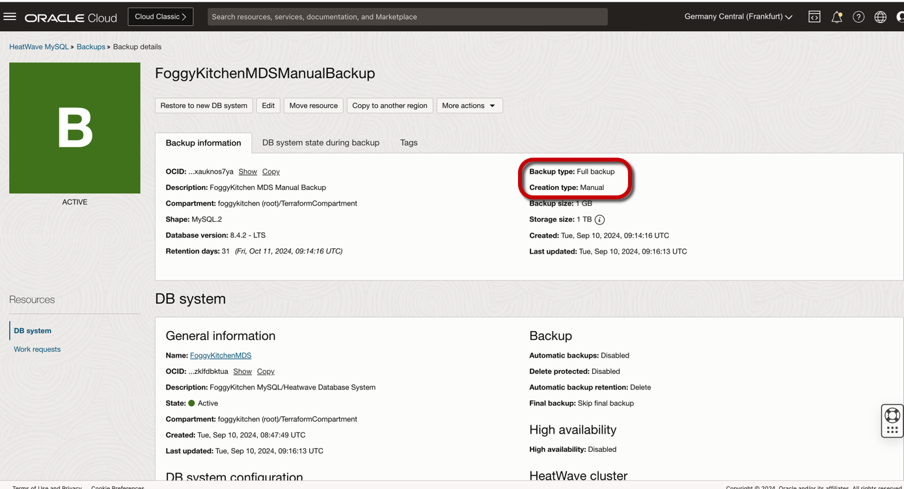
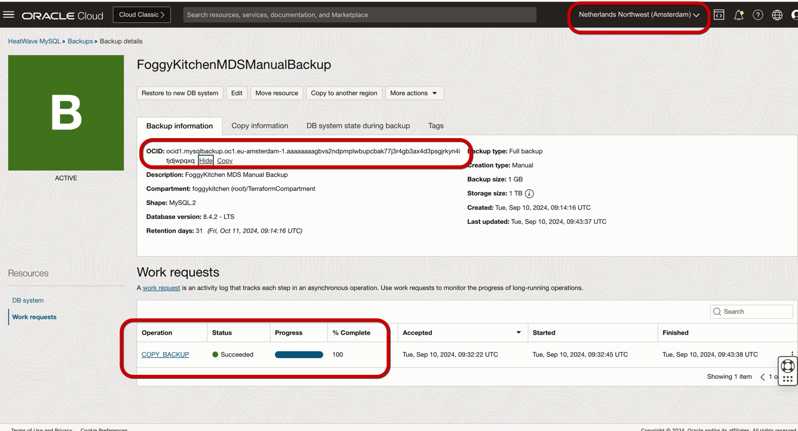

# FoggyKitchen OCI MySQL Heatwave with Terraform 

## LESSON 5 - Creating MySQL Database Service with manual backups and WordPress CMS

In this lesson, we'll delve into the creation of a **MySQL Database Service** in Oracle Cloud Infrastructure with **manual backups** using a **Terraform module**, along with the deployment of **WordPress CMS**, focusing on configuring a reliable backup strategy to ensure data protection and recovery for your WordPress website, with local backups being securely copied to a remote site for **cross-regional backup**.


## Deploy Using Oracle Resource Manager

1. Click [](https://cloud.oracle.com/resourcemanager/stacks/create?region=home&zipUrl=https://github.com/mlinxfeld/terraform-oci-fk-heatwave/releases/latest/download/terraform-oci-fk-heatwave-lesson5.zip)

    If you aren't already signed in, when prompted, enter the tenancy and user credentials.

2. Review and accept the terms and conditions.

3. Select the region where you want to deploy the stack.

4. Follow the on-screen prompts and instructions to create the stack.

5. After creating the stack, click **Terraform Actions**, and select **Plan**.

6. Wait for the job to be completed, and review the plan.

    To make any changes, return to the Stack Details page, click **Edit Stack**, and make the required changes. Then, run the **Plan** action again.

7. If no further changes are necessary, return to the Stack Details page, click **Terraform Actions**, and select **Apply**. 

## Deploy Using the Terraform CLI 

### Clone of the repo 

Now, you'll want a local copy of this repo. You can make that with the commands:
Clone the repo from github by executing the command as follows and then go to proper subdirectory:

```
mlinxfeld@Martins-MacBook-Pro github % git clone https://github.com/mlinxfeld/terraform-oci-fk-heatwave.git

mlinxfeld@Martins-MacBook-Pro github % cd terraform-oci-fk-heatwave

mlinxfeld@Martins-MacBook-Pro terraform-oci-fk-heatwave % cd training/lesson5_mds_manual_backups_with_wordpress/
```

### Prerequisites
Create environment file with terraform.tfvars file starting with example file:

```
mlinxfeld@Martins-MacBook-Pro lesson5_mds_manual_backups_with_wordpress % cp terraform.tfvars.example terraform.tfvars

mlinxfeld@Martins-MacBook-Pro lesson5_mds_manual_backups_with_wordpress % vi terraform.tfvars

tenancy_ocid             = "ocid1.tenancy.oc1..<your_tenancy_ocid>"
compartment_ocid         = "ocid1.compartment.oc1..<your_comparment_ocid>"
fingerprint              = "<fingerprint>"
private_key_path         = "<private_key_path>"
region                   = "<region>"
region2                  = "<region2>"
mds_availability_domain  = "<ad_name>"
mds_availability_domain2 = "<ad_name2>"
mds_compartment_ocid     = "<compartment_ocid>"
mds_admin_password       = "<mds_admin_password>" # MySQL Database Service ADMIN password
mds_wp_password          = "<mds_wp_password>"    # MySQL Database WP user password
wp_site_admin_pass       = "<wp_site_admin_pass>" # WordPress ADMIN User password

mds_manual_backup_enabled              = false
mds_cross_region_manual_backup_enabled = false
mds_cross_region_clone_enabled         = false
```

### Initialize Terraform

Run the following command to initialize Terraform environment:

```
mlinxfeld@Martins-MacBook-Pro lesson5_mds_manual_backups_with_wordpress % terraform init 
Initializing the backend...
Initializing modules...
Downloading git::https://github.com/mlinxfeld/terraform-oci-fk-heatwave.git for oci-fk-mds...
- oci-fk-mds in .terraform/modules/oci-fk-mds
Downloading git::https://github.com/mlinxfeld/terraform-oci-fk-heatwave.git for oci-fk-mds-clone-from-x-region-backup...
- oci-fk-mds-clone-from-x-region-backup in .terraform/modules/oci-fk-mds-clone-from-x-region-backup
Downloading git::https://github.com/mlinxfeld/terraform-oci-fk-wordpress.git for oci-fk-wordpress...
- oci-fk-wordpress in .terraform/modules/oci-fk-wordpress
Downloading git::https://github.com/mlinxfeld/terraform-oci-fk-heatwave.git for oci-fk-x-region-mds-backup...
- oci-fk-x-region-mds-backup in .terraform/modules/oci-fk-x-region-mds-backup
Initializing provider plugins...
- Finding latest version of hashicorp/tls...
- Finding latest version of hashicorp/null...
- Finding latest version of hashicorp/template...
- Finding latest version of hashicorp/time...
- Finding latest version of oracle/oci...
- Installing hashicorp/tls v4.0.5...
- Installed hashicorp/tls v4.0.5 (signed by HashiCorp)
- Installing hashicorp/null v3.2.2...
- Installed hashicorp/null v3.2.2 (signed by HashiCorp)
- Installing hashicorp/template v2.2.0...
- Installed hashicorp/template v2.2.0 (signed by HashiCorp)
- Installing hashicorp/time v0.12.0...
- Installed hashicorp/time v0.12.0 (signed by HashiCorp)
- Installing oracle/oci v6.9.0...
- Installed oracle/oci v6.9.0 (signed by a HashiCorp partner, key ID 1533A49284137CEB)
Partner and community providers are signed by their developers.
If you'd like to know more about provider signing, you can read about it here:
https://www.terraform.io/docs/cli/plugins/signing.html
Terraform has created a lock file .terraform.lock.hcl to record the provider
selections it made above. Include this file in your version control repository
so that Terraform can guarantee to make the same selections by default when
you run "terraform init" in the future.

Terraform has been successfully initialized!

You may now begin working with Terraform. Try running "terraform plan" to see
any changes that are required for your infrastructure. All Terraform commands
should now work.

If you ever set or change modules or backend configuration for Terraform,
rerun this command to reinitialize your working directory. If you forget, other
commands will detect it and remind you to do so if necessary.
```

### Apply the changes 

Run the following command for applying changes with the proposed plan:

```
mlinxfeld@Martins-MacBook-Pro lesson5_mds_manual_backups_with_wordpress % terraform apply                

(...)

  + generated_ssh_private_key = (sensitive value)
  + mds_database              = {
      + mds_id         = (known after apply)
      + mds_ip_address = (known after apply)
      + mds_port       = (known after apply)
      + mds_port_x     = (known after apply)
    }
  + wordpress_home_URL        = (known after apply)
  + wordpress_wp-admin_URL    = (known after apply)

Do you want to perform these actions?
  Terraform will perform the actions described above.
  Only 'yes' will be accepted to approve.

  Enter a value: yes

module.oci-fk-wordpress.tls_private_key.public_private_key_pair: Creating...
tls_private_key.public_private_key_pair: Creating...
oci_core_vcn.FoggyKitchenVCN: Creating...
module.oci-fk-wordpress.tls_private_key.public_private_key_pair: Creation complete after 0s [id=eae72cc57867c79772a5a13948ed38d8761414aa]
module.oci-fk-wordpress.data.template_file.key_script: Reading...
module.oci-fk-wordpress.data.template_file.key_script: Read complete after 0s [id=5324dd1a95a896fed19716a18684f04e56908b838df61fd22e488f2b6173f279]
module.oci-fk-wordpress.data.template_cloudinit_config.cloud_init: Reading...
module.oci-fk-wordpress.data.template_cloudinit_config.cloud_init: Read complete after 0s [id=2698632270]
tls_private_key.public_private_key_pair: Creation complete after 0s [id=de04e254b33a4bcd3f8d7f1999096e53e734c63d]
oci_core_vcn.FoggyKitchenVCN: Creation complete after 1s [id=ocid1.vcn.oc1.eu-frankfurt-1.amaaaaaadngk4giadeowcfokicz7avtsnfm6mtea2g7wtqlpqebnuai4gxza]
oci_core_nat_gateway.FoggyKitchenNATGateway: Creating...
oci_core_internet_gateway.FoggyKitchenInternetGateway: Creating...
oci_core_security_list.FoggyKitchenMDSSecurityList: Creating...
oci_core_security_list.FoggyKitchenBastionSecurityList: Creating...
oci_core_internet_gateway.FoggyKitchenInternetGateway: Creation complete after 0s [id=ocid1.internetgateway.oc1.eu-frankfurt-1.aaaaaaaa3arsre2x7eshmcv3gr7y76b5kuxb4qs5bjpwsgrk5wz2sgl6jv2a]
oci_core_route_table.FoggyKitchenPublicRouteTable: Creating...
oci_core_security_list.FoggyKitchenMDSSecurityList: Creation complete after 0s [id=ocid1.securitylist.oc1.eu-frankfurt-1.aaaaaaaaero3e6mzyyoxnkt2imhd36w6uu7777d2tjgfhhrjbopo7rmhpqda]
oci_core_security_list.FoggyKitchenBastionSecurityList: Creation complete after 0s [id=ocid1.securitylist.oc1.eu-frankfurt-1.aaaaaaaagk4xr75vmmauzaugpu7646ah657lwfk4i6znu7cg6nbz5zp67ula]
oci_core_subnet.FoggyKitchenPrivateSubnet: Creating...
oci_core_subnet.FoggyKitchenPublicSubnet: Creating...
oci_core_route_table.FoggyKitchenPublicRouteTable: Creation complete after 1s [id=ocid1.routetable.oc1.eu-frankfurt-1.aaaaaaaagqqrwgobvgbng24dbswqpkds2wpfa4mvzwl467labfhwnrkfsv6a]
oci_core_nat_gateway.FoggyKitchenNATGateway: Creation complete after 1s [id=ocid1.natgateway.oc1.eu-frankfurt-1.aaaaaaaagc7svdrbwqj5zpeikx5ir7nvejhth7clybhcql32quviihxdayhq]
oci_core_route_table.FoggyKitchenPrivateRouteTable: Creating...
oci_core_route_table.FoggyKitchenPrivateRouteTable: Creation complete after 0s [id=ocid1.routetable.oc1.eu-frankfurt-1.aaaaaaaanmz6zafh5a2sbu25w2nnicbr2uamnfyrnezuo5w2adhj3gqwmasa]
oci_core_subnet.FoggyKitchenPublicSubnet: Creation complete after 3s [id=ocid1.subnet.oc1.eu-frankfurt-1.aaaaaaaasm4j2hcnmsdx6ujema3vkq7cb6m2633vez7dbdjgovkuuyy4pska]
oci_core_route_table_attachment.FoggyKitchenPublicSubnetRouteTableAttachment: Creating...
module.oci-fk-wordpress.oci_core_instance.WordPress: Creating...
oci_core_route_table_attachment.FoggyKitchenPublicSubnetRouteTableAttachment: Creation complete after 0s [id=ocid1.subnet.oc1.eu-frankfurt-1.aaaaaaaasm4j2hcnmsdx6ujema3vkq7cb6m2633vez7dbdjgovkuuyy4pska/ocid1.routetable.oc1.eu-frankfurt-1.aaaaaaaagqqrwgobvgbng24dbswqpkds2wpfa4mvzwl467labfhwnrkfsv6a]
oci_core_subnet.FoggyKitchenPrivateSubnet: Creation complete after 3s [id=ocid1.subnet.oc1.eu-frankfurt-1.aaaaaaaaddvwaplnh6agflfp2t6sz6gyu2fu63k6loxojm5n5bgazirhnyna]
oci_core_route_table_attachment.FoggyKitchenPrivateSubnetRouteTableAttachment: Creating...
module.oci-fk-mds.oci_mysql_mysql_db_system.FoggyKitchenMDS[0]: Creating...
oci_core_route_table_attachment.FoggyKitchenPrivateSubnetRouteTableAttachment: Creation complete after 0s [id=ocid1.subnet.oc1.eu-frankfurt-1.aaaaaaaaddvwaplnh6agflfp2t6sz6gyu2fu63k6loxojm5n5bgazirhnyna/ocid1.routetable.oc1.eu-frankfurt-1.aaaaaaaanmz6zafh5a2sbu25w2nnicbr2uamnfyrnezuo5w2adhj3gqwmasa]
module.oci-fk-wordpress.oci_core_instance.WordPress: Still creating... [10s elapsed]
module.oci-fk-mds.oci_mysql_mysql_db_system.FoggyKitchenMDS[0]: Still creating... [10s elapsed]
module.oci-fk-wordpress.oci_core_instance.WordPress: Still creating... [20s elapsed]
module.oci-fk-mds.oci_mysql_mysql_db_system.FoggyKitchenMDS[0]: Still creating... [20s elapsed]
module.oci-fk-wordpress.oci_core_instance.WordPress: Still creating... [30s elapsed]
module.oci-fk-mds.oci_mysql_mysql_db_system.FoggyKitchenMDS[0]: Still creating... [30s elapsed]
module.oci-fk-wordpress.oci_core_instance.WordPress: Still creating... [40s elapsed]
module.oci-fk-mds.oci_mysql_mysql_db_system.FoggyKitchenMDS[0]: Still creating... [40s elapsed]
module.oci-fk-wordpress.oci_core_instance.WordPress: Still creating... [50s elapsed]
module.oci-fk-mds.oci_mysql_mysql_db_system.FoggyKitchenMDS[0]: Still creating... [50s elapsed]
module.oci-fk-wordpress.oci_core_instance.WordPress: Still creating... [1m0s elapsed]
module.oci-fk-mds.oci_mysql_mysql_db_system.FoggyKitchenMDS[0]: Still creating... [1m0s elapsed]
module.oci-fk-wordpress.oci_core_instance.WordPress: Still creating... [1m10s elapsed]
module.oci-fk-mds.oci_mysql_mysql_db_system.FoggyKitchenMDS[0]: Still creating... [1m10s elapsed]
module.oci-fk-wordpress.oci_core_instance.WordPress: Still creating... [1m20s elapsed]
module.oci-fk-mds.oci_mysql_mysql_db_system.FoggyKitchenMDS[0]: Still creating... [1m20s elapsed]
module.oci-fk-wordpress.oci_core_instance.WordPress: Still creating... [1m30s elapsed]
module.oci-fk-mds.oci_mysql_mysql_db_system.FoggyKitchenMDS[0]: Still creating... [1m30s elapsed]
module.oci-fk-wordpress.oci_core_instance.WordPress: Still creating... [1m40s elapsed]
module.oci-fk-mds.oci_mysql_mysql_db_system.FoggyKitchenMDS[0]: Still creating... [1m40s elapsed]
module.oci-fk-wordpress.oci_core_instance.WordPress: Still creating... [1m50s elapsed]
module.oci-fk-mds.oci_mysql_mysql_db_system.FoggyKitchenMDS[0]: Still creating... [1m50s elapsed]
module.oci-fk-wordpress.oci_core_instance.WordPress: Still creating... [2m0s elapsed]
module.oci-fk-mds.oci_mysql_mysql_db_system.FoggyKitchenMDS[0]: Still creating... [2m0s elapsed]
module.oci-fk-wordpress.oci_core_instance.WordPress: Still creating... [2m10s elapsed]
module.oci-fk-mds.oci_mysql_mysql_db_system.FoggyKitchenMDS[0]: Still creating... [2m10s elapsed]
module.oci-fk-wordpress.oci_core_instance.WordPress: Still creating... [2m20s elapsed]
module.oci-fk-mds.oci_mysql_mysql_db_system.FoggyKitchenMDS[0]: Still creating... [2m20s elapsed]
module.oci-fk-wordpress.oci_core_instance.WordPress: Provisioning with 'local-exec'...
module.oci-fk-wordpress.oci_core_instance.WordPress (local-exec): Executing: ["/bin/sh" "-c" "sleep 240"]
module.oci-fk-wordpress.oci_core_instance.WordPress: Still creating... [2m30s elapsed]
module.oci-fk-mds.oci_mysql_mysql_db_system.FoggyKitchenMDS[0]: Still creating... [2m30s elapsed]
module.oci-fk-wordpress.oci_core_instance.WordPress: Still creating... [2m40s elapsed]
module.oci-fk-mds.oci_mysql_mysql_db_system.FoggyKitchenMDS[0]: Still creating... [2m40s elapsed]
module.oci-fk-wordpress.oci_core_instance.WordPress: Still creating... [2m50s elapsed]
module.oci-fk-mds.oci_mysql_mysql_db_system.FoggyKitchenMDS[0]: Still creating... [2m50s elapsed]
module.oci-fk-wordpress.oci_core_instance.WordPress: Still creating... [3m0s elapsed]
module.oci-fk-mds.oci_mysql_mysql_db_system.FoggyKitchenMDS[0]: Still creating... [3m0s elapsed]
module.oci-fk-wordpress.oci_core_instance.WordPress: Still creating... [3m10s elapsed]
module.oci-fk-mds.oci_mysql_mysql_db_system.FoggyKitchenMDS[0]: Still creating... [3m10s elapsed]
module.oci-fk-wordpress.oci_core_instance.WordPress: Still creating... [3m20s elapsed]
module.oci-fk-mds.oci_mysql_mysql_db_system.FoggyKitchenMDS[0]: Still creating... [3m20s elapsed]
module.oci-fk-wordpress.oci_core_instance.WordPress: Still creating... [3m30s elapsed]
module.oci-fk-mds.oci_mysql_mysql_db_system.FoggyKitchenMDS[0]: Still creating... [3m30s elapsed]
module.oci-fk-wordpress.oci_core_instance.WordPress: Still creating... [3m40s elapsed]
module.oci-fk-mds.oci_mysql_mysql_db_system.FoggyKitchenMDS[0]: Still creating... [3m40s elapsed]
module.oci-fk-wordpress.oci_core_instance.WordPress: Still creating... [3m50s elapsed]
module.oci-fk-mds.oci_mysql_mysql_db_system.FoggyKitchenMDS[0]: Still creating... [3m50s elapsed]
module.oci-fk-wordpress.oci_core_instance.WordPress: Still creating... [4m0s elapsed]
module.oci-fk-mds.oci_mysql_mysql_db_system.FoggyKitchenMDS[0]: Still creating... [4m0s elapsed]
module.oci-fk-wordpress.oci_core_instance.WordPress: Still creating... [4m10s elapsed]
module.oci-fk-mds.oci_mysql_mysql_db_system.FoggyKitchenMDS[0]: Still creating... [4m10s elapsed]
module.oci-fk-wordpress.oci_core_instance.WordPress: Still creating... [4m20s elapsed]
module.oci-fk-mds.oci_mysql_mysql_db_system.FoggyKitchenMDS[0]: Still creating... [4m20s elapsed]
module.oci-fk-wordpress.oci_core_instance.WordPress: Still creating... [4m30s elapsed]
module.oci-fk-mds.oci_mysql_mysql_db_system.FoggyKitchenMDS[0]: Still creating... [4m30s elapsed]
module.oci-fk-wordpress.oci_core_instance.WordPress: Still creating... [4m40s elapsed]
module.oci-fk-mds.oci_mysql_mysql_db_system.FoggyKitchenMDS[0]: Still creating... [4m40s elapsed]
module.oci-fk-wordpress.oci_core_instance.WordPress: Still creating... [4m50s elapsed]
module.oci-fk-mds.oci_mysql_mysql_db_system.FoggyKitchenMDS[0]: Still creating... [4m50s elapsed]
module.oci-fk-wordpress.oci_core_instance.WordPress: Still creating... [5m0s elapsed]
module.oci-fk-mds.oci_mysql_mysql_db_system.FoggyKitchenMDS[0]: Still creating... [5m0s elapsed]
module.oci-fk-wordpress.oci_core_instance.WordPress: Still creating... [5m10s elapsed]
module.oci-fk-mds.oci_mysql_mysql_db_system.FoggyKitchenMDS[0]: Still creating... [5m10s elapsed]
module.oci-fk-wordpress.oci_core_instance.WordPress: Still creating... [5m20s elapsed]
module.oci-fk-mds.oci_mysql_mysql_db_system.FoggyKitchenMDS[0]: Still creating... [5m20s elapsed]
module.oci-fk-wordpress.oci_core_instance.WordPress: Still creating... [5m30s elapsed]
module.oci-fk-mds.oci_mysql_mysql_db_system.FoggyKitchenMDS[0]: Still creating... [5m30s elapsed]
module.oci-fk-wordpress.oci_core_instance.WordPress: Still creating... [5m40s elapsed]
module.oci-fk-mds.oci_mysql_mysql_db_system.FoggyKitchenMDS[0]: Still creating... [5m40s elapsed]
module.oci-fk-wordpress.oci_core_instance.WordPress: Still creating... [5m50s elapsed]
module.oci-fk-mds.oci_mysql_mysql_db_system.FoggyKitchenMDS[0]: Still creating... [5m50s elapsed]
module.oci-fk-wordpress.oci_core_instance.WordPress: Still creating... [6m0s elapsed]
module.oci-fk-mds.oci_mysql_mysql_db_system.FoggyKitchenMDS[0]: Still creating... [6m0s elapsed]
module.oci-fk-wordpress.oci_core_instance.WordPress: Still creating... [6m10s elapsed]
module.oci-fk-mds.oci_mysql_mysql_db_system.FoggyKitchenMDS[0]: Still creating... [6m10s elapsed]
module.oci-fk-wordpress.oci_core_instance.WordPress: Still creating... [6m20s elapsed]
module.oci-fk-mds.oci_mysql_mysql_db_system.FoggyKitchenMDS[0]: Still creating... [6m20s elapsed]
module.oci-fk-wordpress.oci_core_instance.WordPress: Creation complete after 6m27s [id=ocid1.instance.oc1.eu-frankfurt-1.antheljtdngk4gicc6hh3cxeynxa6ffrkrquyrvaigkrcxhczp5plv62ltsa]
module.oci-fk-wordpress.data.oci_core_vnic_attachments.WordPress_vnics: Reading...
module.oci-fk-wordpress.data.oci_core_vnic_attachments.WordPress_vnics: Read complete after 0s [id=CoreVnicAttachmentsDataSource-3600495683]
module.oci-fk-wordpress.data.oci_core_vnic.WordPress_vnic1: Reading...
module.oci-fk-wordpress.data.oci_core_vnic.WordPress_vnic1: Read complete after 0s [id=ocid1.vnic.oc1.eu-frankfurt-1.abtheljtxtnrozo2t7f3744mb54mmycuzgnferkgbb7kjt562kol3chsxqya]
module.oci-fk-wordpress.data.oci_core_private_ips.WordPress_private_ips1: Reading...
module.oci-fk-wordpress.data.oci_core_private_ips.WordPress_private_ips1: Read complete after 1s [id=CorePrivateIpsDataSource-581865994]
module.oci-fk-wordpress.oci_core_public_ip.WordPress_public_ip_for_single_node[0]: Creating...
module.oci-fk-wordpress.oci_core_public_ip.WordPress_public_ip_for_single_node[0]: Creation complete after 0s [id=ocid1.publicip.oc1.eu-frankfurt-1.amaaaaaadngk4giabxcb6czr64o3udltcovekmtiwrbwu7gtzrpoekspybfa]
module.oci-fk-mds.oci_mysql_mysql_db_system.FoggyKitchenMDS[0]: Still creating... [6m30s elapsed]
module.oci-fk-mds.oci_mysql_mysql_db_system.FoggyKitchenMDS[0]: Still creating... [6m40s elapsed]
module.oci-fk-mds.oci_mysql_mysql_db_system.FoggyKitchenMDS[0]: Still creating... [6m50s elapsed]
module.oci-fk-mds.oci_mysql_mysql_db_system.FoggyKitchenMDS[0]: Still creating... [7m0s elapsed]
module.oci-fk-mds.oci_mysql_mysql_db_system.FoggyKitchenMDS[0]: Still creating... [7m10s elapsed]
module.oci-fk-mds.oci_mysql_mysql_db_system.FoggyKitchenMDS[0]: Still creating... [7m20s elapsed]
module.oci-fk-mds.oci_mysql_mysql_db_system.FoggyKitchenMDS[0]: Still creating... [7m30s elapsed]
module.oci-fk-mds.oci_mysql_mysql_db_system.FoggyKitchenMDS[0]: Still creating... [7m40s elapsed]
module.oci-fk-mds.oci_mysql_mysql_db_system.FoggyKitchenMDS[0]: Still creating... [7m50s elapsed]
module.oci-fk-mds.oci_mysql_mysql_db_system.FoggyKitchenMDS[0]: Still creating... [8m0s elapsed]
module.oci-fk-mds.oci_mysql_mysql_db_system.FoggyKitchenMDS[0]: Still creating... [8m10s elapsed]
module.oci-fk-mds.oci_mysql_mysql_db_system.FoggyKitchenMDS[0]: Still creating... [8m20s elapsed]
module.oci-fk-mds.oci_mysql_mysql_db_system.FoggyKitchenMDS[0]: Still creating... [8m30s elapsed]
module.oci-fk-mds.oci_mysql_mysql_db_system.FoggyKitchenMDS[0]: Still creating... [8m40s elapsed]
module.oci-fk-mds.oci_mysql_mysql_db_system.FoggyKitchenMDS[0]: Still creating... [8m50s elapsed]
module.oci-fk-mds.oci_mysql_mysql_db_system.FoggyKitchenMDS[0]: Still creating... [9m0s elapsed]
module.oci-fk-mds.oci_mysql_mysql_db_system.FoggyKitchenMDS[0]: Still creating... [9m10s elapsed]
module.oci-fk-mds.oci_mysql_mysql_db_system.FoggyKitchenMDS[0]: Still creating... [9m20s elapsed]
module.oci-fk-mds.oci_mysql_mysql_db_system.FoggyKitchenMDS[0]: Still creating... [9m30s elapsed]
module.oci-fk-mds.oci_mysql_mysql_db_system.FoggyKitchenMDS[0]: Still creating... [9m40s elapsed]
module.oci-fk-mds.oci_mysql_mysql_db_system.FoggyKitchenMDS[0]: Still creating... [9m50s elapsed]
module.oci-fk-mds.oci_mysql_mysql_db_system.FoggyKitchenMDS[0]: Still creating... [10m0s elapsed]
module.oci-fk-mds.oci_mysql_mysql_db_system.FoggyKitchenMDS[0]: Still creating... [10m10s elapsed]
module.oci-fk-mds.oci_mysql_mysql_db_system.FoggyKitchenMDS[0]: Still creating... [10m20s elapsed]
module.oci-fk-mds.oci_mysql_mysql_db_system.FoggyKitchenMDS[0]: Still creating... [10m30s elapsed]
module.oci-fk-mds.oci_mysql_mysql_db_system.FoggyKitchenMDS[0]: Creation complete after 10m34s [id=ocid1.mysqldbsystem.oc1.eu-frankfurt-1.aaaaaaaaqcwpumg6tutx6duyug5h2rltheo6vbo5ly3xmfenabzklfdbktua]
module.oci-fk-wordpress.data.template_file.create_wp_db: Reading...
module.oci-fk-wordpress.data.template_file.setup_wp: Reading...
module.oci-fk-wordpress.data.template_file.create_wp_db: Read complete after 0s [id=88ca3ff9d39bc29876399ee54062cafe6a3a19238417292381ee0d2f0d9ebadc]
module.oci-fk-wordpress.data.template_file.setup_wp: Read complete after 0s [id=48beb447ecb051114533c845f4a9b621b040744b71842bb2eb8b3545d91e2778]
module.oci-fk-wordpress.null_resource.WordPress_provisioner_without_bastion[0]: Creating...
module.oci-fk-wordpress.null_resource.WordPress_provisioner_without_bastion[0]: Provisioning with 'file'...
module.oci-fk-wordpress.null_resource.WordPress_provisioner_without_bastion[0]: Provisioning with 'file'...
module.oci-fk-wordpress.null_resource.WordPress_provisioner_without_bastion[0]: Provisioning with 'file'...
module.oci-fk-wordpress.null_resource.WordPress_provisioner_without_bastion[0]: Provisioning with 'file'...
module.oci-fk-wordpress.null_resource.WordPress_provisioner_without_bastion[0]: Provisioning with 'file'...
module.oci-fk-wordpress.null_resource.WordPress_provisioner_without_bastion[0]: Provisioning with 'remote-exec'...
module.oci-fk-wordpress.null_resource.WordPress_provisioner_without_bastion[0] (remote-exec): Connecting to remote host via SSH...
module.oci-fk-wordpress.null_resource.WordPress_provisioner_without_bastion[0] (remote-exec):   Host: 141.147.27.91
module.oci-fk-wordpress.null_resource.WordPress_provisioner_without_bastion[0] (remote-exec):   User: opc
module.oci-fk-wordpress.null_resource.WordPress_provisioner_without_bastion[0] (remote-exec):   Password: false
module.oci-fk-wordpress.null_resource.WordPress_provisioner_without_bastion[0] (remote-exec):   Private key: true
module.oci-fk-wordpress.null_resource.WordPress_provisioner_without_bastion[0] (remote-exec):   Certificate: false
module.oci-fk-wordpress.null_resource.WordPress_provisioner_without_bastion[0] (remote-exec):   SSH Agent: false
module.oci-fk-wordpress.null_resource.WordPress_provisioner_without_bastion[0] (remote-exec):   Checking Host Key: false
module.oci-fk-wordpress.null_resource.WordPress_provisioner_without_bastion[0] (remote-exec):   Target Platform: unix
module.oci-fk-wordpress.null_resource.WordPress_provisioner_without_bastion[0] (remote-exec): Connected!
module.oci-fk-wordpress.null_resource.WordPress_provisioner_without_bastion[0] (remote-exec): Detected aarch64 architecture...
module.oci-fk-wordpress.null_resource.WordPress_provisioner_without_bastion[0] (remote-exec): epel-release-latest-8 skipped.
module.oci-fk-wordpress.null_resource.WordPress_provisioner_without_bastion[0] (remote-exec): remi-release-8 skipped.
module.oci-fk-wordpress.null_resource.WordPress_provisioner_without_bastion[0] (remote-exec): Retrieving https://dev.mysql.com/get/mysql80-community-release-el8-1.noarch.rpm
module.oci-fk-wordpress.null_resource.WordPress_provisioner_without_bastion[0] (remote-exec): warning: /var/tmp/rpm-tmp.gxw9a3: Header V3 DSA/SHA1 Signature, key ID 5072e1f5: NOKEY
module.oci-fk-wordpress.null_resource.WordPress_provisioner_without_bastion[0] (remote-exec): Verifying...                           ################################# [100%]
module.oci-fk-wordpress.null_resource.WordPress_provisioner_without_bastion[0] (remote-exec): Preparing...                           ################################# [100%]
module.oci-fk-wordpress.null_resource.WordPress_provisioner_without_bastion[0] (remote-exec): Updating / installing...
(...)
module.oci-fk-wordpress.null_resource.WordPress_provisioner_without_bastion[0] (remote-exec):   Running scriptlet: php-mysqlnd-   1/1
module.oci-fk-wordpress.null_resource.WordPress_provisioner_without_bastion[0] (remote-exec):   Verifying        : php-mysqlnd-   1/1

module.oci-fk-wordpress.null_resource.WordPress_provisioner_without_bastion[0] (remote-exec): Installed:
module.oci-fk-wordpress.null_resource.WordPress_provisioner_without_bastion[0] (remote-exec):   php-mysqlnd-7.4.33-1.module+el8.8.0+20974+ef7eddfa.aarch64

module.oci-fk-wordpress.null_resource.WordPress_provisioner_without_bastion[0] (remote-exec): Complete!
module.oci-fk-wordpress.null_resource.WordPress_provisioner_without_bastion[0] (remote-exec): Last metadata expiration check: 0:01:15 ago on Tue 10 Sep 2024 09:00:05 AM GMT.
module.oci-fk-wordpress.null_resource.WordPress_provisioner_without_bastion[0]: Still creating... [3m0s elapsed]
module.oci-fk-wordpress.null_resource.WordPress_provisioner_without_bastion[0] (remote-exec): Dependencies resolved.
module.oci-fk-wordpress.null_resource.WordPress_provisioner_without_bastion[0] (remote-exec): ========================================
module.oci-fk-wordpress.null_resource.WordPress_provisioner_without_bastion[0] (remote-exec):  Package Arch    Version
module.oci-fk-wordpress.null_resource.WordPress_provisioner_without_bastion[0] (remote-exec):                     Repository     Size
module.oci-fk-wordpress.null_resource.WordPress_provisioner_without_bastion[0] (remote-exec): ========================================
module.oci-fk-wordpress.null_resource.WordPress_provisioner_without_bastion[0] (remote-exec): Installing:
module.oci-fk-wordpress.null_resource.WordPress_provisioner_without_bastion[0] (remote-exec):  php-pecl-zip
module.oci-fk-wordpress.null_resource.WordPress_provisioner_without_bastion[0] (remote-exec):          aarch64 1.18.2-1.module+el8.3.0+7685+72d70b58
module.oci-fk-wordpress.null_resource.WordPress_provisioner_without_bastion[0] (remote-exec):                     ol8_appstream  53 k
module.oci-fk-wordpress.null_resource.WordPress_provisioner_without_bastion[0] (remote-exec): Installing dependencies:
module.oci-fk-wordpress.null_resource.WordPress_provisioner_without_bastion[0] (remote-exec):  libzip  aarch64 1.6.1-1.module+el8.3.0+7685+72d70b58
module.oci-fk-wordpress.null_resource.WordPress_provisioner_without_bastion[0] (remote-exec):                     ol8_appstream  62 k

module.oci-fk-wordpress.null_resource.WordPress_provisioner_without_bastion[0] (remote-exec): Transaction Summary
module.oci-fk-wordpress.null_resource.WordPress_provisioner_without_bastion[0] (remote-exec): ========================================
module.oci-fk-wordpress.null_resource.WordPress_provisioner_without_bastion[0] (remote-exec): Install  2 Packages
(...)  
module.oci-fk-wordpress.null_resource.WordPress_provisioner_without_bastion[0] (remote-exec): wp-cli installed, wp config, user, plugin theme executed.
module.oci-fk-wordpress.null_resource.WordPress_provisioner_without_bastion[0]: Creation complete after 4m24s [id=482632571337150122]

Apply complete! Resources: 17 added, 0 changed, 0 destroyed.

Outputs:

generated_ssh_private_key = <sensitive>
mds_database = {
  "mds_id" = "ocid1.mysqldbsystem.oc1.eu-frankfurt-1.aaaaaaaaqcwpumg6tutx6duyug5h2rltheo6vbo5ly3xmfenabzklfdbktua"
  "mds_ip_address" = "10.0.2.231"
  "mds_port" = "3306"
  "mds_port_x" = "33060"
}
wordpress_home_URL = "http://141.147.27.91/"
wordpress_wp-admin_URL = "http://141.147.27.91/wp-admin/"
```

### Verify the deployment:

1. Review the MySQL Database Service instance that is not part of the FreeTier:



2. Verify access to the WordPress Admin Console:


### Enabling local manual backup 

Update environment file with terraform.tfvars file:

```
mlinxfeld@Martins-MacBook-Pro lesson5_mds_manual_backups_with_wordpress % vi terraform.tfvars
(...)
mds_manual_backup_enabled              = true # <- we are now enabling local manual backup
mds_cross_region_manual_backup_enabled = false
mds_cross_region_clone_enabled         = false
```

### Re-apply the changes 

Run the following command for applying changes with the new plan including local manual backup:

```
mlinxfeld@Martins-MacBook-Pro lesson5_mds_manual_backups_with_wordpress % terraform apply                

(...)

Terraform used the selected providers to generate the following execution plan. Resource actions are indicated with the following
symbols:
  + create

Terraform will perform the following actions:

  # module.oci-fk-mds.oci_mysql_mysql_backup.FoggyKitchenMDSManualBackup[0] will be created
  + resource "oci_mysql_mysql_backup" "FoggyKitchenMDSManualBackup" {
      + backup_size_in_gbs         = (known after apply)
      + backup_type                = "FULL"
      + compartment_id             = (known after apply)
      + creation_type              = (known after apply)
      + data_storage_size_in_gb    = (known after apply)
      + db_system_id               = "ocid1.mysqldbsystem.oc1.eu-frankfurt-1.aaaaaaaaqcwpumg6tutx6duyug5h2rltheo6vbo5ly3xmfenabzklfdbktua"
      + db_system_snapshot         = (known after apply)
      + defined_tags               = (known after apply)
      + description                = "FoggyKitchen MDS Manual Backup"
      + display_name               = "FoggyKitchenMDSManualBackup"
      + freeform_tags              = (known after apply)
      + id                         = (known after apply)
      + immediate_source_backup_id = (known after apply)
      + lifecycle_details          = (known after apply)
      + mysql_version              = (known after apply)
      + original_source_backup_id  = (known after apply)
      + retention_in_days          = 31
      + shape_name                 = (known after apply)
      + state                      = (known after apply)
      + time_copy_created          = (known after apply)
      + time_created               = (known after apply)
      + time_updated               = (known after apply)

      + db_system_snapshot_summary (known after apply)
    }

Plan: 1 to add, 0 to change, 0 to destroy.

Do you want to perform these actions?
  Terraform will perform the actions described above.
  Only 'yes' will be accepted to approve.

  Enter a value: yes

module.oci-fk-mds.oci_mysql_mysql_backup.FoggyKitchenMDSManualBackup[0]: Creating...
module.oci-fk-mds.oci_mysql_mysql_backup.FoggyKitchenMDSManualBackup[0]: Still creating... [10s elapsed]
module.oci-fk-mds.oci_mysql_mysql_backup.FoggyKitchenMDSManualBackup[0]: Still creating... [20s elapsed]
module.oci-fk-mds.oci_mysql_mysql_backup.FoggyKitchenMDSManualBackup[0]: Still creating... [30s elapsed]
module.oci-fk-mds.oci_mysql_mysql_backup.FoggyKitchenMDSManualBackup[0]: Still creating... [40s elapsed]
module.oci-fk-mds.oci_mysql_mysql_backup.FoggyKitchenMDSManualBackup[0]: Still creating... [50s elapsed]
module.oci-fk-mds.oci_mysql_mysql_backup.FoggyKitchenMDSManualBackup[0]: Still creating... [1m0s elapsed]
module.oci-fk-mds.oci_mysql_mysql_backup.FoggyKitchenMDSManualBackup[0]: Still creating... [1m10s elapsed]
module.oci-fk-mds.oci_mysql_mysql_backup.FoggyKitchenMDSManualBackup[0]: Still creating... [1m20s elapsed]
module.oci-fk-mds.oci_mysql_mysql_backup.FoggyKitchenMDSManualBackup[0]: Still creating... [1m30s elapsed]
module.oci-fk-mds.oci_mysql_mysql_backup.FoggyKitchenMDSManualBackup[0]: Still creating... [1m40s elapsed]
module.oci-fk-mds.oci_mysql_mysql_backup.FoggyKitchenMDSManualBackup[0]: Still creating... [1m50s elapsed]
module.oci-fk-mds.oci_mysql_mysql_backup.FoggyKitchenMDSManualBackup[0]: Still creating... [2m0s elapsed]
module.oci-fk-mds.oci_mysql_mysql_backup.FoggyKitchenMDSManualBackup[0]: Creation complete after 2m7s [id=ocid1.mysqlbackup.oc1.eu-frankfurt-1.aaaaaaaav2ma4uezpb4nml3sf2qghgk3zma3kbprie62xprgnsxauknos7ya]

Apply complete! Resources: 1 added, 0 changed, 0 destroyed.

Outputs:

generated_ssh_private_key = <sensitive>
mds_database = {
  "mds_id" = "ocid1.mysqldbsystem.oc1.eu-frankfurt-1.aaaaaaaaqcwpumg6tutx6duyug5h2rltheo6vbo5ly3xmfenabzklfdbktua"
  "mds_ip_address" = "10.0.2.231"
  "mds_port" = "3306"
  "mds_port_x" = "33060"
}
wordpress_home_URL = "http://141.147.27.91/"
wordpress_wp-admin_URL = "http://141.147.27.91/wp-admin/"

```

### Verify the manual backup:

1. Confirm that a local manual backup has been successfully created:


### Enabling cross-regional backup 

Update environment file with terraform.tfvars file:

```
mlinxfeld@Martins-MacBook-Pro lesson5_mds_manual_backups_with_wordpress % vi terraform.tfvars
(...)
mds_manual_backup_enabled              = true # 
mds_cross_region_manual_backup_enabled = true # <- we are now enabling cross-region backup copy based on local backup
mds_cross_region_clone_enabled         = false
```

### Re-apply the changes 

Run the following command for applying changes with the new plan including cross-regional backup:

```
mlinxfeld@Martins-MacBook-Pro lesson5_mds_manual_backups_with_wordpress % terraform apply                

(...)
  # module.oci-fk-x-region-mds-backup[0].oci_mysql_mysql_backup.FoggyKitchenMDSCrossRegionBackup[0] will be created
  + resource "oci_mysql_mysql_backup" "FoggyKitchenMDSCrossRegionBackup" {
      + backup_size_in_gbs         = (known after apply)
      + backup_type                = (known after apply)
      + compartment_id             = (known after apply)
      + creation_type              = (known after apply)
      + data_storage_size_in_gb    = (known after apply)
      + db_system_id               = (known after apply)
      + db_system_snapshot         = (known after apply)
      + defined_tags               = (known after apply)
      + description                = "FoggyKitchen MDS Cross-Region Copy of Manual Backup"
      + display_name               = "FoggyKitchenMDSXRegionBackup"
      + freeform_tags              = (known after apply)
      + id                         = (known after apply)
      + immediate_source_backup_id = (known after apply)
      + lifecycle_details          = (known after apply)
      + mysql_version              = (known after apply)
      + original_source_backup_id  = (known after apply)
      + retention_in_days          = 31
      + shape_name                 = (known after apply)
      + state                      = (known after apply)
      + time_copy_created          = (known after apply)
      + time_created               = (known after apply)
      + time_updated               = (known after apply)

      + db_system_snapshot_summary (known after apply)

      + source_details {
          + backup_id      = "ocid1.mysqlbackup.oc1.eu-frankfurt-1.aaaaaaaav2ma4uezpb4nml3sf2qghgk3zma3kbprie62xprgnsxauknos7ya"
          + compartment_id = "ocid1.compartment.oc1..aaaaaaaaiyy4srmrb32v5rlniicwmpxsytywiucgbcp5ext6e4ahjfuloewa"
          + region         = "eu-frankfurt-1"
        }
    }

Plan: 8 to add, 0 to change, 0 to destroy.

Do you want to perform these actions?
  Terraform will perform the actions described above.
  Only 'yes' will be accepted to approve.

  Enter a value: yes

module.oci-fk-x-region-mds-backup[0].oci_core_vcn.FoggyKitchenVCN[0]: Creating...
module.oci-fk-x-region-mds-backup[0].oci_mysql_mysql_backup.FoggyKitchenMDSCrossRegionBackup[0]: Creating...
module.oci-fk-x-region-mds-backup[0].oci_core_vcn.FoggyKitchenVCN[0]: Creation complete after 1s [id=ocid1.vcn.oc1.eu-amsterdam-1.amaaaaaadngk4gia33ybst5xbf3ggkuqzgh2ylbrfpembdvglfebsccdy2pq]
module.oci-fk-x-region-mds-backup[0].oci_core_nat_gateway.FoggyKitchenNATGateway[0]: Creating...
module.oci-fk-x-region-mds-backup[0].oci_core_default_security_list.FoggyKitchenDefaultSecurityList[0]: Creating...
module.oci-fk-x-region-mds-backup[0].oci_core_security_list.FoggyKitchenMDSSecurityList[0]: Creating...
module.oci-fk-x-region-mds-backup[0].oci_core_security_list.FoggyKitchenMDSSecurityList[0]: Creation complete after 0s [id=ocid1.securitylist.oc1.eu-amsterdam-1.aaaaaaaarno7xnkwj3gfziuqjt56eny3yputpgdnbl5e4w5vmnm7esta33qa]
module.oci-fk-x-region-mds-backup[0].oci_core_default_security_list.FoggyKitchenDefaultSecurityList[0]: Creation complete after 0s [id=ocid1.securitylist.oc1.eu-amsterdam-1.aaaaaaaas62vhyqbtlpjmae7ery6g542axmkv4vudwr35yewrov5ru4onxcq]
module.oci-fk-x-region-mds-backup[0].oci_core_subnet.FoggyKitchenPrivateSubnet[0]: Creating...
module.oci-fk-x-region-mds-backup[0].oci_core_nat_gateway.FoggyKitchenNATGateway[0]: Creation complete after 1s [id=ocid1.natgateway.oc1.eu-amsterdam-1.aaaaaaaa5pf56lwbfjz65vbjuwrpj57sj2qfygjzbvt6qolwmbmrxhohjupq]
module.oci-fk-x-region-mds-backup[0].oci_core_route_table.FoggyKitchenPrivateRouteTable[0]: Creating...
module.oci-fk-x-region-mds-backup[0].oci_core_route_table.FoggyKitchenPrivateRouteTable[0]: Creation complete after 0s [id=ocid1.routetable.oc1.eu-amsterdam-1.aaaaaaaa4sv44nksndjewwx4wwifumvkxx5dr32usustcxduyfkpb6eqjcpa]
module.oci-fk-x-region-mds-backup[0].oci_core_subnet.FoggyKitchenPrivateSubnet[0]: Creation complete after 4s [id=ocid1.subnet.oc1.eu-amsterdam-1.aaaaaaaaeesvr2c54dxb5zyk5l2pwmxyju4wtdo3yalen67xtkq2vzbm5fsq]
module.oci-fk-x-region-mds-backup[0].oci_core_route_table_attachment.FoggyKitchenPrivateSubnetRouteTableAttachment[0]: Creating...
module.oci-fk-x-region-mds-backup[0].oci_core_route_table_attachment.FoggyKitchenPrivateSubnetRouteTableAttachment[0]: Creation complete after 1s [id=ocid1.subnet.oc1.eu-amsterdam-1.aaaaaaaaeesvr2c54dxb5zyk5l2pwmxyju4wtdo3yalen67xtkq2vzbm5fsq/ocid1.routetable.oc1.eu-amsterdam-1.aaaaaaaa4sv44nksndjewwx4wwifumvkxx5dr32usustcxduyfkpb6eqjcpa]
module.oci-fk-x-region-mds-backup[0].oci_mysql_mysql_backup.FoggyKitchenMDSCrossRegionBackup[0]: Still creating... [10s elapsed]
module.oci-fk-x-region-mds-backup[0].oci_mysql_mysql_backup.FoggyKitchenMDSCrossRegionBackup[0]: Still creating... [20s elapsed]
module.oci-fk-x-region-mds-backup[0].oci_mysql_mysql_backup.FoggyKitchenMDSCrossRegionBackup[0]: Still creating... [30s elapsed]
module.oci-fk-x-region-mds-backup[0].oci_mysql_mysql_backup.FoggyKitchenMDSCrossRegionBackup[0]: Still creating... [40s elapsed]
module.oci-fk-x-region-mds-backup[0].oci_mysql_mysql_backup.FoggyKitchenMDSCrossRegionBackup[0]: Still creating... [50s elapsed]
module.oci-fk-x-region-mds-backup[0].oci_mysql_mysql_backup.FoggyKitchenMDSCrossRegionBackup[0]: Still creating... [1m0s elapsed]

(...)

module.oci-fk-x-region-mds-backup[0].oci_mysql_mysql_backup.FoggyKitchenMDSCrossRegionBackup[0]: Creation complete after 17m7s [id=ocid1.mysqlbackup.oc1.eu-amsterdam-1.aaaaaaaagbvs2ndpmplwbupcbak77j3r4gb3ax4d3psgjrkyn4itjdjwpqxq]

Apply complete! Resources: 8 added, 0 changed, 0 destroyed.

Outputs:

generated_ssh_private_key = <sensitive>
mds_database = {
  "mds_id" = "ocid1.mysqldbsystem.oc1.eu-frankfurt-1.aaaaaaaaqcwpumg6tutx6duyug5h2rltheo6vbo5ly3xmfenabzklfdbktua"
  "mds_ip_address" = "10.0.2.231"
  "mds_port" = "3306"
  "mds_port_x" = "33060"
}
wordpress_home_URL = "http://141.147.27.91/"
wordpress_wp-admin_URL = "http://141.147.27.91/wp-admin/"
```

### Verify the manual backup:

1. Confirm that a cross-region backup has been successfully created:


### Enabling cross-regional backup-based MySQL Database Service instance

Update environment file with terraform.tfvars file:

```
mlinxfeld@Martins-MacBook-Pro lesson5_mds_manual_backups_with_wordpress % vi terraform.tfvars
(...)
mds_manual_backup_enabled              = true # 
mds_cross_region_manual_backup_enabled = true # 
mds_cross_region_clone_enabled         = true # <- we are now creating cross-regional backup-based MDS instance
```

### Re-apply the changes 

Run the following command for applying changes with the new plan including cross-regional backup-based MDS instance:

```
mlinxfeld@Martins-MacBook-Pro lesson5_mds_manual_backups_with_wordpress % terraform apply                

(...)
  # module.oci-fk-mds-clone-from-x-region-backup[0].oci_mysql_mysql_db_system.FoggyKitchenMDS[0] will be created
  + resource "oci_mysql_mysql_db_system" "FoggyKitchenMDS" {
      + admin_password                 = (sensitive value)
      + admin_username                 = "mysql"
      + availability_domain            = "unja:eu-amsterdam-1-ad-1"
      + channels                       = (known after apply)
      + compartment_id                 = "ocid1.compartment.oc1..aaaaaaaaiyy4srmrb32v5rlniicwmpxsytywiucgbcp5ext6e4ahjfuloewa"
      + configuration_id               = (known after apply)
      + crash_recovery                 = (known after apply)
      + current_placement              = (known after apply)
      + data_storage_size_in_gb        = 1024
      + database_management            = (known after apply)
      + defined_tags                   = (known after apply)
      + description                    = "FoggyKitchen MySQL/Heatwave Database System (X-Region Clone)"
      + display_name                   = "FoggyKitchenMDSXRegionClone"
      + endpoints                      = (known after apply)
      + fault_domain                   = (known after apply)
      + freeform_tags                  = (known after apply)
      + heat_wave_cluster              = (known after apply)
      + hostname_label                 = "fkmds"
      + id                             = (known after apply)
      + ip_address                     = (known after apply)
      + is_heat_wave_cluster_attached  = (known after apply)
      + is_highly_available            = false
      + lifecycle_details              = (known after apply)
      + mysql_version                  = (known after apply)
      + point_in_time_recovery_details = (known after apply)
      + port                           = 3306
      + port_x                         = 33060
      + shape_name                     = "MySQL.2"
      + state                          = (known after apply)
      + subnet_id                      = (known after apply)
      + time_created                   = (known after apply)
      + time_updated                   = (known after apply)

      + backup_policy {
          + defined_tags      = (known after apply)
          + freeform_tags     = (known after apply)
          + is_enabled        = false
          + retention_in_days = (known after apply)
          + window_start_time = (known after apply)

          + pitr_policy (known after apply)
        }

      + customer_contacts (known after apply)

      + data_storage (known after apply)

      + deletion_policy (known after apply)

      + maintenance {
          + window_start_time = "MONDAY 23:59"
        }

      + secure_connections (known after apply)

      + source {
          + backup_id      = "ocid1.mysqlbackup.oc1.eu-amsterdam-1.aaaaaaaagbvs2ndpmplwbupcbak77j3r4gb3ax4d3psgjrkyn4itjdjwpqxq"
          + db_system_id   = (known after apply)
          + recovery_point = (known after apply)
          + source_type    = "BACKUP"
        }
    }

Plan: 8 to add, 0 to change, 0 to destroy.

Do you want to perform these actions?
  Terraform will perform the actions described above.
  Only 'yes' will be accepted to approve.

  Enter a value: yes

module.oci-fk-mds-clone-from-x-region-backup[0].oci_core_vcn.FoggyKitchenVCN[0]: Creating...
module.oci-fk-mds-clone-from-x-region-backup[0].oci_core_vcn.FoggyKitchenVCN[0]: Creation complete after 1s [id=ocid1.vcn.oc1.eu-amsterdam-1.amaaaaaadngk4giaghhjdlojqs4lcsqxmywqlw3cyq2e274umnu3rk567lza]
module.oci-fk-mds-clone-from-x-region-backup[0].oci_core_internet_gateway.FoggyKitchenInternetGateway[0]: Creating...
module.oci-fk-mds-clone-from-x-region-backup[0].oci_core_default_security_list.FoggyKitchenDefaultSecurityList[0]: Creating...
module.oci-fk-mds-clone-from-x-region-backup[0].oci_core_security_list.FoggyKitchenMDSSecurityList[0]: Creating...
module.oci-fk-mds-clone-from-x-region-backup[0].oci_core_security_list.FoggyKitchenMDSSecurityList[0]: Creation complete after 1s [id=ocid1.securitylist.oc1.eu-amsterdam-1.aaaaaaaawb6wjquz7osh6vqnsocoqp7owhrxx5gpzmvc3aeewj5h7zbtdbdq]
module.oci-fk-mds-clone-from-x-region-backup[0].oci_core_subnet.FoggyKitchenPublicSubnet[0]: Creating...
module.oci-fk-mds-clone-from-x-region-backup[0].oci_core_default_security_list.FoggyKitchenDefaultSecurityList[0]: Creation complete after 1s [id=ocid1.securitylist.oc1.eu-amsterdam-1.aaaaaaaat7327wt3v7gjsg6ashfjvyms6fiu3oilicwsq2trm33getq557pq]
module.oci-fk-mds-clone-from-x-region-backup[0].oci_core_internet_gateway.FoggyKitchenInternetGateway[0]: Creation complete after 1s [id=ocid1.internetgateway.oc1.eu-amsterdam-1.aaaaaaaa4e6gttgrwb362w3qcowwast3ldojv4rpwotxddwb4xj3hx6qo3qa]
module.oci-fk-mds-clone-from-x-region-backup[0].oci_core_route_table.FoggyKitchenPublicRouteTable[0]: Creating...
module.oci-fk-mds-clone-from-x-region-backup[0].oci_core_route_table.FoggyKitchenPublicRouteTable[0]: Creation complete after 1s [id=ocid1.routetable.oc1.eu-amsterdam-1.aaaaaaaajlwelqnx3qtlgmtsiiivuat3g4xysrrr6gdkgyawxz3trj7yorxa]
module.oci-fk-mds-clone-from-x-region-backup[0].oci_core_subnet.FoggyKitchenPublicSubnet[0]: Creation complete after 2s [id=ocid1.subnet.oc1.eu-amsterdam-1.aaaaaaaaeyufcmt5solh6liedqq263fv6gvotsngwmmtz7ugwan5xzyw3o5q]
module.oci-fk-mds-clone-from-x-region-backup[0].oci_core_route_table_attachment.FoggyKitchenPublicSubnetRouteTableAttachment[0]: Creating...
module.oci-fk-mds-clone-from-x-region-backup[0].oci_mysql_mysql_db_system.FoggyKitchenMDS[0]: Creating...
module.oci-fk-mds-clone-from-x-region-backup[0].oci_core_route_table_attachment.FoggyKitchenPublicSubnetRouteTableAttachment[0]: Creation complete after 1s [id=ocid1.subnet.oc1.eu-amsterdam-1.aaaaaaaaeyufcmt5solh6liedqq263fv6gvotsngwmmtz7ugwan5xzyw3o5q/ocid1.routetable.oc1.eu-amsterdam-1.aaaaaaaajlwelqnx3qtlgmtsiiivuat3g4xysrrr6gdkgyawxz3trj7yorxa]
module.oci-fk-mds-clone-from-x-region-backup[0].oci_mysql_mysql_db_system.FoggyKitchenMDS[0]: Still creating... [10s elapsed]
module.oci-fk-mds-clone-from-x-region-backup[0].oci_mysql_mysql_db_system.FoggyKitchenMDS[0]: Still creating... [20s elapsed]
module.oci-fk-mds-clone-from-x-region-backup[0].oci_mysql_mysql_db_system.FoggyKitchenMDS[0]: Still creating... [30s elapsed]
module.oci-fk-mds-clone-from-x-region-backup[0].oci_mysql_mysql_db_system.FoggyKitchenMDS[0]: Still creating... [40s elapsed]
module.oci-fk-mds-clone-from-x-region-backup[0].oci_mysql_mysql_db_system.FoggyKitchenMDS[0]: Still creating... [50s elapsed]
module.oci-fk-mds-clone-from-x-region-backup[0].oci_mysql_mysql_db_system.FoggyKitchenMDS[0]: Still creating... [1m0s elapsed]
module.oci-fk-mds-clone-from-x-region-backup[0].oci_mysql_mysql_db_system.FoggyKitchenMDS[0]: Still creating... [1m10s elapsed]
module.oci-fk-mds-clone-from-x-region-backup[0].oci_mysql_mysql_db_system.FoggyKitchenMDS[0]: Still creating... [1m20s elapsed]
module.oci-fk-mds-clone-from-x-region-backup[0].oci_mysql_mysql_db_system.FoggyKitchenMDS[0]: Still creating... [1m30s elapsed]
module.oci-fk-mds-clone-from-x-region-backup[0].oci_mysql_mysql_db_system.FoggyKitchenMDS[0]: Still creating... [1m40s elapsed]
module.oci-fk-mds-clone-from-x-region-backup[0].oci_mysql_mysql_db_system.FoggyKitchenMDS[0]: Still creating... [1m51s elapsed]
module.oci-fk-mds-clone-from-x-region-backup[0].oci_mysql_mysql_db_system.FoggyKitchenMDS[0]: Still creating... [2m1s elapsed]
module.oci-fk-mds-clone-from-x-region-backup[0].oci_mysql_mysql_db_system.FoggyKitchenMDS[0]: Still creating... [2m11s elapsed]
module.oci-fk-mds-clone-from-x-region-backup[0].oci_mysql_mysql_db_system.FoggyKitchenMDS[0]: Still creating... [2m21s elapsed]
module.oci-fk-mds-clone-from-x-region-backup[0].oci_mysql_mysql_db_system.FoggyKitchenMDS[0]: Still creating... [2m31s elapsed]
module.oci-fk-mds-clone-from-x-region-backup[0].oci_mysql_mysql_db_system.FoggyKitchenMDS[0]: Still creating... [2m41s elapsed]

(...)

module.oci-fk-mds-clone-from-x-region-backup[0].oci_mysql_mysql_db_system.FoggyKitchenMDS[0]: Still creating... [5m1s elapsed]
module.oci-fk-mds-clone-from-x-region-backup[0].oci_mysql_mysql_db_system.FoggyKitchenMDS[0]: Still creating... [5m11s elapsed]
module.oci-fk-mds-clone-from-x-region-backup[0].oci_mysql_mysql_db_system.FoggyKitchenMDS[0]: Still creating... [5m21s elapsed]
module.oci-fk-mds-clone-from-x-region-backup[0].oci_mysql_mysql_db_system.FoggyKitchenMDS[0]: Still creating... [5m31s elapsed]
module.oci-fk-mds-clone-from-x-region-backup[0].oci_mysql_mysql_db_system.FoggyKitchenMDS[0]: Still creating... [5m41s elapsed]
module.oci-fk-mds-clone-from-x-region-backup[0].oci_mysql_mysql_db_system.FoggyKitchenMDS[0]: Still creating... [5m51s elapsed]
module.oci-fk-mds-clone-from-x-region-backup[0].oci_mysql_mysql_db_system.FoggyKitchenMDS[0]: Still creating... [6m1s elapsed]
module.oci-fk-mds-clone-from-x-region-backup[0].oci_mysql_mysql_db_system.FoggyKitchenMDS[0]: Still creating... [6m11s elapsed]
module.oci-fk-mds-clone-from-x-region-backup[0].oci_mysql_mysql_db_system.FoggyKitchenMDS[0]: Still creating... [6m21s elapsed]
module.oci-fk-mds-clone-from-x-region-backup[0].oci_mysql_mysql_db_system.FoggyKitchenMDS[0]: Still creating... [6m31s elapsed]
module.oci-fk-mds-clone-from-x-region-backup[0].oci_mysql_mysql_db_system.FoggyKitchenMDS[0]: Still creating... [6m41s elapsed]
module.oci-fk-mds-clone-from-x-region-backup[0].oci_mysql_mysql_db_system.FoggyKitchenMDS[0]: Still creating... [6m51s elapsed]
module.oci-fk-mds-clone-from-x-region-backup[0].oci_mysql_mysql_db_system.FoggyKitchenMDS[0]: Still creating... [7m1s elapsed]
module.oci-fk-mds-clone-from-x-region-backup[0].oci_mysql_mysql_db_system.FoggyKitchenMDS[0]: Still creating... [7m11s elapsed]
module.oci-fk-mds-clone-from-x-region-backup[0].oci_mysql_mysql_db_system.FoggyKitchenMDS[0]: Still creating... [7m21s elapsed]
module.oci-fk-mds-clone-from-x-region-backup[0].oci_mysql_mysql_db_system.FoggyKitchenMDS[0]: Still creating... [7m31s elapsed]
module.oci-fk-mds-clone-from-x-region-backup[0].oci_mysql_mysql_db_system.FoggyKitchenMDS[0]: Still creating... [7m41s elapsed]
module.oci-fk-mds-clone-from-x-region-backup[0].oci_mysql_mysql_db_system.FoggyKitchenMDS[0]: Still creating... [7m51s elapsed]
module.oci-fk-mds-clone-from-x-region-backup[0].oci_mysql_mysql_db_system.FoggyKitchenMDS[0]: Still creating... [8m1s elapsed]
module.oci-fk-mds-clone-from-x-region-backup[0].oci_mysql_mysql_db_system.FoggyKitchenMDS[0]: Still creating... [8m11s elapsed]
module.oci-fk-mds-clone-from-x-region-backup[0].oci_mysql_mysql_db_system.FoggyKitchenMDS[0]: Still creating... [8m21s elapsed]
module.oci-fk-mds-clone-from-x-region-backup[0].oci_mysql_mysql_db_system.FoggyKitchenMDS[0]: Still creating... [8m31s elapsed]
module.oci-fk-mds-clone-from-x-region-backup[0].oci_mysql_mysql_db_system.FoggyKitchenMDS[0]: Still creating... [8m41s elapsed]
module.oci-fk-mds-clone-from-x-region-backup[0].oci_mysql_mysql_db_system.FoggyKitchenMDS[0]: Still creating... [8m51s elapsed]
module.oci-fk-mds-clone-from-x-region-backup[0].oci_mysql_mysql_db_system.FoggyKitchenMDS[0]: Still creating... [9m1s elapsed]
module.oci-fk-mds-clone-from-x-region-backup[0].oci_mysql_mysql_db_system.FoggyKitchenMDS[0]: Still creating... [9m11s elapsed]
module.oci-fk-mds-clone-from-x-region-backup[0].oci_mysql_mysql_db_system.FoggyKitchenMDS[0]: Still creating... [9m21s elapsed]
module.oci-fk-mds-clone-from-x-region-backup[0].oci_mysql_mysql_db_system.FoggyKitchenMDS[0]: Still creating... [9m31s elapsed]
module.oci-fk-mds-clone-from-x-region-backup[0].oci_mysql_mysql_db_system.FoggyKitchenMDS[0]: Still creating... [9m41s elapsed]
module.oci-fk-mds-clone-from-x-region-backup[0].oci_mysql_mysql_db_system.FoggyKitchenMDS[0]: Still creating... [9m51s elapsed]
module.oci-fk-mds-clone-from-x-region-backup[0].oci_mysql_mysql_db_system.FoggyKitchenMDS[0]: Still creating... [10m1s elapsed]
module.oci-fk-mds-clone-from-x-region-backup[0].oci_mysql_mysql_db_system.FoggyKitchenMDS[0]: Still creating... [10m11s elapsed]
module.oci-fk-mds-clone-from-x-region-backup[0].oci_mysql_mysql_db_system.FoggyKitchenMDS[0]: Still creating... [10m21s elapsed]
module.oci-fk-mds-clone-from-x-region-backup[0].oci_mysql_mysql_db_system.FoggyKitchenMDS[0]: Still creating... [10m31s elapsed]
module.oci-fk-mds-clone-from-x-region-backup[0].oci_mysql_mysql_db_system.FoggyKitchenMDS[0]: Still creating... [10m41s elapsed]
module.oci-fk-mds-clone-from-x-region-backup[0].oci_mysql_mysql_db_system.FoggyKitchenMDS[0]: Still creating... [10m51s elapsed]
module.oci-fk-mds-clone-from-x-region-backup[0].oci_mysql_mysql_db_system.FoggyKitchenMDS[0]: Still creating... [11m1s elapsed]
module.oci-fk-mds-clone-from-x-region-backup[0].oci_mysql_mysql_db_system.FoggyKitchenMDS[0]: Still creating... [11m11s elapsed]
module.oci-fk-mds-clone-from-x-region-backup[0].oci_mysql_mysql_db_system.FoggyKitchenMDS[0]: Still creating... [11m21s elapsed]
module.oci-fk-mds-clone-from-x-region-backup[0].oci_mysql_mysql_db_system.FoggyKitchenMDS[0]: Creation complete after 11m24s [id=ocid1.mysqldbsystem.oc1.eu-amsterdam-1.aaaaaaaaczucbihr2fexyt4mr3x3liqikbfhyd5mfjrad7am7a2oqyim75wq]

Apply complete! Resources: 8 added, 0 changed, 0 destroyed.

Outputs:

generated_ssh_private_key = <sensitive>
mds_database = {
  "mds_id" = "ocid1.mysqldbsystem.oc1.eu-frankfurt-1.aaaaaaaaqcwpumg6tutx6duyug5h2rltheo6vbo5ly3xmfenabzklfdbktua"
  "mds_ip_address" = "10.0.2.231"
  "mds_port" = "3306"
  "mds_port_x" = "33060"
}
wordpress_home_URL = "http://141.147.27.91/"
wordpress_wp-admin_URL = "http://141.147.27.91/wp-admin/"
```

### Verify the MDS instance from cross-region backup:

1. Verify that the operation of creating the MySQL Database Service (MDS) instance from a cross-region backup has been completed successfully:



2. Verify the status and proper functioning of the MySQL Database Service (MDS) instance itself:


### Destroy the changes 

Run the following command for destroying all resources:

```
mlinxfeld@Martins-MacBook-Pro lesson5_mds_manual_backups_with_wordpress % terraform destroy

(...)

      - defined_tags               = {} -> null
      - description                = "FoggyKitchen MDS Cross-Region Copy of Manual Backup" -> null
      - display_name               = "FoggyKitchenMDSXRegionBackup" -> null
      - freeform_tags              = {} -> null
      - id                         = "ocid1.mysqlbackup.oc1.eu-amsterdam-1.aaaaaaaagbvs2ndpmplwbupcbak77j3r4gb3ax4d3psgjrkyn4itjdjwpqxq" -> null
      - immediate_source_backup_id = "ocid1.mysqlbackup.oc1.eu-frankfurt-1.aaaaaaaav2ma4uezpb4nml3sf2qghgk3zma3kbprie62xprgnsxauknos7ya" -> null
      - mysql_version              = "8.4.2" -> null
      - original_source_backup_id  = "ocid1.mysqlbackup.oc1.eu-frankfurt-1.aaaaaaaav2ma4uezpb4nml3sf2qghgk3zma3kbprie62xprgnsxauknos7ya" -> null
      - retention_in_days          = 31 -> null
      - shape_name                 = "MySQL.2" -> null
      - state                      = "ACTIVE" -> null
      - time_copy_created          = "2024-09-10 09:32:22.243 +0000 UTC" -> null
      - time_created               = "2024-09-10 09:14:16.532 +0000 UTC" -> null
      - time_updated               = "2024-09-10 10:05:54.465 +0000 UTC" -> null

      - source_details {
          - backup_id      = "ocid1.mysqlbackup.oc1.eu-frankfurt-1.aaaaaaaav2ma4uezpb4nml3sf2qghgk3zma3kbprie62xprgnsxauknos7ya" -> null
          - compartment_id = "ocid1.compartment.oc1..aaaaaaaaiyy4srmrb32v5rlniicwmpxsytywiucgbcp5ext6e4ahjfuloewa" -> null
          - region         = "eu-frankfurt-1" -> null
        }

Plan: 0 to add, 0 to change, 34 to destroy.

Changes to Outputs:
  - generated_ssh_private_key = (sensitive value) -> null
  - mds_database              = {
      - mds_id         = "ocid1.mysqldbsystem.oc1.eu-frankfurt-1.aaaaaaaaqcwpumg6tutx6duyug5h2rltheo6vbo5ly3xmfenabzklfdbktua"
      - mds_ip_address = "10.0.2.231"
      - mds_port       = "3306"
      - mds_port_x     = "33060"
    } -> null
  - wordpress_home_URL        = "http://141.147.27.91/" -> null
  - wordpress_wp-admin_URL    = "http://141.147.27.91/wp-admin/" -> null

Do you really want to destroy all resources?
  Terraform will destroy all your managed infrastructure, as shown above.
  There is no undo. Only 'yes' will be accepted to confirm.

  Enter a value: yes

(...)

module.oci-fk-mds.oci_mysql_mysql_db_system.FoggyKitchenMDS[0]: Still destroying... [id=ocid1.mysqldbsystem.oc1.eu-frankfurt-1....uyug5h2rltheo6vbo5ly3xmfenabzklfdbktua, 2m20s elapsed]
module.oci-fk-mds.oci_mysql_mysql_db_system.FoggyKitchenMDS[0]: Still destroying... [id=ocid1.mysqldbsystem.oc1.eu-frankfurt-1....uyug5h2rltheo6vbo5ly3xmfenabzklfdbktua, 2m30s elapsed]
module.oci-fk-mds.oci_mysql_mysql_db_system.FoggyKitchenMDS[0]: Destruction complete after 2m39s
oci_core_subnet.FoggyKitchenPrivateSubnet: Destroying... [id=ocid1.subnet.oc1.eu-frankfurt-1.aaaaaaaaddvwaplnh6agflfp2t6sz6gyu2fu63k6loxojm5n5bgazirhnyna]
oci_core_subnet.FoggyKitchenPrivateSubnet: Destruction complete after 1s
oci_core_security_list.FoggyKitchenMDSSecurityList: Destroying... [id=ocid1.securitylist.oc1.eu-frankfurt-1.aaaaaaaaero3e6mzyyoxnkt2imhd36w6uu7777d2tjgfhhrjbopo7rmhpqda]
oci_core_security_list.FoggyKitchenMDSSecurityList: Destruction complete after 0s
oci_core_vcn.FoggyKitchenVCN: Destroying... [id=ocid1.vcn.oc1.eu-frankfurt-1.amaaaaaadngk4giadeowcfokicz7avtsnfm6mtea2g7wtqlpqebnuai4gxza]
oci_core_vcn.FoggyKitchenVCN: Destruction complete after 1s

Destroy complete! Resources: 34 destroyed.

```