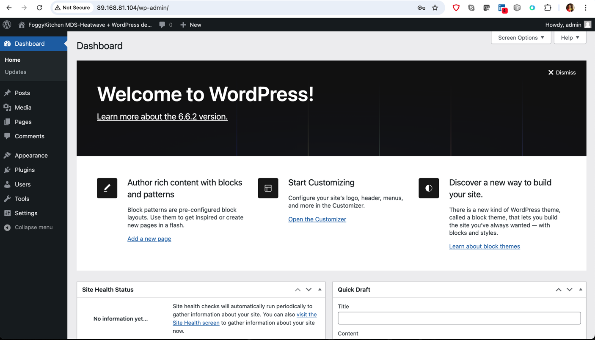

# FoggyKitchen OCI MySQL Heatwave with Terraform 

## LESSON 6 - Creating MySQL Database Service with Replication Channel and WordPress CMS

In this lesson, we'll delve into the creation of a **MySQL Database Service** in Oracle Cloud Infrastructure with a **Replication Channel** using OCI's MDS Channel feature and a Terraform module, along with deploying WordPress CMS. The focus will be on setting up a cross-regional replication channel that connects the source MySQL Database Service in the first region to the target MDS in the second region. This target MDS was originally created from a cross-regional backup in the previous lesson. By the end of this lesson, you'll learn how to replicate the database across regions, establishing a new production environment and enhancing disaster recovery and business continuity.


## Deploy Using Oracle Resource Manager

1. Click [](https://cloud.oracle.com/resourcemanager/stacks/create?region=home&zipUrl=https://github.com/mlinxfeld/terraform-oci-fk-heatwave/releases/latest/download/terraform-oci-fk-heatwave-lesson6.zip)

    If you aren't already signed in, when prompted, enter the tenancy and user credentials.

2. Review and accept the terms and conditions.

3. Select the region where you want to deploy the stack.

4. Follow the on-screen prompts and instructions to create the stack.

5. After creating the stack, click **Terraform Actions**, and select **Plan**.

6. Wait for the job to be completed, and review the plan.

    To make any changes, return to the Stack Details page, click **Edit Stack**, and make the required changes. Then, run the **Plan** action again.

7. If no further changes are necessary, return to the Stack Details page, click **Terraform Actions**, and select **Apply**. 

## Deploy Using the Terraform CLI 

### Clone of the repo 

Now, you'll want a local copy of this repo. You can make that with the commands:
Clone the repo from github by executing the command as follows and then go to proper subdirectory:

```
mlinxfeld@Martins-MacBook-Pro github % git clone https://github.com/mlinxfeld/terraform-oci-fk-heatwave.git

mlinxfeld@Martins-MacBook-Pro github % cd terraform-oci-fk-heatwave

mlinxfeld@Martins-MacBook-Pro terraform-oci-fk-heatwave % cd training/lesson6_mds_channel_with_wordpress/
```

### Prerequisites
Create environment file with terraform.tfvars file starting with example file:

```
mlinxfeld@Martins-MacBook-Pro lesson6_mds_channel_with_wordpress % cp terraform.tfvars.example terraform.tfvars

mlinxfeld@Martins-MacBook-Pro lesson6_mds_channel_with_wordpress % vi terraform.tfvars

tenancy_ocid            = <tenancy_ocid>"
region                  = "<region>"
region2                 = "<region2>"
mds_availability_domain = "<ad_name>"
mds_availability_domain2 = <ad_name_in_region2>"
mds_compartment_ocid    = "<compartment_ocid>"
mds_admin_password      = "<admin_password>" # MySQL Heatwave Admin password (mysql user)
mds_wp_password         = "<wp_user_password>" # MySQL Heatware WP password (wp user)
wp_site_admin_pass      = "<wp_admin_password>" # WordPress Console Admin User
mds_repl_password       = "<mds_repl_password>"

mds_manual_backup_enabled                   = true # This flag will enable manual backup of source MDS instance in region1
mds_cross_region_manual_backup_enabled      = true # This flag will deploy cross-region backup copy into region2
mds_cross_region_clone_enabled              = true # This flag will create MDS instance in region2 based on the cross-region backup copy
mds_channel_repl_user_setup_enabled         = false # This flag will create replica user in MDS instance in region1
mds_channel_enabled                         = false # This flag will enable MDS channel for replica from MDS instance in region1 (source) into MDS instance in region2 (target)
wordpress_on_mds_cross_region_clone_enabled = false # This flag will enable WordPress2 instance in region2 based on replicated MDS instance in region2 (target)
```

### Initialize Terraform

Run the following command to initialize Terraform environment:

```
mlinxfeld@Martins-MacBook-Pro lesson6_mds_channel_with_wordpress % terraform init 
Initializing the backend...
Initializing modules...
Downloading git::https://github.com/mlinxfeld/terraform-oci-fk-heatwave.git for oci-fk-mds-channel-source-to-target-clone...
- oci-fk-mds-channel-source-to-target-clone in .terraform/modules/oci-fk-mds-channel-source-to-target-clone
Downloading git::https://github.com/mlinxfeld/terraform-oci-fk-heatwave.git for oci-fk-mds-repl-user-setup...
- oci-fk-mds-repl-user-setup in .terraform/modules/oci-fk-mds-repl-user-setup
Downloading git::https://github.com/mlinxfeld/terraform-oci-fk-heatwave.git for oci-fk-mds-source...
- oci-fk-mds-source in .terraform/modules/oci-fk-mds-source
Downloading git::https://github.com/mlinxfeld/terraform-oci-fk-heatwave.git for oci-fk-mds-target-clone-from-x-region-backup...
- oci-fk-mds-target-clone-from-x-region-backup in .terraform/modules/oci-fk-mds-target-clone-from-x-region-backup
Downloading git::https://github.com/mlinxfeld/terraform-oci-fk-wordpress.git for oci-fk-wordpress...
- oci-fk-wordpress in .terraform/modules/oci-fk-wordpress
Downloading git::https://github.com/mlinxfeld/terraform-oci-fk-wordpress.git for oci-fk-wordpress2...
- oci-fk-wordpress2 in .terraform/modules/oci-fk-wordpress2
Downloading git::https://github.com/mlinxfeld/terraform-oci-fk-heatwave.git for oci-fk-x-region-mds-backup...
- oci-fk-x-region-mds-backup in .terraform/modules/oci-fk-x-region-mds-backup
Initializing provider plugins...
- Finding latest version of hashicorp/null...
- Finding latest version of hashicorp/template...
- Finding latest version of hashicorp/time...
- Finding latest version of oracle/oci...
- Finding latest version of hashicorp/tls...
- Installing hashicorp/null v3.2.2...
- Installed hashicorp/null v3.2.2 (signed by HashiCorp)
- Installing hashicorp/template v2.2.0...
- Installed hashicorp/template v2.2.0 (signed by HashiCorp)
- Installing hashicorp/time v0.12.0...
- Installed hashicorp/time v0.12.0 (signed by HashiCorp)
- Installing oracle/oci v6.9.0...
- Installed oracle/oci v6.9.0 (signed by a HashiCorp partner, key ID 1533A49284137CEB)
- Installing hashicorp/tls v4.0.5...
- Installed hashicorp/tls v4.0.5 (signed by HashiCorp)
Partner and community providers are signed by their developers.
If you'd like to know more about provider signing, you can read about it here:
https://www.terraform.io/docs/cli/plugins/signing.html
Terraform has created a lock file .terraform.lock.hcl to record the provider
selections it made above. Include this file in your version control repository
so that Terraform can guarantee to make the same selections by default when
you run "terraform init" in the future.

Terraform has been successfully initialized!

You may now begin working with Terraform. Try running "terraform plan" to see
any changes that are required for your infrastructure. All Terraform commands
should now work.

If you ever set or change modules or backend configuration for Terraform,
rerun this command to reinitialize your working directory. If you forget, other
commands will detect it and remind you to do so if necessary.
```

### Apply the changes 

Run the following command for applying changes with the proposed plan:

```
mlinxfeld@Martins-MacBook-Pro lesson6_mds_channel_with_wordpress % terraform apply                

(...)

   # module.oci-fk-x-region-mds-backup[0].oci_mysql_mysql_backup.FoggyKitchenMDSCrossRegionBackup[0] will be created
  + resource "oci_mysql_mysql_backup" "FoggyKitchenMDSCrossRegionBackup" {
      + backup_size_in_gbs         = (known after apply)
      + backup_type                = (known after apply)
      + compartment_id             = (known after apply)
      + creation_type              = (known after apply)
      + data_storage_size_in_gb    = (known after apply)
      + db_system_id               = (known after apply)
      + db_system_snapshot         = (known after apply)
      + defined_tags               = (known after apply)
      + description                = "FoggyKitchen MDS Cross-Region Copy of Manual Backup"
      + display_name               = "FoggyKitchenMDSXRegionBackup"
      + freeform_tags              = (known after apply)
      + id                         = (known after apply)
      + immediate_source_backup_id = (known after apply)
      + lifecycle_details          = (known after apply)
      + mysql_version              = (known after apply)
      + original_source_backup_id  = (known after apply)
      + retention_in_days          = 31
      + shape_name                 = (known after apply)
      + state                      = (known after apply)
      + time_copy_created          = (known after apply)
      + time_created               = (known after apply)
      + time_updated               = (known after apply)

      + db_system_snapshot_summary (known after apply)

      + source_details {
          + backup_id      = (known after apply)
          + compartment_id = "ocid1.compartment.oc1..aaaaaaaaiyy4srmrb32v5rlniicwmpxsytywiucgbcp5ext6e4ahjfuloewa"
          + region         = "eu-frankfurt-1"
        }
    }

Plan: 32 to add, 0 to change, 0 to destroy.

Changes to Outputs:
  + generated_ssh_private_key = (sensitive value)
  + mds_channel               = {
      + mds_channel_id = ""
    }
  + mds_source                = {
      + mds_id         = (known after apply)
      + mds_ip_address = (known after apply)
      + mds_port       = (known after apply)
      + mds_port_x     = (known after apply)
    }
  + mds_target_clone          = {
      + mds_id         = (known after apply)
      + mds_ip_address = (known after apply)
      + mds_port       = (known after apply)
      + mds_port_x     = (known after apply)
    }
  + wordpress2_home_URL       = ""
  + wordpress2_wp-admin_URL   = ""
  + wordpress_home_URL        = (known after apply)
  + wordpress_wp-admin_URL    = (known after apply)

Do you want to perform these actions?
  Terraform will perform the actions described above.
  Only 'yes' will be accepted to approve.

  Enter a value: yes

tls_private_key.public_private_key_pair: Creating...
module.oci-fk-wordpress.tls_private_key.public_private_key_pair: Creating...
module.oci-fk-wordpress.tls_private_key.public_private_key_pair: Creation complete after 0s [id=8b30be4a8bfccf85b384eb7396aac5031ef101c7]
module.oci-fk-wordpress.data.template_file.key_script: Reading...
module.oci-fk-wordpress.data.template_file.key_script: Read complete after 0s [id=e49ac710cc64439c368089a48ddd975dfba48bdfbb788eb4743ddfdfd79ddd26]
module.oci-fk-wordpress.data.template_cloudinit_config.cloud_init: Reading...
oci_core_vcn.FoggyKitchenVCN2: Creating...
oci_core_vcn.FoggyKitchenVCN: Creating...
module.oci-fk-wordpress.data.template_cloudinit_config.cloud_init: Read complete after 0s [id=3443201808]
module.oci-fk-mds-source.oci_mysql_mysql_configuration.FoggyKitchenMDSConfiguration[0]: Creating...
tls_private_key.public_private_key_pair: Creation complete after 0s [id=9cf49dd7e752f552c4ad129c15120cfbd278906c]
module.oci-fk-mds-source.oci_mysql_mysql_configuration.FoggyKitchenMDSConfiguration[0]: Creation complete after 1s [id=ocid1.mysqlconfiguration.oc1.eu-frankfurt-1.aaaaaaaac7k3jeo7x2m46qtaegt25vmhehrkz6c4xecfsfglmz3otx7bmmoq]

(...)

module.oci-fk-mds-target-clone-from-x-region-backup[0].oci_mysql_mysql_db_system.FoggyKitchenMDS[0]: Still creating... [8m20s elapsed]
module.oci-fk-mds-target-clone-from-x-region-backup[0].oci_mysql_mysql_db_system.FoggyKitchenMDS[0]: Still creating... [8m30s elapsed]
module.oci-fk-mds-target-clone-from-x-region-backup[0].oci_mysql_mysql_db_system.FoggyKitchenMDS[0]: Still creating... [8m40s elapsed]
module.oci-fk-mds-target-clone-from-x-region-backup[0].oci_mysql_mysql_db_system.FoggyKitchenMDS[0]: Still creating... [8m50s elapsed]
module.oci-fk-mds-target-clone-from-x-region-backup[0].oci_mysql_mysql_db_system.FoggyKitchenMDS[0]: Still creating... [9m0s elapsed]
module.oci-fk-mds-target-clone-from-x-region-backup[0].oci_mysql_mysql_db_system.FoggyKitchenMDS[0]: Still creating... [9m10s elapsed]
module.oci-fk-mds-target-clone-from-x-region-backup[0].oci_mysql_mysql_db_system.FoggyKitchenMDS[0]: Still creating... [9m20s elapsed]
module.oci-fk-mds-target-clone-from-x-region-backup[0].oci_mysql_mysql_db_system.FoggyKitchenMDS[0]: Still creating... [9m30s elapsed]
module.oci-fk-mds-target-clone-from-x-region-backup[0].oci_mysql_mysql_db_system.FoggyKitchenMDS[0]: Still creating... [9m40s elapsed]
module.oci-fk-mds-target-clone-from-x-region-backup[0].oci_mysql_mysql_db_system.FoggyKitchenMDS[0]: Still creating... [9m50s elapsed]
module.oci-fk-mds-target-clone-from-x-region-backup[0].oci_mysql_mysql_db_system.FoggyKitchenMDS[0]: Still creating... [10m0s elapsed]
module.oci-fk-mds-target-clone-from-x-region-backup[0].oci_mysql_mysql_db_system.FoggyKitchenMDS[0]: Still creating... [10m10s elapsed]
module.oci-fk-mds-target-clone-from-x-region-backup[0].oci_mysql_mysql_db_system.FoggyKitchenMDS[0]: Still creating... [10m20s elapsed]
module.oci-fk-mds-target-clone-from-x-region-backup[0].oci_mysql_mysql_db_system.FoggyKitchenMDS[0]: Still creating... [10m30s elapsed]
module.oci-fk-mds-target-clone-from-x-region-backup[0].oci_mysql_mysql_db_system.FoggyKitchenMDS[0]: Creation complete after 10m33s [id=ocid1.mysqldbsystem.oc1.eu-amsterdam-1.aaaaaaaae3fr6ivqvkrzjpxpmi3sxq4dn4qsufw4cp5kxzlpbwfz6poe2jza]

Apply complete! Resources: 32 added, 0 changed, 0 destroyed.

Outputs:

generated_ssh_private_key = <sensitive>
mds_channel = {
  "mds_channel_id" = ""
}
mds_source = {
  "mds_id" = "ocid1.mysqldbsystem.oc1.eu-frankfurt-1.aaaaaaaa6uz2kqrrpdylcea5o635m7odis2fui6eovosiyqzm6p5eexm4j3a"
  "mds_ip_address" = "10.0.2.135"
  "mds_port" = "3306"
  "mds_port_x" = "33060"
}
mds_target_clone = {
  "mds_id" = "ocid1.mysqldbsystem.oc1.eu-amsterdam-1.aaaaaaaae3fr6ivqvkrzjpxpmi3sxq4dn4qsufw4cp5kxzlpbwfz6poe2jza"
  "mds_ip_address" = "172.16.2.201"
  "mds_port" = "3306"
  "mds_port_x" = "33060"
}
wordpress2_home_URL = ""
wordpress2_wp-admin_URL = ""
wordpress_home_URL = "http://89.168.81.104/"
wordpress_wp-admin_URL = "http://89.168.81.104/wp-admin/"

```

### Verify the deployment:

1. Verify access to the WordPress Admin Console:


2. Verify MDS instance in source region:


3. Verify MDS instance in target region:


### Enabling local manual backup 

Update environment file with terraform.tfvars file:

```
mlinxfeld@Martins-MacBook-Pro lesson6_mds_channel_with_wordpress % vi terraform.tfvars
(...)
mds_channel_repl_user_setup_enabled         = true # <- enabling now replication user in MySQL on the source
mds_channel_enabled                         = true # <- after we can enable MDS Channel between source and target
wordpress_on_mds_cross_region_clone_enabled = false
```

### Re-apply the changes 

Run the following command for applying changes with the new plan including replication user and MDS Channel:

```
mlinxfeld@Martins-MacBook-Pro lesson6_mds_channel_with_wordpress % terraform apply                

(...)

module.oci-fk-wordpress.data.template_file.setup_wp: Reading...
module.oci-fk-wordpress.data.template_file.setup_wp: Read complete after 0s [id=ad208a1a4f5a11c5bb3ab15d7683a3c69a423a0390bee18d3adb292d64fb6824]
module.oci-fk-wordpress.null_resource.WordPress_provisioner_without_bastion[0]: Refreshing state... [id=4089929761909372830]

Terraform used the selected providers to generate the following execution plan. Resource actions are indicated with the following symbols:
  + create
  ~ update in-place

Terraform will perform the following actions:

  # oci_core_drg.FoggyKitchenDRG1[0] will be created
  + resource "oci_core_drg" "FoggyKitchenDRG1" {
      + compartment_id                           = "ocid1.compartment.oc1..aaaaaaaaiyy4srmrb32v5rlniicwmpxsytywiucgbcp5ext6e4ahjfuloewa"
      + default_drg_route_tables                 = (known after apply)
      + default_export_drg_route_distribution_id = (known after apply)
      + defined_tags                             = (known after apply)
      + display_name                             = "FoggyKitchenDRG1"
      + freeform_tags                            = (known after apply)
      + id                                       = (known after apply)
      + redundancy_status                        = (known after apply)
      + state                                    = (known after apply)
      + time_created                             = (known after apply)
    }

  # oci_core_drg.FoggyKitchenDRG2[0] will be created
  + resource "oci_core_drg" "FoggyKitchenDRG2" {
      + compartment_id                           = "ocid1.compartment.oc1..aaaaaaaaiyy4srmrb32v5rlniicwmpxsytywiucgbcp5ext6e4ahjfuloewa"
      + default_drg_route_tables                 = (known after apply)
      + default_export_drg_route_distribution_id = (known after apply)
      + defined_tags                             = (known after apply)
      + display_name                             = "FoggyKitchenDRG2"
      + freeform_tags                            = (known after apply)
      + id                                       = (known after apply)
      + redundancy_status                        = (known after apply)
      + state                                    = (known after apply)
      + time_created                             = (known after apply)
    }

  # oci_core_drg_attachment.FoggyKitchenDRG1Attachment[0] will be created
  + resource "oci_core_drg_attachment" "FoggyKitchenDRG1Attachment" {
      + compartment_id                   = (known after apply)
      + defined_tags                     = (known after apply)
      + display_name                     = "FoggyKitchenDRG1Attachment"
      + drg_id                           = (known after apply)
      + drg_route_table_id               = (known after apply)
      + export_drg_route_distribution_id = (known after apply)
      + freeform_tags                    = (known after apply)
      + id                               = (known after apply)
      + is_cross_tenancy                 = (known after apply)
      + route_table_id                   = (known after apply)
      + state                            = (known after apply)
      + time_created                     = (known after apply)
      + vcn_id                           = "ocid1.vcn.oc1.eu-frankfurt-1.amaaaaaadngk4giaqp3cw263qtbbvviuxqaqj6cvafcxuomyo4pjeq3vkdfa"

      + network_details (known after apply)
    }

  # oci_core_drg_attachment.FoggyKitchenDRG2Attachment[0] will be created
  + resource "oci_core_drg_attachment" "FoggyKitchenDRG2Attachment" {
      + compartment_id                   = (known after apply)
      + defined_tags                     = (known after apply)
      + display_name                     = "FoggyKitchenDRG2Attachment"
      + drg_id                           = (known after apply)
      + drg_route_table_id               = (known after apply)
      + export_drg_route_distribution_id = (known after apply)
      + freeform_tags                    = (known after apply)
      + id                               = (known after apply)
      + is_cross_tenancy                 = (known after apply)
      + route_table_id                   = (known after apply)
      + state                            = (known after apply)
      + time_created                     = (known after apply)
      + vcn_id                           = "ocid1.vcn.oc1.eu-amsterdam-1.amaaaaaadngk4giazwqpoavqss4jpmio4akwi2rdgh5dqquaj4fpkqenuojq"

      + network_details (known after apply)
    }

  # oci_core_remote_peering_connection.FoggyKitchenRPC1[0] will be created
  + resource "oci_core_remote_peering_connection" "FoggyKitchenRPC1" {
      + compartment_id           = "ocid1.compartment.oc1..aaaaaaaaiyy4srmrb32v5rlniicwmpxsytywiucgbcp5ext6e4ahjfuloewa"
      + defined_tags             = (known after apply)
      + display_name             = "FoggyKitchenRPC1"
      + drg_id                   = (known after apply)
      + freeform_tags            = (known after apply)
      + id                       = (known after apply)
      + is_cross_tenancy_peering = (known after apply)
      + peer_id                  = (known after apply)
      + peer_region_name         = "eu-amsterdam-1"
      + peer_tenancy_id          = (known after apply)
      + peering_status           = (known after apply)
      + state                    = (known after apply)
      + time_created             = (known after apply)
    }

  # oci_core_remote_peering_connection.FoggyKitchenRPC2[0] will be created
  + resource "oci_core_remote_peering_connection" "FoggyKitchenRPC2" {
      + compartment_id           = "ocid1.compartment.oc1..aaaaaaaaiyy4srmrb32v5rlniicwmpxsytywiucgbcp5ext6e4ahjfuloewa"
      + defined_tags             = (known after apply)
      + display_name             = "FoggyKitchenRPC2"
      + drg_id                   = (known after apply)
      + freeform_tags            = (known after apply)
      + id                       = (known after apply)
      + is_cross_tenancy_peering = (known after apply)
      + peer_id                  = (known after apply)
      + peer_region_name         = (known after apply)
      + peer_tenancy_id          = (known after apply)
      + peering_status           = (known after apply)
      + state                    = (known after apply)
      + time_created             = (known after apply)
    }

  # oci_core_route_table.FoggyKitchenPrivateRouteTable will be updated in-place
  ~ resource "oci_core_route_table" "FoggyKitchenPrivateRouteTable" {
        id             = "ocid1.routetable.oc1.eu-frankfurt-1.aaaaaaaauqz2cv745iwrcidqp3ydyyjbt243cra7x7i2tfibsjyhkgl24ooa"
        # (7 unchanged attributes hidden)

      - route_rules {
          - destination       = "0.0.0.0/0" -> null
          - destination_type  = "CIDR_BLOCK" -> null
          - network_entity_id = "ocid1.natgateway.oc1.eu-frankfurt-1.aaaaaaaap3f2d6gbylkuc35npgi6kdyex6smwvu4xasmgvc7rrhwl2zgdgsa" -> null
            # (3 unchanged attributes hidden)
        }
      + route_rules {
          + cidr_block        = (known after apply)
          + description       = (known after apply)
          + destination       = "0.0.0.0/0"
          + destination_type  = "CIDR_BLOCK"
          + network_entity_id = "ocid1.natgateway.oc1.eu-frankfurt-1.aaaaaaaap3f2d6gbylkuc35npgi6kdyex6smwvu4xasmgvc7rrhwl2zgdgsa"
          + route_type        = (known after apply)
        }
      + route_rules {
          + cidr_block        = (known after apply)
          + description       = (known after apply)
          + destination       = "172.16.0.0/16"
          + destination_type  = "CIDR_BLOCK"
          + network_entity_id = (known after apply)
          + route_type        = (known after apply)
        }
    }

  # oci_core_route_table.FoggyKitchenPrivateRouteTable2 will be updated in-place
  ~ resource "oci_core_route_table" "FoggyKitchenPrivateRouteTable2" {
        id             = "ocid1.routetable.oc1.eu-amsterdam-1.aaaaaaaadzwmikv5gaqs6muhv4nij5fbww6tzalnmseucdqznpj6mzrtdxga"
        # (7 unchanged attributes hidden)

      - route_rules {
          - destination       = "0.0.0.0/0" -> null
          - destination_type  = "CIDR_BLOCK" -> null
          - network_entity_id = "ocid1.natgateway.oc1.eu-amsterdam-1.aaaaaaaax6yg5x72lpcg32a73brplzuwucnpsqnrvfsumgawzzspz5bzudea" -> null
            # (3 unchanged attributes hidden)
        }
      + route_rules {
          + cidr_block        = (known after apply)
          + description       = (known after apply)
          + destination       = "0.0.0.0/0"
          + destination_type  = "CIDR_BLOCK"
          + network_entity_id = "ocid1.natgateway.oc1.eu-amsterdam-1.aaaaaaaax6yg5x72lpcg32a73brplzuwucnpsqnrvfsumgawzzspz5bzudea"
          + route_type        = (known after apply)
        }
      + route_rules {
          + cidr_block        = (known after apply)
          + description       = (known after apply)
          + destination       = "10.0.0.0/16"
          + destination_type  = "CIDR_BLOCK"
          + network_entity_id = (known after apply)
          + route_type        = (known after apply)
        }
    }

  # oci_core_route_table.FoggyKitchenPublicRouteTable will be updated in-place
  ~ resource "oci_core_route_table" "FoggyKitchenPublicRouteTable" {
        id             = "ocid1.routetable.oc1.eu-frankfurt-1.aaaaaaaa2epgeiupqoo5fgpqeifedjeauizj52g7zbtyomziz6rgant5rusa"
        # (7 unchanged attributes hidden)

      - route_rules {
          - destination       = "0.0.0.0/0" -> null
          - destination_type  = "CIDR_BLOCK" -> null
          - network_entity_id = "ocid1.internetgateway.oc1.eu-frankfurt-1.aaaaaaaaunk4nxp2frq747nn2aqpmolnwfyp3bcl7qbqhlpvog2cfv6x2dna" -> null
            # (3 unchanged attributes hidden)
        }
      + route_rules {
          + cidr_block        = (known after apply)
          + description       = (known after apply)
          + destination       = "0.0.0.0/0"
          + destination_type  = "CIDR_BLOCK"
          + network_entity_id = "ocid1.internetgateway.oc1.eu-frankfurt-1.aaaaaaaaunk4nxp2frq747nn2aqpmolnwfyp3bcl7qbqhlpvog2cfv6x2dna"
          + route_type        = (known after apply)
        }
      + route_rules {
          + cidr_block        = (known after apply)
          + description       = (known after apply)
          + destination       = "172.16.0.0/16"
          + destination_type  = "CIDR_BLOCK"
          + network_entity_id = (known after apply)
          + route_type        = (known after apply)
        }
    }

  # oci_core_route_table.FoggyKitchenPublicRouteTable2 will be updated in-place
  ~ resource "oci_core_route_table" "FoggyKitchenPublicRouteTable2" {
        id             = "ocid1.routetable.oc1.eu-amsterdam-1.aaaaaaaa7bgaji5av67hpusdikjy6pavqduc4mjlu3cw3szzop5lzoatxbka"
        # (7 unchanged attributes hidden)

      - route_rules {
          - destination       = "0.0.0.0/0" -> null
          - destination_type  = "CIDR_BLOCK" -> null
          - network_entity_id = "ocid1.internetgateway.oc1.eu-amsterdam-1.aaaaaaaasaufxz735ficiwauad3xoisw5gtosnak3abm3tnfpqhy5ncq7quq" -> null
            # (3 unchanged attributes hidden)
        }
      + route_rules {
          + cidr_block        = (known after apply)
          + description       = (known after apply)
          + destination       = "0.0.0.0/0"
          + destination_type  = "CIDR_BLOCK"
          + network_entity_id = "ocid1.internetgateway.oc1.eu-amsterdam-1.aaaaaaaasaufxz735ficiwauad3xoisw5gtosnak3abm3tnfpqhy5ncq7quq"
          + route_type        = (known after apply)
        }
      + route_rules {
          + cidr_block        = (known after apply)
          + description       = (known after apply)
          + destination       = "10.0.0.0/16"
          + destination_type  = "CIDR_BLOCK"
          + network_entity_id = (known after apply)
          + route_type        = (known after apply)
        }
    }

  # module.oci-fk-mds-channel-source-to-target-clone[0].oci_mysql_channel.FoggyKitchenMDSChannel[0] will be created
  + resource "oci_mysql_channel" "FoggyKitchenMDSChannel" {
      + compartment_id    = (known after apply)
      + defined_tags      = (known after apply)
      + description       = (known after apply)
      + display_name      = "FoggyKitchenMDSChannel"
      + freeform_tags     = (known after apply)
      + id                = (known after apply)
      + is_enabled        = (known after apply)
      + lifecycle_details = (known after apply)
      + state             = (known after apply)
      + time_created      = (known after apply)
      + time_updated      = (known after apply)

      + source {
          + hostname    = "10.0.2.135"
          + password    = (sensitive value)
          + port        = (known after apply)
          + source_type = "MYSQL"
          + ssl_mode    = "REQUIRED"
          + username    = "wp_repl_user"

          + anonymous_transactions_handling {
              + last_configured_log_filename = (known after apply)
              + last_configured_log_offset   = (known after apply)
              + policy                       = "ERROR_ON_ANONYMOUS"
              + uuid                         = (known after apply)
            }

          + ssl_ca_certificate (known after apply)
        }

      + target {
          + applier_username                    = (known after apply)
          + channel_name                        = "MySQLMDSChannel"
          + db_system_id                        = "ocid1.mysqldbsystem.oc1.eu-amsterdam-1.aaaaaaaae3fr6ivqvkrzjpxpmi3sxq4dn4qsufw4cp5kxzlpbwfz6poe2jza"
          + delay_in_seconds                    = 1
          + tables_without_primary_key_handling = "GENERATE_IMPLICIT_PRIMARY_KEY"
          + target_type                         = "DBSYSTEM"

          + filters (known after apply)
        }
    }

  # module.oci-fk-mds-repl-user-setup[0].null_resource.mysqlsh_source_repl_user_setup_with_bastion[0] will be created
  + resource "null_resource" "mysqlsh_source_repl_user_setup_with_bastion" {
      + id = (known after apply)
    }

Plan: 8 to add, 4 to change, 0 to destroy.

Changes to Outputs:
  ~ mds_channel               = {
      ~ mds_channel_id = "" -> (known after apply)
    }

Do you want to perform these actions?
  Terraform will perform the actions described above.
  Only 'yes' will be accepted to approve.

  Enter a value: yes

(...)

oci_core_route_table.FoggyKitchenPrivateRouteTable: Modifying... [id=ocid1.routetable.oc1.eu-frankfurt-1.aaaaaaaauqz2cv745iwrcidqp3ydyyjbt243cra7x7i2tfibsjyhkgl24ooa]
oci_core_route_table.FoggyKitchenPrivateRouteTable2: Modifications complete after 1s [id=ocid1.routetable.oc1.eu-amsterdam-1.aaaaaaaadzwmikv5gaqs6muhv4nij5fbww6tzalnmseucdqznpj6mzrtdxga]
oci_core_route_table.FoggyKitchenPublicRouteTable2: Modifications complete after 1s [id=ocid1.routetable.oc1.eu-amsterdam-1.aaaaaaaa7bgaji5av67hpusdikjy6pavqduc4mjlu3cw3szzop5lzoatxbka]
oci_core_route_table.FoggyKitchenPrivateRouteTable: Modifications complete after 1s [id=ocid1.routetable.oc1.eu-frankfurt-1.aaaaaaaauqz2cv745iwrcidqp3ydyyjbt243cra7x7i2tfibsjyhkgl24ooa]
oci_core_route_table.FoggyKitchenPublicRouteTable: Modifications complete after 1s [id=ocid1.routetable.oc1.eu-frankfurt-1.aaaaaaaa2epgeiupqoo5fgpqeifedjeauizj52g7zbtyomziz6rgant5rusa]
module.oci-fk-mds-channel-source-to-target-clone[0].oci_mysql_channel.FoggyKitchenMDSChannel[0]: Still creating... [20s elapsed]
oci_core_remote_peering_connection.FoggyKitchenRPC2[0]: Creation complete after 7s [id=ocid1.remotepeeringconnection.oc1.eu-amsterdam-1.aaaaaaaaa2bzqdxnfa5bhdln7t3qqgf42mlnrn23okev5lwpu5smlio5hgta]
oci_core_remote_peering_connection.FoggyKitchenRPC1[0]: Creating...
oci_core_drg_attachment.FoggyKitchenDRG2Attachment[0]: Creation complete after 8s [id=ocid1.drgattachment.oc1.eu-amsterdam-1.aaaaaaaapzfjgwxbl7v6pdsk3ud6xvg4c43aa4jabnbyw63xdljqu6hyu2za]
oci_core_drg_attachment.FoggyKitchenDRG1Attachment[0]: Creation complete after 8s [id=ocid1.drgattachment.oc1.eu-frankfurt-1.aaaaaaaabrtsarlr64bxyb64zzs4wmng262irlfl6e5pjmqzkyhfufxfi4ha]
module.oci-fk-mds-channel-source-to-target-clone[0].oci_mysql_channel.FoggyKitchenMDSChannel[0]: Still creating... [30s elapsed]
oci_core_remote_peering_connection.FoggyKitchenRPC1[0]: Still creating... [10s elapsed]
module.oci-fk-mds-channel-source-to-target-clone[0].oci_mysql_channel.FoggyKitchenMDSChannel[0]: Still creating... [40s elapsed]
oci_core_remote_peering_connection.FoggyKitchenRPC1[0]: Still creating... [20s elapsed]
module.oci-fk-mds-channel-source-to-target-clone[0].oci_mysql_channel.FoggyKitchenMDSChannel[0]: Still creating... [50s elapsed]
oci_core_remote_peering_connection.FoggyKitchenRPC1[0]: Still creating... [30s elapsed]
module.oci-fk-mds-channel-source-to-target-clone[0].oci_mysql_channel.FoggyKitchenMDSChannel[0]: Still creating... [1m0s elapsed]
oci_core_remote_peering_connection.FoggyKitchenRPC1[0]: Still creating... [40s elapsed]
module.oci-fk-mds-channel-source-to-target-clone[0].oci_mysql_channel.FoggyKitchenMDSChannel[0]: Still creating... [1m10s elapsed]
oci_core_remote_peering_connection.FoggyKitchenRPC1[0]: Still creating... [50s elapsed]
module.oci-fk-mds-channel-source-to-target-clone[0].oci_mysql_channel.FoggyKitchenMDSChannel[0]: Still creating... [1m20s elapsed]
oci_core_remote_peering_connection.FoggyKitchenRPC1[0]: Still creating... [1m0s elapsed]
module.oci-fk-mds-channel-source-to-target-clone[0].oci_mysql_channel.FoggyKitchenMDSChannel[0]: Creation complete after 1m25s [id=ocid1.mysqlchannel.oc1.eu-amsterdam-1.aaaaaaaarok6l4azuspej5ycl2plk6uhs3l7zw23ph753vw62c2bxl7zjlcq]
oci_core_remote_peering_connection.FoggyKitchenRPC1[0]: Still creating... [1m10s elapsed]
oci_core_remote_peering_connection.FoggyKitchenRPC1[0]: Still creating... [1m20s elapsed]
oci_core_remote_peering_connection.FoggyKitchenRPC1[0]: Still creating... [1m30s elapsed]
oci_core_remote_peering_connection.FoggyKitchenRPC1[0]: Still creating... [1m40s elapsed]
oci_core_remote_peering_connection.FoggyKitchenRPC1[0]: Creation complete after 1m44s [id=ocid1.remotepeeringconnection.oc1.eu-frankfurt-1.aaaaaaaahrgzece564k66vrcodypym4lriosqodfwavoohwfassxe6ijcpaq]

Apply complete! Resources: 8 added, 4 changed, 0 destroyed.

Outputs:

generated_ssh_private_key = <sensitive>
mds_channel = {
  "mds_channel_id" = "ocid1.mysqlchannel.oc1.eu-amsterdam-1.aaaaaaaarok6l4azuspej5ycl2plk6uhs3l7zw23ph753vw62c2bxl7zjlcq"
}
mds_source = {
  "mds_id" = "ocid1.mysqldbsystem.oc1.eu-frankfurt-1.aaaaaaaa6uz2kqrrpdylcea5o635m7odis2fui6eovosiyqzm6p5eexm4j3a"
  "mds_ip_address" = "10.0.2.135"
  "mds_port" = "3306"
  "mds_port_x" = "33060"
}
mds_target_clone = {
  "mds_id" = "ocid1.mysqldbsystem.oc1.eu-amsterdam-1.aaaaaaaae3fr6ivqvkrzjpxpmi3sxq4dn4qsufw4cp5kxzlpbwfz6poe2jza"
  "mds_ip_address" = "172.16.2.201"
  "mds_port" = "3306"
  "mds_port_x" = "33060"
}
wordpress2_home_URL = ""
wordpress2_wp-admin_URL = ""
wordpress_home_URL = "http://89.168.81.104/"
wordpress_wp-admin_URL = "http://89.168.81.104/wp-admin/"
```

### Verify MDS Channel deployment

1. Confirm that MDS Channel work request is successful:


2. Confirm that MDS Channel is active (sometimes you need to resume it):


### Enabling WordPress deployment in the target region

Update environment file with terraform.tfvars file:

```
mlinxfeld@Martins-MacBook-Pro lesson6_mds_channel_with_wordpress % vi terraform.tfvars
(...)
mds_channel_repl_user_setup_enabled         = true 
mds_channel_enabled                         = true 
wordpress_on_mds_cross_region_clone_enabled = true # <- enable deployment of WordPress in target region
```

### Re-apply the changes 

Run the following command for applying changes with the new plan including WordPress deployment in target region:

```
mlinxfeld@Martins-MacBook-Pro lesson6_mds_channel_with_wordpress % terraform apply                

(...)

  # module.oci-fk-wordpress2[0].oci_core_public_ip.WordPress_public_ip_for_single_node[0] will be created
  + resource "oci_core_public_ip" "WordPress_public_ip_for_single_node" {
      + assigned_entity_id   = (known after apply)
      + assigned_entity_type = (known after apply)
      + availability_domain  = (known after apply)
      + compartment_id       = "ocid1.compartment.oc1..aaaaaaaaiyy4srmrb32v5rlniicwmpxsytywiucgbcp5ext6e4ahjfuloewa"
      + defined_tags         = (known after apply)
      + display_name         = "WordPress_public_ip_for_single_node"
      + freeform_tags        = (known after apply)
      + id                   = (known after apply)
      + ip_address           = (known after apply)
      + lifetime             = "RESERVED"
      + private_ip_id        = (known after apply)
      + public_ip_pool_id    = (known after apply)
      + scope                = (known after apply)
      + state                = (known after apply)
      + time_created         = (known after apply)
    }

  # module.oci-fk-wordpress2[0].tls_private_key.public_private_key_pair will be created
  + resource "tls_private_key" "public_private_key_pair" {
      + algorithm                     = "RSA"
      + ecdsa_curve                   = "P224"
      + id                            = (known after apply)
      + private_key_openssh           = (sensitive value)
      + private_key_pem               = (sensitive value)
      + private_key_pem_pkcs8         = (sensitive value)
      + public_key_fingerprint_md5    = (known after apply)
      + public_key_fingerprint_sha256 = (known after apply)
      + public_key_openssh            = (known after apply)
      + public_key_pem                = (known after apply)
      + rsa_bits                      = 2048
    }

Plan: 4 to add, 0 to change, 0 to destroy.

Changes to Outputs:
  ~ wordpress2_home_URL       = null -> (known after apply)
  ~ wordpress2_wp-admin_URL   = null -> (known after apply)

Do you want to perform these actions?
  Terraform will perform the actions described above.
  Only 'yes' will be accepted to approve.

  Enter a value: yes

(...)
module.oci-fk-wordpress2[0].null_resource.WordPress_provisioner_without_bastion[0] (remote-exec): Unpacking the package...
module.oci-fk-wordpress2[0].null_resource.WordPress_provisioner_without_bastion[0] (remote-exec): Installing the theme...
module.oci-fk-wordpress2[0].null_resource.WordPress_provisioner_without_bastion[0] (remote-exec): Theme installed successfully.
module.oci-fk-wordpress2[0].null_resource.WordPress_provisioner_without_bastion[0] (remote-exec): Installing Lodestar (1.0.8)
module.oci-fk-wordpress2[0].null_resource.WordPress_provisioner_without_bastion[0] (remote-exec): Downloading installation package from https://downloads.wordpress.org/theme/lodestar.1.0.8.zip...
module.oci-fk-wordpress2[0].null_resource.WordPress_provisioner_without_bastion[0] (remote-exec): Unpacking the package...
module.oci-fk-wordpress2[0].null_resource.WordPress_provisioner_without_bastion[0] (remote-exec): Installing the theme...
module.oci-fk-wordpress2[0].null_resource.WordPress_provisioner_without_bastion[0] (remote-exec): Theme installed successfully.
module.oci-fk-wordpress2[0].null_resource.WordPress_provisioner_without_bastion[0] (remote-exec): Success: Installed 2 of 2 themes.
module.oci-fk-wordpress2[0].null_resource.WordPress_provisioner_without_bastion[0]: Still creating... [4m30s elapsed]
module.oci-fk-wordpress2[0].null_resource.WordPress_provisioner_without_bastion[0] (remote-exec): Updating to version 6.6.1 (en_US)...
module.oci-fk-wordpress2[0].null_resource.WordPress_provisioner_without_bastion[0] (remote-exec): Using cached file '/root/.wp-cli/cache/core/wordpress-6.6.1-en_US.zip'...
module.oci-fk-wordpress2[0].null_resource.WordPress_provisioner_without_bastion[0] (remote-exec): Unpacking the update...
module.oci-fk-wordpress2[0].null_resource.WordPress_provisioner_without_bastion[0] (remote-exec): Success: WordPress updated successfully.
module.oci-fk-wordpress2[0].null_resource.WordPress_provisioner_without_bastion[0] (remote-exec): 6.6.1
module.oci-fk-wordpress2[0].null_resource.WordPress_provisioner_without_bastion[0] (remote-exec): WordPress Auto Update will be enabled.
module.oci-fk-wordpress2[0].null_resource.WordPress_provisioner_without_bastion[0] (remote-exec): wp-cli installed, wp config, user, plugin theme executed.
module.oci-fk-wordpress2[0].null_resource.WordPress_provisioner_without_bastion[0]: Creation complete after 4m39s [id=2395669019430213070]

Apply complete! Resources: 4 added, 0 changed, 0 destroyed.

Outputs:

generated_ssh_private_key = <sensitive>
mds_channel = {
  "mds_channel_id" = "ocid1.mysqlchannel.oc1.eu-amsterdam-1.aaaaaaaarok6l4azuspej5ycl2plk6uhs3l7zw23ph753vw62c2bxl7zjlcq"
}
mds_source = {
  "mds_id" = "ocid1.mysqldbsystem.oc1.eu-frankfurt-1.aaaaaaaa6uz2kqrrpdylcea5o635m7odis2fui6eovosiyqzm6p5eexm4j3a"
  "mds_ip_address" = "10.0.2.135"
  "mds_port" = "3306"
  "mds_port_x" = "33060"
}
mds_target_clone = {
  "mds_id" = "ocid1.mysqldbsystem.oc1.eu-amsterdam-1.aaaaaaaae3fr6ivqvkrzjpxpmi3sxq4dn4qsufw4cp5kxzlpbwfz6poe2jza"
  "mds_ip_address" = "172.16.2.201"
  "mds_port" = "3306"
  "mds_port_x" = "33060"
}
wordpress2_home_URL = "http://150.230.22.39/"
wordpress2_wp-admin_URL = "http://150.230.22.39/wp-admin/"
wordpress_home_URL = "http://89.168.81.104/"
wordpress_wp-admin_URL = "http://89.168.81.104/wp-admin/"

```

### Verify WordPress on the target location:

1. Confirm that WordPress is up and running in the target location



### Destroy the changes 

Run the following command for destroying all resources:

```
mlinxfeld@Martins-MacBook-Pro lesson6_mds_channel_with_wordpress % terraform destroy

(...)
Plan: 0 to add, 0 to change, 44 to destroy.

Changes to Outputs:
  - generated_ssh_private_key = (sensitive value) -> null
  - mds_channel               = {
      - mds_channel_id = "ocid1.mysqlchannel.oc1.eu-amsterdam-1.aaaaaaaarok6l4azuspej5ycl2plk6uhs3l7zw23ph753vw62c2bxl7zjlcq"
    } -> null
  - mds_source                = {
      - mds_id         = "ocid1.mysqldbsystem.oc1.eu-frankfurt-1.aaaaaaaa6uz2kqrrpdylcea5o635m7odis2fui6eovosiyqzm6p5eexm4j3a"
      - mds_ip_address = "10.0.2.135"
      - mds_port       = "3306"
      - mds_port_x     = "33060"
    } -> null
  - mds_target_clone          = {
      - mds_id         = "ocid1.mysqldbsystem.oc1.eu-amsterdam-1.aaaaaaaae3fr6ivqvkrzjpxpmi3sxq4dn4qsufw4cp5kxzlpbwfz6poe2jza"
      - mds_ip_address = "172.16.2.201"
      - mds_port       = "3306"
      - mds_port_x     = "33060"
    } -> null
  - wordpress2_home_URL       = "http://150.230.22.39/" -> null
  - wordpress2_wp-admin_URL   = "http://150.230.22.39/wp-admin/" -> null
  - wordpress_home_URL        = "http://89.168.81.104/" -> null
  - wordpress_wp-admin_URL    = "http://89.168.81.104/wp-admin/" -> null

Do you really want to destroy all resources?
  Terraform will destroy all your managed infrastructure, as shown above.
  There is no undo. Only 'yes' will be accepted to confirm.

  Enter a value: yes

(...)

module.oci-fk-mds-source.oci_mysql_mysql_db_system.FoggyKitchenMDS[0]: Still destroying... [id=ocid1.mysqldbsystem.oc1.eu-frankfurt-1....a5o635m7odis2fui6eovosiyqzm6p5eexm4j3a, 2m20s elapsed]
module.oci-fk-mds-source.oci_mysql_mysql_db_system.FoggyKitchenMDS[0]: Still destroying... [id=ocid1.mysqldbsystem.oc1.eu-frankfurt-1....a5o635m7odis2fui6eovosiyqzm6p5eexm4j3a, 2m30s elapsed]
module.oci-fk-mds-source.oci_mysql_mysql_db_system.FoggyKitchenMDS[0]: Destruction complete after 2m39s
module.oci-fk-mds-source.oci_mysql_mysql_configuration.FoggyKitchenMDSConfiguration[0]: Destroying... [id=ocid1.mysqlconfiguration.oc1.eu-frankfurt-1.aaaaaaaac7k3jeo7x2m46qtaegt25vmhehrkz6c4xecfsfglmz3otx7bmmoq]
oci_core_subnet.FoggyKitchenPrivateSubnet: Destroying... [id=ocid1.subnet.oc1.eu-frankfurt-1.aaaaaaaacxdk6svhont5w3vt2lluwz3wscqcq6blhnf3tvxlfo24am4x2f7a]
module.oci-fk-mds-source.oci_mysql_mysql_configuration.FoggyKitchenMDSConfiguration[0]: Destruction complete after 1s
oci_core_subnet.FoggyKitchenPrivateSubnet: Destruction complete after 2s
oci_core_security_list.FoggyKitchenMDSSecurityList: Destroying... [id=ocid1.securitylist.oc1.eu-frankfurt-1.aaaaaaaakyrlrlzvfgoie5zhyeiemoqn7k6xlssnmtsvkbmkmbyqiko6ucpq]
oci_core_security_list.FoggyKitchenMDSSecurityList: Destruction complete after 0s
oci_core_vcn.FoggyKitchenVCN: Destroying... [id=ocid1.vcn.oc1.eu-frankfurt-1.amaaaaaadngk4giaqp3cw263qtbbvviuxqaqj6cvafcxuomyo4pjeq3vkdfa]
oci_core_vcn.FoggyKitchenVCN: Destruction complete after 1s

Destroy complete! Resources: 44 destroyed.
```