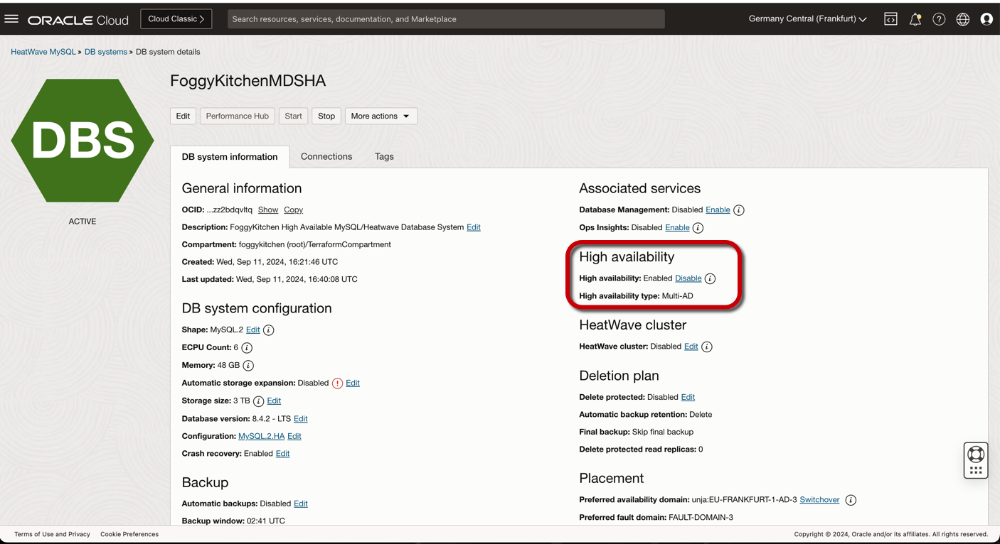
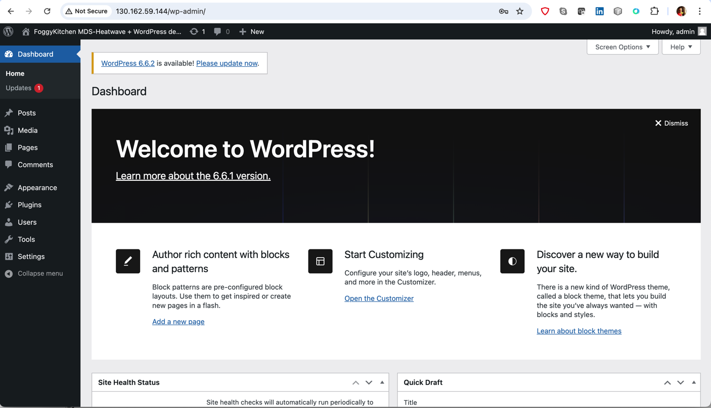
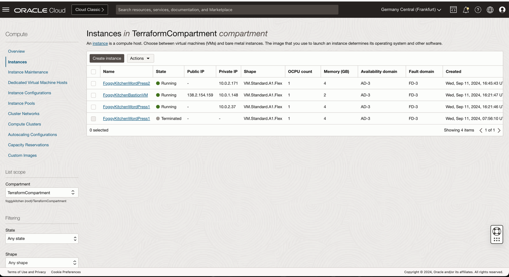
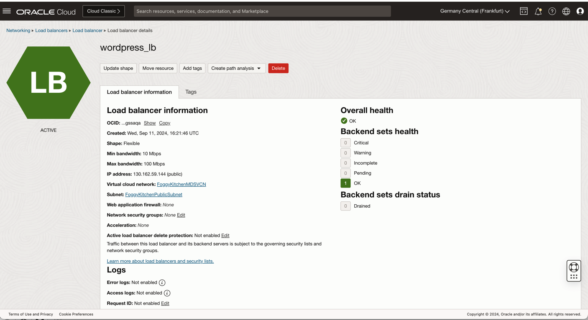
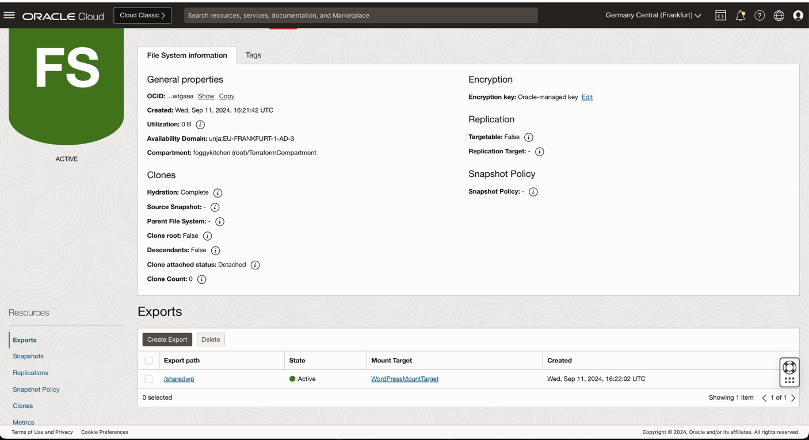

# FoggyKitchen OCI MySQL Heatwave with Terraform 

## LESSON 7 - Creating Highly Available MySQL Database Service with Highly Available WordPress CMS

In this lesson, we'll delve into the creation of a **Highly Available MySQL Database Service** in Oracle Cloud Infrastructure using a **Terraform module**, along with deploying a **Highly Available WordPress CMS**, focusing on ensuring both database and application availability with redundancy across multiple availability domains for enhanced fault tolerance and resilience.



## Deploy Using Oracle Resource Manager

1. Click [](https://cloud.oracle.com/resourcemanager/stacks/create?region=home&zipUrl=https://github.com/mlinxfeld/terraform-oci-fk-heatwave/releases/latest/download/terraform-oci-fk-heatwave-lesson7.zip)

    If you aren't already signed in, when prompted, enter the tenancy and user credentials.

2. Review and accept the terms and conditions.

3. Select the region where you want to deploy the stack.

4. Follow the on-screen prompts and instructions to create the stack.

5. After creating the stack, click **Terraform Actions**, and select **Plan**.

6. Wait for the job to be completed, and review the plan.

    To make any changes, return to the Stack Details page, click **Edit Stack**, and make the required changes. Then, run the **Plan** action again.

7. If no further changes are necessary, return to the Stack Details page, click **Terraform Actions**, and select **Apply**. 

## Deploy Using the Terraform CLI 

### Clone of the repo 

Now, you'll want a local copy of this repo. You can make that with the commands:
Clone the repo from github by executing the command as follows and then go to proper subdirectory:

```
mlinxfeld@Martins-MacBook-Pro github % git clone https://github.com/mlinxfeld/terraform-oci-fk-heatwave.git

mlinxfeld@Martins-MacBook-Pro github % cd terraform-oci-fk-heatwave

mlinxfeld@Martins-MacBook-Pro terraform-oci-fk-heatwave % cd training/lesson7_ha_mds_with_ha_wordpress/
```

### Prerequisites
Create environment file with terraform.tfvars file starting with example file:

```
mlinxfeld@Martins-MacBook-Pro lesson7_ha_mds_with_ha_wordpress % cp terraform.tfvars.example terraform.tfvars

mlinxfeld@Martins-MacBook-Pro lesson7_ha_mds_with_ha_wordpress % vi terraform.tfvars

tenancy_ocid            = <tenancy_ocid>"
user_ocid               = "<user_ocid>"
fingerprint             = "<fingerprint>"
private_key_path        = "<private_key_path>"
region                  = "<region>"
mds_availability_domain = "<ad_name>"
mds_compartment_ocid    = "<compartment_ocid>"
mds_admin_password      = "<admin_password>" # MySQL Heatwave Admin password (mysql user)
mds_wp_password         = "<wp_user_password>" # MySQL Heatware WP password (wp user)
wp_site_admin_pass      = "wp_admin_password>" # WordPress Console Admin User
```

### Initialize Terraform

Run the following command to initialize Terraform environment:

```
mlinxfeld@Martins-MacBook-Pro lesson7_ha_mds_with_ha_wordpress % terraform init 
Initializing the backend...
Initializing modules...
Initializing provider plugins...
- Finding latest version of hashicorp/template...
- Finding latest version of hashicorp/oci...
- Finding latest version of oracle/oci...
- Finding latest version of hashicorp/time...
- Finding latest version of hashicorp/null...
- Finding latest version of hashicorp/tls...
- Installing hashicorp/time v0.12.1...
- Installed hashicorp/time v0.12.1 (signed by HashiCorp)
- Installing hashicorp/null v3.2.3...
- Installed hashicorp/null v3.2.3 (signed by HashiCorp)
- Installing hashicorp/tls v4.0.6...
- Installed hashicorp/tls v4.0.6 (signed by HashiCorp)
- Installing hashicorp/template v2.2.0...
- Installed hashicorp/template v2.2.0 (signed by HashiCorp)
- Installing hashicorp/oci v6.9.0...
- Installed hashicorp/oci v6.9.0 (signed by HashiCorp)
- Installing oracle/oci v6.9.0...
- Installed oracle/oci v6.9.0 (signed by a HashiCorp partner, key ID 1533A49284137CEB)
Partner and community providers are signed by their developers.
If you'd like to know more about provider signing, you can read about it here:
https://www.terraform.io/docs/cli/plugins/signing.html
Terraform has created a lock file .terraform.lock.hcl to record the provider
selections it made above. Include this file in your version control repository
so that Terraform can guarantee to make the same selections by default when
you run "terraform init" in the future.

Terraform has been successfully initialized!

You may now begin working with Terraform. Try running "terraform plan" to see
any changes that are required for your infrastructure. All Terraform commands
should now work.

If you ever set or change modules or backend configuration for Terraform,
rerun this command to reinitialize your working directory. If you forget, other
commands will detect it and remind you to do so if necessary.
```

### Apply the changes 

Run the following command for applying changes with the proposed plan:

```
mlinxfeld@Martins-MacBook-Pro lesson7_ha_mds_with_ha_wordpress % terraform apply                

(...)

  # module.oci-fk-wordpress.tls_private_key.public_private_key_pair will be created
  + resource "tls_private_key" "public_private_key_pair" {
      + algorithm                     = "RSA"
      + ecdsa_curve                   = "P224"
      + id                            = (known after apply)
      + private_key_openssh           = (sensitive value)
      + private_key_pem               = (sensitive value)
      + private_key_pem_pkcs8         = (sensitive value)
      + public_key_fingerprint_md5    = (known after apply)
      + public_key_fingerprint_sha256 = (known after apply)
      + public_key_openssh            = (known after apply)
      + public_key_pem                = (known after apply)
      + rsa_bits                      = 2048
    }

Plan: 37 to add, 0 to change, 0 to destroy.

Changes to Outputs:
  + generated_ssh_private_key = (sensitive value)
  + mds_database              = {
      + mds_id         = (known after apply)
      + mds_ip_address = (known after apply)
      + mds_port       = (known after apply)
      + mds_port_x     = (known after apply)
    }
  + wordpress_home_URL        = (known after apply)
  + wordpress_wp-admin_URL    = (known after apply)

Do you want to perform these actions?
  Terraform will perform the actions described above.
  Only 'yes' will be accepted to approve.

  Enter a value: yes

module.oci-fk-wordpress.tls_private_key.public_private_key_pair: Creating...
oci_core_vcn.FoggyKitchenVCN: Creating...
module.oci-fk-wordpress.oci_core_public_ip.WordPress_public_ip_for_multi_node[0]: Creating...
module.oci-fk-wordpress.oci_file_storage_file_system.WordPressFilesystem[0]: Creating...
module.oci-fk-wordpress.tls_private_key.public_private_key_pair: Creation complete after 0s [id=4b770db04ed409b95745a400328126ef2eadd8b7]
module.oci-fk-wordpress.data.template_file.key_script: Reading...
module.oci-fk-wordpress.data.template_file.key_script: Read complete after 0s [id=b98de2f3f8fc39f9736112b127e12981684136bb08672dabc871d6d08360df3b]
module.oci-fk-wordpress.data.template_cloudinit_config.cloud_init: Reading...
module.oci-fk-wordpress.data.template_cloudinit_config.cloud_init: Read complete after 0s [id=986549001]
module.oci-fk-wordpress.oci_core_public_ip.WordPress_public_ip_for_multi_node[0]: Creation complete after 1s [id=ocid1.publicip.oc1.eu-frankfurt-1.amaaaaaadngk4giagksugnkni3iacepzjqgkb6mijoos3ny6x45ofg52fb6a]
oci_core_vcn.FoggyKitchenVCN: Creation complete after 1s [id=ocid1.vcn.oc1.eu-frankfurt-1.amaaaaaadngk4giallswsfyxy6kxxlbz3zphsd7g7agcq4iwibpmryfwoqiq]
module.oci-fk-wordpress.oci_core_network_security_group.WordPressFSSSecurityGroup[0]: Creating...
oci_core_nat_gateway.FoggyKitchenNATGateway: Creating...
oci_core_internet_gateway.FoggyKitchenInternetGateway: Creating...
oci_core_security_list.FoggyKitchenBastionSecurityList: Creating...
oci_core_security_list.FoggyKitchenMDSSecurityList: Creating...
module.oci-fk-wordpress.oci_core_network_security_group.WordPressFSSSecurityGroup[0]: Creation complete after 0s [id=ocid1.networksecuritygroup.oc1.eu-frankfurt-1.aaaaaaaaxxtfajzhfjsnw2ypo5sfvrwcwn5gjpqayiglkvb7atadrema4tta]
oci_core_security_list.FoggyKitchenMDSSecurityList: Creation complete after 1s [id=ocid1.securitylist.oc1.eu-frankfurt-1.aaaaaaaahyuubpjxvvzdurgdjufbru6fsejkxx2wtv27drbwvziij2lg7fgq]
oci_core_security_list.FoggyKitchenBastionSecurityList: Creation complete after 1s [id=ocid1.securitylist.oc1.eu-frankfurt-1.aaaaaaaan5rr2enthqycz2ce3g5e27sbqjwctohkygs6cv2hird3jrardwbq]
oci_core_subnet.FoggyKitchenPublicSubnet: Creating...
oci_core_subnet.FoggyKitchenPrivateSubnet: Creating...

(...)

module.oci-fk-wordpress.oci_core_instance.WordPress_from_image[0]: Creation complete after 5m57s [id=ocid1.instance.oc1.eu-frankfurt-1.antheljtdngk4gicufek3yla5jv6ufdtefydixp7gussb367f72sjc7z56pq]
module.oci-fk-wordpress.oci_load_balancer_backend.lb_be_wp2plus[0]: Creating...
module.oci-fk-wordpress.oci_load_balancer_backend.lb_be_wp2plus[0]: Still creating... [10s elapsed]
module.oci-fk-wordpress.oci_load_balancer_backend.lb_be_wp2plus[0]: Creation complete after 14s [id=loadBalancers/ocid1.loadbalancer.oc1.eu-frankfurt-1.aaaaaaaalvtk6q4lplqtlr27lp3w33nwt4ydgguqfwgeipspaeeembgssaqa/backendSets/lb_app01/backends/10.0.2.171:80]

Apply complete! Resources: 37 added, 0 changed, 0 destroyed.

Outputs:

generated_ssh_private_key = <sensitive>
mds_database = {
  "mds_id" = "ocid1.mysqldbsystem.oc1.eu-frankfurt-1.aaaaaaaa572j3ljorlguuyvw5fj2qx6ji2ueypq22fajnwmkt4zz2bdqvltq"
  "mds_ip_address" = "10.0.2.4"
  "mds_port" = "3306"
  "mds_port_x" = "33060"
}
wordpress_home_URL = "http://130.162.59.144/"
wordpress_wp-admin_URL = "http://130.162.59.144/wp-admin/"
```

### Verify the deployment:

1. Verify access to the WordPress Admin Console:



2. Verify MDS instance in HA configuration:


3. Verify WordPress compute instances:



4. Verify WordPress Load Balancer:



5. Verify NFS for WordPress compute instances:



### Destroy the changes 

Run the following command for destroying all resources:

```
mlinxfeld@Martins-MacBook-Pro lesson7_ha_mds_with_ha_wordpress % terraform destroy

(...)

Plan: 0 to add, 0 to change, 37 to destroy.

Changes to Outputs:
  - generated_ssh_private_key = (sensitive value) -> null
  - mds_database              = {
      - mds_id         = "ocid1.mysqldbsystem.oc1.eu-frankfurt-1.aaaaaaaa572j3ljorlguuyvw5fj2qx6ji2ueypq22fajnwmkt4zz2bdqvltq"
      - mds_ip_address = "10.0.2.4"
      - mds_port       = "3306"
      - mds_port_x     = "33060"
    } -> null
  - wordpress_home_URL        = "http://130.162.59.144/" -> null
  - wordpress_wp-admin_URL    = "http://130.162.59.144/wp-admin/" -> null

Do you really want to destroy all resources?
  Terraform will destroy all your managed infrastructure, as shown above.
  There is no undo. Only 'yes' will be accepted to confirm.

  Enter a value: yes

(...)

module.oci-fk-mds.oci_mysql_mysql_db_system.FoggyKitchenMDS[0]: Still destroying... [id=ocid1.mysqldbsystem.oc1.eu-frankfurt-1....vw5fj2qx6ji2ueypq22fajnwmkt4zz2bdqvltq, 2m40s elapsed]
module.oci-fk-mds.oci_mysql_mysql_db_system.FoggyKitchenMDS[0]: Still destroying... [id=ocid1.mysqldbsystem.oc1.eu-frankfurt-1....vw5fj2qx6ji2ueypq22fajnwmkt4zz2bdqvltq, 2m50s elapsed]
module.oci-fk-mds.oci_mysql_mysql_db_system.FoggyKitchenMDS[0]: Still destroying... [id=ocid1.mysqldbsystem.oc1.eu-frankfurt-1....vw5fj2qx6ji2ueypq22fajnwmkt4zz2bdqvltq, 3m0s elapsed]
module.oci-fk-mds.oci_mysql_mysql_db_system.FoggyKitchenMDS[0]: Still destroying... [id=ocid1.mysqldbsystem.oc1.eu-frankfurt-1....vw5fj2qx6ji2ueypq22fajnwmkt4zz2bdqvltq, 3m10s elapsed]
module.oci-fk-mds.oci_mysql_mysql_db_system.FoggyKitchenMDS[0]: Still destroying... [id=ocid1.mysqldbsystem.oc1.eu-frankfurt-1....vw5fj2qx6ji2ueypq22fajnwmkt4zz2bdqvltq, 3m20s elapsed]
module.oci-fk-mds.oci_mysql_mysql_db_system.FoggyKitchenMDS[0]: Destruction complete after 3m22s
oci_core_subnet.FoggyKitchenPrivateSubnet: Destroying... [id=ocid1.subnet.oc1.eu-frankfurt-1.aaaaaaaahof7bofvi7gcgxfxn76jjjmcpfk3rzwttfsjzcg4lww3uoc4nh4q]
oci_core_subnet.FoggyKitchenPrivateSubnet: Destruction complete after 1s
oci_core_security_list.FoggyKitchenMDSSecurityList: Destroying... [id=ocid1.securitylist.oc1.eu-frankfurt-1.aaaaaaaahyuubpjxvvzdurgdjufbru6fsejkxx2wtv27drbwvziij2lg7fgq]
oci_core_security_list.FoggyKitchenMDSSecurityList: Destruction complete after 0s
oci_core_vcn.FoggyKitchenVCN: Destroying... [id=ocid1.vcn.oc1.eu-frankfurt-1.amaaaaaadngk4giallswsfyxy6kxxlbz3zphsd7g7agcq4iwibpmryfwoqiq]
oci_core_vcn.FoggyKitchenVCN: Destruction complete after 1s

Destroy complete! Resources: 37 destroyed.
```

## Copyright
Copyright (c) 2024 [FoggyKitchen.com](https://foggykitchen.com/)