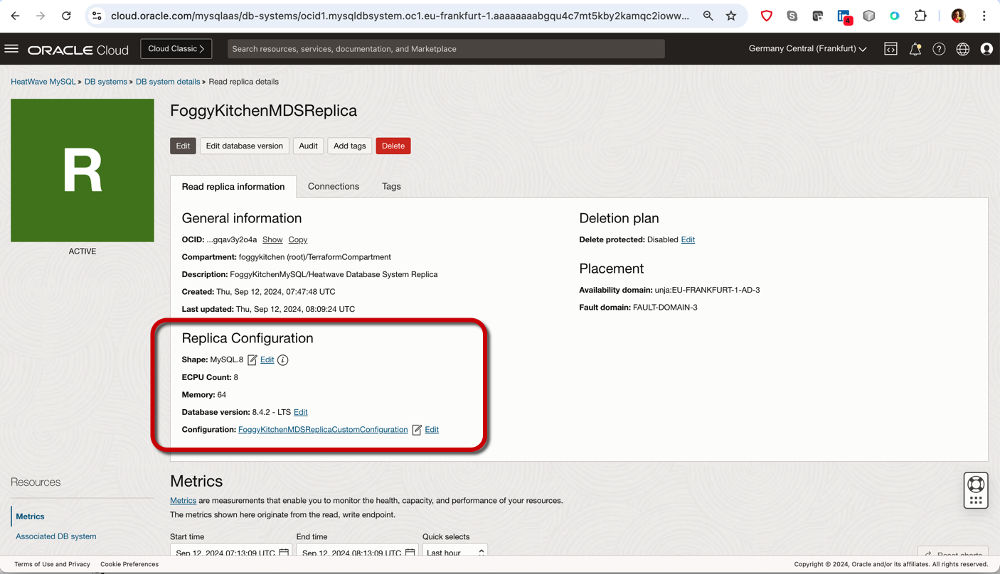

# FoggyKitchen OCI MySQL Heatwave with Terraform 

## LESSON 8 - Creating MySQL Database Service with Replicas

In this lesson, we'll delve into the creation of a **MySQL Database Service** in Oracle Cloud Infrastructure with **Replicas** using a **Terraform module**, focusing on setting up read replicas to offload read-heavy workloads, improve performance, and enhance data availability and redundancy across different instances.



## Deploy Using Oracle Resource Manager

1. Click [](https://cloud.oracle.com/resourcemanager/stacks/create?region=home&zipUrl=https://github.com/mlinxfeld/terraform-oci-fk-heatwave/releases/latest/download/terraform-oci-fk-heatwave-lesson8.zip)

    If you aren't already signed in, when prompted, enter the tenancy and user credentials.

2. Review and accept the terms and conditions.

3. Select the region where you want to deploy the stack.

4. Follow the on-screen prompts and instructions to create the stack.

5. After creating the stack, click **Terraform Actions**, and select **Plan**.

6. Wait for the job to be completed, and review the plan.

    To make any changes, return to the Stack Details page, click **Edit Stack**, and make the required changes. Then, run the **Plan** action again.

7. If no further changes are necessary, return to the Stack Details page, click **Terraform Actions**, and select **Apply**. 

## Deploy Using the Terraform CLI 

### Clone of the repo 

Now, you'll want a local copy of this repo. You can make that with the commands:
Clone the repo from github by executing the command as follows and then go to proper subdirectory:

```
mlinxfeld@Martins-MacBook-Pro github % git clone https://github.com/mlinxfeld/terraform-oci-fk-heatwave.git

mlinxfeld@Martins-MacBook-Pro github % cd terraform-oci-fk-heatwave

mlinxfeld@Martins-MacBook-Pro terraform-oci-fk-heatwave % cd training/lesson8_mds_with_replicas/
```

### Prerequisites
Create environment file with terraform.tfvars file starting with example file:

```
mlinxfeld@Martins-MacBook-Pro lesson8_mds_with_replicas % cp terraform.tfvars.example terraform.tfvars

mlinxfeld@Martins-MacBook-Pro lesson8_mds_with_replicas % vi terraform.tfvars

tenancy_ocid            = <tenancy_ocid>"
user_ocid               = "<user_ocid>"
fingerprint             = "<fingerprint>"
private_key_path        = "<private_key_path>"
region                  = "<region>"
mds_availability_domain = "<ad_name>"
mds_compartment_ocid    = "<compartment_ocid>"
mds_admin_password      = "<mds_admin_password>"
mds_replica_enabled     = false
```

### Initialize Terraform

Run the following command to initialize Terraform environment:

```
mlinxfeld@Martins-MacBook-Pro lesson8_mds_with_replicas % terraform init 
Initializing the backend...
Initializing modules...
Downloading git::https://github.com/mlinxfeld/terraform-oci-fk-heatwave.git for oci-fk-mds...
- oci-fk-mds in .terraform/modules/oci-fk-mds
Downloading git::https://github.com/mlinxfeld/terraform-oci-fk-heatwave.git for oci-fk-mds-replica...
- oci-fk-mds-replica in .terraform/modules/oci-fk-mds-replica
Initializing provider plugins...
- Finding latest version of hashicorp/null...
- Finding latest version of hashicorp/template...
- Finding latest version of hashicorp/oci...
- Finding latest version of oracle/oci...
- Installing hashicorp/null v3.2.3...
- Installed hashicorp/null v3.2.3 (signed by HashiCorp)
- Installing hashicorp/template v2.2.0...
- Installed hashicorp/template v2.2.0 (signed by HashiCorp)
- Installing hashicorp/oci v6.9.0...
- Installed hashicorp/oci v6.9.0 (signed by HashiCorp)
- Installing oracle/oci v6.9.0...
- Installed oracle/oci v6.9.0 (signed by a HashiCorp partner, key ID 1533A49284137CEB)
Partner and community providers are signed by their developers.
If you'd like to know more about provider signing, you can read about it here:
https://www.terraform.io/docs/cli/plugins/signing.html
Terraform has created a lock file .terraform.lock.hcl to record the provider
selections it made above. Include this file in your version control repository
so that Terraform can guarantee to make the same selections by default when
you run "terraform init" in the future.

Terraform has been successfully initialized!

You may now begin working with Terraform. Try running "terraform plan" to see
any changes that are required for your infrastructure. All Terraform commands
should now work.

If you ever set or change modules or backend configuration for Terraform,
rerun this command to reinitialize your working directory. If you forget, other
commands will detect it and remind you to do so if necessary.
```

### Apply the changes 

Run the following command for applying changes with the proposed plan:

```
mlinxfeld@Martins-MacBook-Pro lesson8_mds_with_replicas % terraform apply                

  # module.oci-fk-mds.oci_mysql_mysql_db_system.FoggyKitchenMDS[0] will be created
  + resource "oci_mysql_mysql_db_system" "FoggyKitchenMDS" {
      + admin_password                 = (sensitive value)
      + admin_username                 = "mysql"
      + availability_domain            = "unja:EU-FRANKFURT-1-AD-3"
      + channels                       = (known after apply)
      + compartment_id                 = "ocid1.compartment.oc1..aaaaaaaaiyy4srmrb32v5rlniicwmpxsytywiucgbcp5ext6e4ahjfuloewa"
      + configuration_id               = (known after apply)
      + crash_recovery                 = (known after apply)
      + current_placement              = (known after apply)
      + data_storage_size_in_gb        = 1024
      + database_management            = (known after apply)
      + defined_tags                   = (known after apply)
      + description                    = "FoggyKitchenMySQL/Heatwave Database System"
      + display_name                   = "FoggyKitchenMDS"
      + endpoints                      = (known after apply)
      + fault_domain                   = (known after apply)
      + freeform_tags                  = (known after apply)
      + heat_wave_cluster              = (known after apply)
      + hostname_label                 = "fkmds"
      + id                             = (known after apply)
      + ip_address                     = (known after apply)
      + is_heat_wave_cluster_attached  = (known after apply)
      + is_highly_available            = false
      + lifecycle_details              = (known after apply)
      + mysql_version                  = (known after apply)
      + point_in_time_recovery_details = (known after apply)
      + port                           = 3306
      + port_x                         = 33060
      + shape_name                     = "MySQL.2"
      + state                          = (known after apply)
      + subnet_id                      = (known after apply)
      + time_created                   = (known after apply)
      + time_updated                   = (known after apply)

      + backup_policy {
          + defined_tags      = (known after apply)
          + freeform_tags     = (known after apply)
          + is_enabled        = false
          + retention_in_days = (known after apply)
          + window_start_time = (known after apply)

          + pitr_policy (known after apply)
        }

      + customer_contacts (known after apply)

      + data_storage (known after apply)

      + deletion_policy (known after apply)

      + maintenance {
          + window_start_time = "MONDAY 23:59"
        }

      + secure_connections (known after apply)

      + source (known after apply)
    }

Plan: 9 to add, 0 to change, 0 to destroy.

Changes to Outputs:
  + mds_database = {
      + mds_id         = (known after apply)
      + mds_ip_address = (known after apply)
      + mds_port       = (known after apply)
      + mds_port_x     = (known after apply)
    }

Do you want to perform these actions?
  Terraform will perform the actions described above.
  Only 'yes' will be accepted to approve.

  Enter a value: yes

module.oci-fk-mds.oci_core_vcn.FoggyKitchenVCN[0]: Creating...
module.oci-fk-mds.oci_mysql_mysql_configuration.FoggyKitchenMDSConfiguration[0]: Creating...
module.oci-fk-mds.oci_mysql_mysql_configuration.FoggyKitchenMDSConfiguration[0]: Creation complete after 1s [id=ocid1.mysqlconfiguration.oc1.eu-frankfurt-1.aaaaaaaaiss4m5gxegsc3slpkqzoqnyh44q7shm7ot2o6f4f7borahm2sc2a]
module.oci-fk-mds.oci_core_vcn.FoggyKitchenVCN[0]: Creation complete after 1s [id=ocid1.vcn.oc1.eu-frankfurt-1.amaaaaaadngk4gia6fa2mnwelo3hwlawxmqnrmy4zofcizj2qqpigwsrj2oq]
module.oci-fk-mds.oci_core_nat_gateway.FoggyKitchenNATGateway[0]: Creating...
module.oci-fk-mds.oci_core_default_security_list.FoggyKitchenDefaultSecurityList[0]: Creating...
module.oci-fk-mds.oci_core_security_list.FoggyKitchenMDSSecurityList[0]: Creating...
module.oci-fk-mds.oci_core_security_list.FoggyKitchenMDSSecurityList[0]: Creation complete after 1s [id=ocid1.securitylist.oc1.eu-frankfurt-1.aaaaaaaamnhj747trxuylnt37qok2l6zdy7rf7j62f4mzjf3tqj2xoz34omq]
module.oci-fk-mds.oci_core_subnet.FoggyKitchenPrivateSubnet[0]: Creating...
module.oci-fk-mds.oci_core_default_security_list.FoggyKitchenDefaultSecurityList[0]: Creation complete after 1s [id=ocid1.securitylist.oc1.eu-frankfurt-1.aaaaaaaaxiwrjhjhfkmp6h6enjugn7m4tox3s2btg4nqrfyc3c7vfjgsfarq]
module.oci-fk-mds.oci_core_nat_gateway.FoggyKitchenNATGateway[0]: Creation complete after 1s [id=ocid1.natgateway.oc1.eu-frankfurt-1.aaaaaaaa5fm6yjjgzghkygbmxdar5vmr5b46tqu2ur5zl6lqmkvnwn5gnvvq]
module.oci-fk-mds.oci_core_route_table.FoggyKitchenPrivateRouteTable[0]: Creating...
module.oci-fk-mds.oci_core_subnet.FoggyKitchenPrivateSubnet[0]: Creation complete after 1s [id=ocid1.subnet.oc1.eu-frankfurt-1.aaaaaaaanrxirwrqvxr6zgiwjhlhrhsgknzyizchzemnrfuea4qd7qzgja5a]
module.oci-fk-mds.oci_mysql_mysql_db_system.FoggyKitchenMDS[0]: Creating...
module.oci-fk-mds.oci_core_route_table.FoggyKitchenPrivateRouteTable[0]: Creation complete after 1s [id=ocid1.routetable.oc1.eu-frankfurt-1.aaaaaaaakfogmuoxpuz4lhxbguqn6izr4m6zewc5czqzvybaptgq54mic62q]
module.oci-fk-mds.oci_core_route_table_attachment.FoggyKitchenPrivateSubnetRouteTableAttachment[0]: Creating...
module.oci-fk-mds.oci_core_route_table_attachment.FoggyKitchenPrivateSubnetRouteTableAttachment[0]: Creation complete after 0s [id=ocid1.subnet.oc1.eu-frankfurt-1.aaaaaaaanrxirwrqvxr6zgiwjhlhrhsgknzyizchzemnrfuea4qd7qzgja5a/ocid1.routetable.oc1.eu-frankfurt-1.aaaaaaaakfogmuoxpuz4lhxbguqn6izr4m6zewc5czqzvybaptgq54mic62q]
module.oci-fk-mds.oci_mysql_mysql_db_system.FoggyKitchenMDS[0]: Still creating... [10s elapsed]
module.oci-fk-mds.oci_mysql_mysql_db_system.FoggyKitchenMDS[0]: Still creating... [20s elapsed]
module.oci-fk-mds.oci_mysql_mysql_db_system.FoggyKitchenMDS[0]: Still creating... [30s elapsed]
module.oci-fk-mds.oci_mysql_mysql_db_system.FoggyKitchenMDS[0]: Still creating... [40s elapsed]
module.oci-fk-mds.oci_mysql_mysql_db_system.FoggyKitchenMDS[0]: Still creating... [50s elapsed]
module.oci-fk-mds.oci_mysql_mysql_db_system.FoggyKitchenMDS[0]: Still creating... [1m0s elapsed]
module.oci-fk-mds.oci_mysql_mysql_db_system.FoggyKitchenMDS[0]: Still creating... [1m10s elapsed]
module.oci-fk-mds.oci_mysql_mysql_db_system.FoggyKitchenMDS[0]: Still creating... [1m20s elapsed]
module.oci-fk-mds.oci_mysql_mysql_db_system.FoggyKitchenMDS[0]: Still creating... [1m30s elapsed]
module.oci-fk-mds.oci_mysql_mysql_db_system.FoggyKitchenMDS[0]: Still creating... [1m40s elapsed]
module.oci-fk-mds.oci_mysql_mysql_db_system.FoggyKitchenMDS[0]: Still creating... [1m50s elapsed]
module.oci-fk-mds.oci_mysql_mysql_db_system.FoggyKitchenMDS[0]: Still creating... [2m0s elapsed]
module.oci-fk-mds.oci_mysql_mysql_db_system.FoggyKitchenMDS[0]: Still creating... [2m10s elapsed]
module.oci-fk-mds.oci_mysql_mysql_db_system.FoggyKitchenMDS[0]: Still creating... [2m20s elapsed]
module.oci-fk-mds.oci_mysql_mysql_db_system.FoggyKitchenMDS[0]: Still creating... [2m30s elapsed]
module.oci-fk-mds.oci_mysql_mysql_db_system.FoggyKitchenMDS[0]: Still creating... [2m40s elapsed]
module.oci-fk-mds.oci_mysql_mysql_db_system.FoggyKitchenMDS[0]: Still creating... [2m50s elapsed]
module.oci-fk-mds.oci_mysql_mysql_db_system.FoggyKitchenMDS[0]: Still creating... [3m0s elapsed]
module.oci-fk-mds.oci_mysql_mysql_db_system.FoggyKitchenMDS[0]: Still creating... [3m10s elapsed]
module.oci-fk-mds.oci_mysql_mysql_db_system.FoggyKitchenMDS[0]: Still creating... [3m20s elapsed]
module.oci-fk-mds.oci_mysql_mysql_db_system.FoggyKitchenMDS[0]: Still creating... [3m30s elapsed]
module.oci-fk-mds.oci_mysql_mysql_db_system.FoggyKitchenMDS[0]: Still creating... [3m40s elapsed]
module.oci-fk-mds.oci_mysql_mysql_db_system.FoggyKitchenMDS[0]: Still creating... [3m50s elapsed]
module.oci-fk-mds.oci_mysql_mysql_db_system.FoggyKitchenMDS[0]: Still creating... [4m0s elapsed]
module.oci-fk-mds.oci_mysql_mysql_db_system.FoggyKitchenMDS[0]: Still creating... [4m10s elapsed]
module.oci-fk-mds.oci_mysql_mysql_db_system.FoggyKitchenMDS[0]: Still creating... [4m20s elapsed]
module.oci-fk-mds.oci_mysql_mysql_db_system.FoggyKitchenMDS[0]: Still creating... [4m30s elapsed]
module.oci-fk-mds.oci_mysql_mysql_db_system.FoggyKitchenMDS[0]: Still creating... [4m40s elapsed]
module.oci-fk-mds.oci_mysql_mysql_db_system.FoggyKitchenMDS[0]: Still creating... [4m50s elapsed]
module.oci-fk-mds.oci_mysql_mysql_db_system.FoggyKitchenMDS[0]: Still creating... [5m0s elapsed]
module.oci-fk-mds.oci_mysql_mysql_db_system.FoggyKitchenMDS[0]: Still creating... [5m10s elapsed]
module.oci-fk-mds.oci_mysql_mysql_db_system.FoggyKitchenMDS[0]: Still creating... [5m20s elapsed]
module.oci-fk-mds.oci_mysql_mysql_db_system.FoggyKitchenMDS[0]: Still creating... [5m30s elapsed]
module.oci-fk-mds.oci_mysql_mysql_db_system.FoggyKitchenMDS[0]: Still creating... [5m40s elapsed]
module.oci-fk-mds.oci_mysql_mysql_db_system.FoggyKitchenMDS[0]: Still creating... [5m50s elapsed]
module.oci-fk-mds.oci_mysql_mysql_db_system.FoggyKitchenMDS[0]: Still creating... [6m0s elapsed]
module.oci-fk-mds.oci_mysql_mysql_db_system.FoggyKitchenMDS[0]: Still creating... [6m10s elapsed]
module.oci-fk-mds.oci_mysql_mysql_db_system.FoggyKitchenMDS[0]: Still creating... [6m20s elapsed]
module.oci-fk-mds.oci_mysql_mysql_db_system.FoggyKitchenMDS[0]: Still creating... [6m30s elapsed]
module.oci-fk-mds.oci_mysql_mysql_db_system.FoggyKitchenMDS[0]: Still creating... [6m40s elapsed]
module.oci-fk-mds.oci_mysql_mysql_db_system.FoggyKitchenMDS[0]: Still creating... [6m50s elapsed]
module.oci-fk-mds.oci_mysql_mysql_db_system.FoggyKitchenMDS[0]: Still creating... [7m0s elapsed]
module.oci-fk-mds.oci_mysql_mysql_db_system.FoggyKitchenMDS[0]: Still creating... [7m10s elapsed]
module.oci-fk-mds.oci_mysql_mysql_db_system.FoggyKitchenMDS[0]: Still creating... [7m20s elapsed]
module.oci-fk-mds.oci_mysql_mysql_db_system.FoggyKitchenMDS[0]: Still creating... [7m30s elapsed]
module.oci-fk-mds.oci_mysql_mysql_db_system.FoggyKitchenMDS[0]: Still creating... [7m40s elapsed]
module.oci-fk-mds.oci_mysql_mysql_db_system.FoggyKitchenMDS[0]: Still creating... [7m50s elapsed]
module.oci-fk-mds.oci_mysql_mysql_db_system.FoggyKitchenMDS[0]: Still creating... [8m0s elapsed]
module.oci-fk-mds.oci_mysql_mysql_db_system.FoggyKitchenMDS[0]: Still creating... [8m10s elapsed]
module.oci-fk-mds.oci_mysql_mysql_db_system.FoggyKitchenMDS[0]: Still creating... [8m20s elapsed]
module.oci-fk-mds.oci_mysql_mysql_db_system.FoggyKitchenMDS[0]: Still creating... [8m30s elapsed]
module.oci-fk-mds.oci_mysql_mysql_db_system.FoggyKitchenMDS[0]: Still creating... [8m40s elapsed]
module.oci-fk-mds.oci_mysql_mysql_db_system.FoggyKitchenMDS[0]: Still creating... [8m50s elapsed]
module.oci-fk-mds.oci_mysql_mysql_db_system.FoggyKitchenMDS[0]: Still creating... [9m0s elapsed]
module.oci-fk-mds.oci_mysql_mysql_db_system.FoggyKitchenMDS[0]: Still creating... [9m10s elapsed]
module.oci-fk-mds.oci_mysql_mysql_db_system.FoggyKitchenMDS[0]: Still creating... [9m20s elapsed]
module.oci-fk-mds.oci_mysql_mysql_db_system.FoggyKitchenMDS[0]: Still creating... [9m30s elapsed]
module.oci-fk-mds.oci_mysql_mysql_db_system.FoggyKitchenMDS[0]: Still creating... [9m40s elapsed]
module.oci-fk-mds.oci_mysql_mysql_db_system.FoggyKitchenMDS[0]: Still creating... [9m50s elapsed]
module.oci-fk-mds.oci_mysql_mysql_db_system.FoggyKitchenMDS[0]: Still creating... [10m0s elapsed]
module.oci-fk-mds.oci_mysql_mysql_db_system.FoggyKitchenMDS[0]: Still creating... [10m10s elapsed]
module.oci-fk-mds.oci_mysql_mysql_db_system.FoggyKitchenMDS[0]: Still creating... [10m20s elapsed]
module.oci-fk-mds.oci_mysql_mysql_db_system.FoggyKitchenMDS[0]: Still creating... [10m30s elapsed]
module.oci-fk-mds.oci_mysql_mysql_db_system.FoggyKitchenMDS[0]: Still creating... [10m40s elapsed]
module.oci-fk-mds.oci_mysql_mysql_db_system.FoggyKitchenMDS[0]: Still creating... [10m50s elapsed]
module.oci-fk-mds.oci_mysql_mysql_db_system.FoggyKitchenMDS[0]: Still creating... [11m0s elapsed]
module.oci-fk-mds.oci_mysql_mysql_db_system.FoggyKitchenMDS[0]: Still creating... [11m10s elapsed]
module.oci-fk-mds.oci_mysql_mysql_db_system.FoggyKitchenMDS[0]: Still creating... [11m20s elapsed]
module.oci-fk-mds.oci_mysql_mysql_db_system.FoggyKitchenMDS[0]: Still creating... [11m30s elapsed]
module.oci-fk-mds.oci_mysql_mysql_db_system.FoggyKitchenMDS[0]: Still creating... [11m40s elapsed]
module.oci-fk-mds.oci_mysql_mysql_db_system.FoggyKitchenMDS[0]: Still creating... [11m50s elapsed]
module.oci-fk-mds.oci_mysql_mysql_db_system.FoggyKitchenMDS[0]: Creation complete after 11m56s [id=ocid1.mysqldbsystem.oc1.eu-frankfurt-1.aaaaaaaabgqu4c7mt5kby2kamqc2iowwsdnyijaid4glo6najubpgbjyrzua]

Apply complete! Resources: 9 added, 0 changed, 0 destroyed.

Outputs:

mds_database = {
  "mds_id" = "ocid1.mysqldbsystem.oc1.eu-frankfurt-1.aaaaaaaabgqu4c7mt5kby2kamqc2iowwsdnyijaid4glo6najubpgbjyrzua"
  "mds_ip_address" = "10.0.1.38"
  "mds_port" = "3306"
  "mds_port_x" = "33060"
}
```

### Enabling MDS Replica

Update environment file with terraform.tfvars file:

```
mlinxfeld@Martins-MacBook-Pro lesson8_mds_with_replicas % vi terraform.tfvars
(...)
mds_replica_enabled     = true # <- it will enable MDS Replica 
```

### Re-apply the changes 

Run the following command for applying changes with the new plan including replication user and MDS Channel:

```
mlinxfeld@Martins-MacBook-Pro lesson8_mds_with_replicas % terraform apply                

(...)

module.oci-fk-mds.oci_core_route_table_attachment.FoggyKitchenPrivateSubnetRouteTableAttachment[0]: Refreshing state... [id=ocid1.subnet.oc1.eu-frankfurt-1.aaaaaaaanrxirwrqvxr6zgiwjhlhrhsgknzyizchzemnrfuea4qd7qzgja5a/ocid1.routetable.oc1.eu-frankfurt-1.aaaaaaaakfogmuoxpuz4lhxbguqn6izr4m6zewc5czqzvybaptgq54mic62q]
module.oci-fk-mds.oci_mysql_mysql_db_system.FoggyKitchenMDS[0]: Refreshing state... [id=ocid1.mysqldbsystem.oc1.eu-frankfurt-1.aaaaaaaabgqu4c7mt5kby2kamqc2iowwsdnyijaid4glo6najubpgbjyrzua]

Terraform used the selected providers to generate the following execution plan. Resource actions are indicated with the following symbols:
  + create

Terraform will perform the following actions:

  # module.oci-fk-mds-replica[0].oci_mysql_mysql_configuration.FoggyKitchenMDSConfiguration[0] will be created
  + resource "oci_mysql_mysql_configuration" "FoggyKitchenMDSConfiguration" {
      + compartment_id          = "ocid1.compartment.oc1..aaaaaaaaiyy4srmrb32v5rlniicwmpxsytywiucgbcp5ext6e4ahjfuloewa"
      + defined_tags            = (known after apply)
      + description             = "FoggyKitchen MDS Replica Custom Configuration"
      + display_name            = "FoggyKitchenMDSReplicaCustomConfiguration"
      + freeform_tags           = (known after apply)
      + id                      = (known after apply)
      + parent_configuration_id = (known after apply)
      + shape_name              = "MySQL.8"
      + state                   = (known after apply)
      + time_created            = (known after apply)
      + time_updated            = (known after apply)
      + type                    = (known after apply)

      + init_variables (known after apply)

      + variables {
          + autocommit                                  = (known after apply)
          + big_tables                                  = (known after apply)
          + binlog_expire_logs_seconds                  = 3600
          + binlog_row_metadata                         = (known after apply)
          + binlog_row_value_options                    = (known after apply)
          + binlog_transaction_compression              = (known after apply)
          + completion_type                             = (known after apply)
          + connect_timeout                             = (known after apply)
          + connection_memory_chunk_size                = (known after apply)
          + connection_memory_limit                     = (known after apply)
          + cte_max_recursion_depth                     = (known after apply)
          + default_authentication_plugin               = (known after apply)
          + foreign_key_checks                          = (known after apply)
          + generated_random_password_length            = (known after apply)
          + global_connection_memory_limit              = (known after apply)
          + global_connection_memory_tracking           = (known after apply)
          + group_replication_consistency               = (known after apply)
          + information_schema_stats_expiry             = (known after apply)
          + innodb_buffer_pool_dump_pct                 = (known after apply)
          + innodb_buffer_pool_instances                = (known after apply)
          + innodb_buffer_pool_size                     = (known after apply)
          + innodb_ddl_buffer_size                      = (known after apply)
          + innodb_ddl_threads                          = (known after apply)
          + innodb_ft_enable_stopword                   = (known after apply)
          + innodb_ft_max_token_size                    = (known after apply)
          + innodb_ft_min_token_size                    = (known after apply)
          + innodb_ft_num_word_optimize                 = (known after apply)
          + innodb_ft_result_cache_limit                = (known after apply)
          + innodb_ft_server_stopword_table             = (known after apply)
          + innodb_lock_wait_timeout                    = (known after apply)
          + innodb_log_writer_threads                   = (known after apply)
          + innodb_max_purge_lag                        = (known after apply)
          + innodb_max_purge_lag_delay                  = (known after apply)
          + innodb_stats_persistent_sample_pages        = (known after apply)
          + innodb_stats_transient_sample_pages         = (known after apply)
          + interactive_timeout                         = (known after apply)
          + local_infile                                = (known after apply)
          + mandatory_roles                             = (known after apply)
          + max_allowed_packet                          = (known after apply)
          + max_binlog_cache_size                       = (known after apply)
          + max_connect_errors                          = (known after apply)
          + max_connections                             = (known after apply)
          + max_execution_time                          = (known after apply)
          + max_heap_table_size                         = (known after apply)
          + max_prepared_stmt_count                     = (known after apply)
          + mysql_firewall_mode                         = (known after apply)
          + mysql_zstd_default_compression_level        = (known after apply)
          + mysqlx_connect_timeout                      = (known after apply)
          + mysqlx_deflate_default_compression_level    = (known after apply)
          + mysqlx_deflate_max_client_compression_level = (known after apply)
          + mysqlx_document_id_unique_prefix            = (known after apply)
          + mysqlx_enable_hello_notice                  = (known after apply)
          + mysqlx_idle_worker_thread_timeout           = (known after apply)
          + mysqlx_interactive_timeout                  = (known after apply)
          + mysqlx_lz4default_compression_level         = (known after apply)
          + mysqlx_lz4max_client_compression_level      = (known after apply)
          + mysqlx_max_allowed_packet                   = (known after apply)
          + mysqlx_min_worker_threads                   = (known after apply)
          + mysqlx_read_timeout                         = (known after apply)
          + mysqlx_wait_timeout                         = (known after apply)
          + mysqlx_write_timeout                        = (known after apply)
          + mysqlx_zstd_default_compression_level       = (known after apply)
          + mysqlx_zstd_max_client_compression_level    = (known after apply)
          + net_read_timeout                            = (known after apply)
          + net_write_timeout                           = (known after apply)
          + parser_max_mem_size                         = (known after apply)
          + query_alloc_block_size                      = (known after apply)
          + query_prealloc_size                         = (known after apply)
          + regexp_time_limit                           = (known after apply)
          + sort_buffer_size                            = (known after apply)
          + sql_mode                                    = (known after apply)
          + sql_require_primary_key                     = (known after apply)
          + sql_warnings                                = (known after apply)
          + thread_pool_dedicated_listeners             = (known after apply)
          + thread_pool_max_transactions_limit          = (known after apply)
          + time_zone                                   = (known after apply)
          + tmp_table_size                              = (known after apply)
          + transaction_isolation                       = (known after apply)
          + wait_timeout                                = (known after apply)
        }
    }

  # module.oci-fk-mds-replica[0].oci_mysql_replica.FoggyKitchenMDSReplica[0] will be created
  + resource "oci_mysql_replica" "FoggyKitchenMDSReplica" {
      + availability_domain = (known after apply)
      + compartment_id      = (known after apply)
      + configuration_id    = (known after apply)
      + db_system_id        = "ocid1.mysqldbsystem.oc1.eu-frankfurt-1.aaaaaaaabgqu4c7mt5kby2kamqc2iowwsdnyijaid4glo6najubpgbjyrzua"
      + defined_tags        = (known after apply)
      + description         = "FoggyKitchenMySQL/Heatwave Database System Replica"
      + display_name        = "FoggyKitchenMDSReplica"
      + fault_domain        = (known after apply)
      + freeform_tags       = (known after apply)
      + id                  = (known after apply)
      + ip_address          = (known after apply)
      + is_delete_protected = false
      + lifecycle_details   = (known after apply)
      + mysql_version       = (known after apply)
      + port                = (known after apply)
      + port_x              = (known after apply)
      + secure_connections  = (known after apply)
      + shape_name          = (known after apply)
      + state               = (known after apply)
      + time_created        = (known after apply)
      + time_updated        = (known after apply)

      + replica_overrides {
          + configuration_id = (known after apply)
          + mysql_version    = (known after apply)
          + shape_name       = "MySQL.8"
        }
    }

Plan: 2 to add, 0 to change, 0 to destroy.

Do you want to perform these actions?
  Terraform will perform the actions described above.
  Only 'yes' will be accepted to approve.

  Enter a value: yes

(...)

module.oci-fk-mds-replica[0].oci_mysql_replica.FoggyKitchenMDSReplica[0]: Still creating... [19m41s elapsed]
module.oci-fk-mds-replica[0].oci_mysql_replica.FoggyKitchenMDSReplica[0]: Still creating... [19m51s elapsed]
module.oci-fk-mds-replica[0].oci_mysql_replica.FoggyKitchenMDSReplica[0]: Still creating... [20m1s elapsed]
module.oci-fk-mds-replica[0].oci_mysql_replica.FoggyKitchenMDSReplica[0]: Still creating... [20m11s elapsed]
module.oci-fk-mds-replica[0].oci_mysql_replica.FoggyKitchenMDSReplica[0]: Still creating... [20m21s elapsed]
module.oci-fk-mds-replica[0].oci_mysql_replica.FoggyKitchenMDSReplica[0]: Still creating... [20m31s elapsed]
module.oci-fk-mds-replica[0].oci_mysql_replica.FoggyKitchenMDSReplica[0]: Still creating... [20m41s elapsed]
module.oci-fk-mds-replica[0].oci_mysql_replica.FoggyKitchenMDSReplica[0]: Still creating... [20m51s elapsed]
module.oci-fk-mds-replica[0].oci_mysql_replica.FoggyKitchenMDSReplica[0]: Still creating... [21m1s elapsed]
module.oci-fk-mds-replica[0].oci_mysql_replica.FoggyKitchenMDSReplica[0]: Still creating... [21m11s elapsed]
module.oci-fk-mds-replica[0].oci_mysql_replica.FoggyKitchenMDSReplica[0]: Still creating... [21m21s elapsed]
module.oci-fk-mds-replica[0].oci_mysql_replica.FoggyKitchenMDSReplica[0]: Still creating... [21m31s elapsed]
module.oci-fk-mds-replica[0].oci_mysql_replica.FoggyKitchenMDSReplica[0]: Still creating... [21m41s elapsed]
module.oci-fk-mds-replica[0].oci_mysql_replica.FoggyKitchenMDSReplica[0]: Creation complete after 21m43s [id=ocid1.mysqlreplica.oc1.eu-frankfurt-1.aaaaaaaarzkbhe7xwt3u4v7hihdvnmrz4icsqwybuk6aehyfadgqav3y2o4a]

Apply complete! Resources: 2 added, 0 changed, 0 destroyed.

Outputs:

mds_database = {
  "mds_id" = "ocid1.mysqldbsystem.oc1.eu-frankfurt-1.aaaaaaaabgqu4c7mt5kby2kamqc2iowwsdnyijaid4glo6najubpgbjyrzua"
  "mds_ip_address" = "10.0.1.38"
  "mds_port" = "3306"
  "mds_port_x" = "33060"
}
```

### Verify the deployment:

1. Verify MDS replica:


2. Check the details of the MDS replica:


### Destroy the changes 

Run the following command for destroying all resources:

```
mlinxfeld@Martins-MacBook-Pro lesson8_mds_with_replicas % terraform destroy

(...)

  # module.oci-fk-mds-replica[0].oci_mysql_replica.FoggyKitchenMDSReplica[0] will be destroyed
  - resource "oci_mysql_replica" "FoggyKitchenMDSReplica" {
      - availability_domain = "unja:EU-FRANKFURT-1-AD-3" -> null
      - compartment_id      = "ocid1.compartment.oc1..aaaaaaaaiyy4srmrb32v5rlniicwmpxsytywiucgbcp5ext6e4ahjfuloewa" -> null
      - configuration_id    = "ocid1.mysqlconfiguration.oc1.eu-frankfurt-1.aaaaaaaajrpsoefvpyrqg3mecehusqyzkmbyvvgcbldjxmoczmtskjclcfuq" -> null
      - db_system_id        = "ocid1.mysqldbsystem.oc1.eu-frankfurt-1.aaaaaaaabgqu4c7mt5kby2kamqc2iowwsdnyijaid4glo6najubpgbjyrzua" -> null
      - defined_tags        = {} -> null
      - description         = "FoggyKitchenMySQL/Heatwave Database System Replica" -> null
      - display_name        = "FoggyKitchenMDSReplica" -> null
      - fault_domain        = "FAULT-DOMAIN-3" -> null
      - freeform_tags       = {} -> null
      - id                  = "ocid1.mysqlreplica.oc1.eu-frankfurt-1.aaaaaaaarzkbhe7xwt3u4v7hihdvnmrz4icsqwybuk6aehyfadgqav3y2o4a" -> null
      - ip_address          = "10.0.1.151" -> null
      - is_delete_protected = false -> null
      - mysql_version       = "8.4.2" -> null
      - port                = 3306 -> null
      - port_x              = 33060 -> null
      - secure_connections  = [
          - {
              - certificate_generation_type = "SYSTEM"
                # (1 unchanged attribute hidden)
            },
        ] -> null
      - shape_name          = "MySQL.8" -> null
      - state               = "ACTIVE" -> null
      - time_created        = "2024-09-12 07:47:48.425 +0000 UTC" -> null
      - time_updated        = "2024-09-12 08:09:24.256 +0000 UTC" -> null

      - replica_overrides {
          - configuration_id = "ocid1.mysqlconfiguration.oc1.eu-frankfurt-1.aaaaaaaajrpsoefvpyrqg3mecehusqyzkmbyvvgcbldjxmoczmtskjclcfuq" -> null
          - shape_name       = "MySQL.8" -> null
            # (1 unchanged attribute hidden)
        }
    }

Plan: 0 to add, 0 to change, 11 to destroy.

Changes to Outputs:
  - mds_database = {
      - mds_id         = "ocid1.mysqldbsystem.oc1.eu-frankfurt-1.aaaaaaaabgqu4c7mt5kby2kamqc2iowwsdnyijaid4glo6najubpgbjyrzua"
      - mds_ip_address = "10.0.1.207"
      - mds_port       = "3306"
      - mds_port_x     = "33060"
    } -> null

Do you really want to destroy all resources?
  Terraform will destroy all your managed infrastructure, as shown above.
  There is no undo. Only 'yes' will be accepted to confirm.

  Enter a value: yes

(...)

module.oci-fk-mds.oci_core_subnet.FoggyKitchenPrivateSubnet[0]: Destroying... [id=ocid1.subnet.oc1.eu-frankfurt-1.aaaaaaaanrxirwrqvxr6zgiwjhlhrhsgknzyizchzemnrfuea4qd7qzgja5a]
module.oci-fk-mds.oci_mysql_mysql_configuration.FoggyKitchenMDSConfiguration[0]: Destroying... [id=ocid1.mysqlconfiguration.oc1.eu-frankfurt-1.aaaaaaaaiss4m5gxegsc3slpkqzoqnyh44q7shm7ot2o6f4f7borahm2sc2a]
module.oci-fk-mds.oci_mysql_mysql_configuration.FoggyKitchenMDSConfiguration[0]: Destruction complete after 1s
module.oci-fk-mds.oci_core_subnet.FoggyKitchenPrivateSubnet[0]: Destruction complete after 1s
module.oci-fk-mds.oci_core_security_list.FoggyKitchenMDSSecurityList[0]: Destroying... [id=ocid1.securitylist.oc1.eu-frankfurt-1.aaaaaaaamnhj747trxuylnt37qok2l6zdy7rf7j62f4mzjf3tqj2xoz34omq]
module.oci-fk-mds.oci_core_security_list.FoggyKitchenMDSSecurityList[0]: Destruction complete after 0s
module.oci-fk-mds.oci_core_vcn.FoggyKitchenVCN[0]: Destroying... [id=ocid1.vcn.oc1.eu-frankfurt-1.amaaaaaadngk4gia6fa2mnwelo3hwlawxmqnrmy4zofcizj2qqpigwsrj2oq]
module.oci-fk-mds.oci_core_vcn.FoggyKitchenVCN[0]: Destruction complete after 1s

Destroy complete! Resources: 11 destroyed.
```

## Copyright
Copyright (c) 2024 [FoggyKitchen.com](https://foggykitchen.com/)